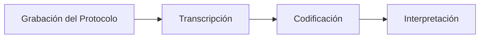

# Análisis de Protocolos

Hacer ejercicio 1
___

> [!abstract] Ubicación en el tema Técnica de **educción de conocimiento** (conocimiento _privado_, no documentado), dentro del proceso general de **Adquisición de Conocimientos**.

## Mapa del proceso de Adquisición de Conocimientos
Obtenes conocimientos a partir de datos. Se obtienen a lo largo del ciclo de vida de un sistema experto. Puede que este en produccion y consiga datos nuevos. Tiene 2 formas

- **Extracción de Conocimientos** → Conocimiento Público. Esta etapa se hace antes y siempre se debe hacer.
    - Análisis de Documentación
    - Análisis de Datos
- **Educción de Conocimientos** → Conocimiento Privado (cosas que estan internalizados en la persona o experto pero no esta detallado o escrito). Se obtiene con:
    - Entrevistas
    - Cuestionarios
    - Observación y Análisis de Tareas Habituales
    - Tormenta de Ideas
    - Clasificación de Conceptos
    - **Análisis de Protocolos** ⭐
    - Emparrillado
> Analisis de protocolos y emparrillados son de IA

## ¿Qué es?

> [!quote] Definición 
> Técnica para revelar lo que saben los expertos en un dominio: se le pide al experto que **piense en voz alta** mientras resuelve una tarea, obteniendo un protocolo verbal grabado.

- **Origen:** procedimiento definido por **Ericsson y Simon (1993)** sobre protocolos verbales.
- Al realizar una tarea el individuo piensa en voz alta todo lo que pasa en su cabeza obteniendo un protocolo verbal grabado.
- El protocolo entonces, es aquello que dice o piensa el experto
- **Objetivo:** obtener información sobre los procedimientos que el experto usa para resolver problemas, pero que **no puede verbalizar de forma consciente** (conocimiento tácito).

## Etapas del Análisis de Protocolos



### 1️⃣ Grabación del Protocolo

Tres pasos del Ingeniero del Conocimiento (IC) con el experto:

1. **El IC explica lo que espera del experto**
    - Objetivo de la técnica
    - Se pide Informar todo lo que piensa en el momento de la resolución
    - El IC interrumpe cuando el experto queda callado
    - Instrucciones sobre qué debe hacer
El experto para esto debe ser **colaborador** y debe poder **articular lo que piensa**.
2. **Puesta en situación** (recien cuando el experto sabe lo que tiene que hacer) se hace:
    - Proponer pequeños ejercicios al experto y que piense en voz alta
    - Objetivo: darle confianza al experto
3. **Registro del Protocolo**
    - Se graba al experto resolviendo el caso real
>[!important] objetivo
>Es importante tener el objetivo de protocolo en cuenta para que el IC tome notas y pueda orientar el analisis de protocolos. Despues de todo, el protocolo es un espacio de estados que se recorren hasta llegar a una solucion

> [!example] Caso de ejemplo usado en la presentación Diagnóstico médico en voz alta sobre un paciente con fiebre, dolor de garganta, tos y dolores musculares → se plantean dos hipótesis: **COVID-19** y **Gripe clase A (H1N1)**.

### 2️⃣ Transcripción

- El IC escucha la grabación y **transcribe el protocolo segmentándolo** en líneas numeradas.
	- Las lineas no deben ser muy largas
	- No puede quedar tampoco una palabra por linea
- Se anotan también elementos no verbales del experto:
    - `[acción del experto]`
    - `[x segundos]` (pausas/tiempos)

|Línea|Texto|
|---|---|
|1|El paciente|
|2|presenta fiebre superior a 38,|
|3|manifiesta un fuerte dolor de garganta y|
|4|tos seca. `[acción del experto]`|
|...|...|
|17|El análisis de laboratorio `[x segundos]`|

### 3️⃣ Codificación
Se analiza toda la transcripcion

Se identifican, línea por línea, los **elementos del protocolo**:

- **Conceptos**
- **Características**
- **Valores**
- **Relaciones**
- **Operadores**

#### a) Conceptos, características, valores y relaciones
Obtengo relaciones como segmentos de frases entre otros elementos de protocolo como por ejemplo:

|Texto|Tipo|
|---|---|
|paciente|Concepto|
|presenta|Relación|
|fiebre|Característica|
|superior a 38°|Valor|
|manifiesta|Relación|
|dolor de garganta|Característica|
|que estamos ante un|**Operador**|
|coronavirus COVID-19|Concepto/Valor|
|concluimos que se trata de una|**Operador**|
|gripe clase A|Concepto/Valor|
- **Operador**: Es un segmento de frase que me permite pasar de un **estado** a otro estado de protocolo
- **Estado**: Es un concepto o es un valor
	- El valor implica que con un operador cambia de estado
	- El concepto tiene caracteristicas
- **Relacion**: Conecta con un segmento de frase a 2 elementos de protocolo

> [!tip] Tabla resumen Concepto–Característica–Valor Se puede armar una tabla consolidada. Existen dos criterios posibles para tratar los **diagnósticos** (COVID-19 / Gripe A):
> 
> - **Como Conceptos** → relaciones implícitas tipo `paciente TIENE coronavirus COVID-19`
> 	- Generalmente es algo que tiene sus propias caracteristicas. Si tiene caracteristicas propias es concepto
> - **Como Valores** → característica `(diagnóstico)` del concepto `paciente`
> - **Como Caracteristica** -> elementos caracteristicos de un concepto o se aplican a un concepto

- Luego se arma la tabla de **Conceptos**, **caracteristicas** y **valores** donde tenemos

| **Concepto**            | Característica                         | Valores                         |
| ----------------------- | -------------------------------------- | ------------------------------- |
| paciente                | fiebre<br>Dolor de garganta<br>Tos<br> | superior a 38<br>fuerte<br>seca |
| analisis de laboratorio | resultado                              | Positivo virus H1N1             |

###### Relaciones entre conceptos - Relaciones implicitas
Son relaciones entre conceptos. Los conceptos que no pueden quedar relacionados son los sinonimos.

#### b) Identificación de la búsqueda

Se arma un grafico de busqueda:
Tengo que poner el:
- Objetivo
- Estados por donde paso el experto
- Operadores de mi grafico
- Condiciones para llegar a un estado especifico

- **Diagnóstico?**
    - _"que estamos ante un"_ → **Coronavirus COVID-19**
        - fiebre superior a 38°, dolor de garganta fuerte, tos seca, frecuencia respiratoria muy elevada, dolores musculares intensos
    - _"concluimos que se trata de una"_ → **Gripe Clase A**
        - dolor de cabeza persistente, mareo repentino, mareo de larga duración, análisis de laboratorio positivo al virus H1N1

#### c) Sinónimos, metacomentarios e incertidumbres

- **Sinónimos:** `paciente` ≈ `persona`
	- Conceptos que refieren a la misma idea
	- Se identifican al comienzo de la transcripcion
    - ⚠️ **No existen relaciones entre sinónimos** (`paciente ES UNA persona` / `persona ES UN paciente` → inválido)
- **Metacomentarios:** frases que no aportan conocimiento del dominio sino contexto del razonamiento
	- Suelen ser largos y por eso tienen significados que lo resumen
    - _"el paciente debe permanecer aislado por precaución dado lo contagioso del virus"_ → referencia a lo contagioso del COVID-19
    - _"en una segunda observación"_ → indica subetapas del razonamiento
- **Incertidumbre:** _"podríamos pensar"_ (línea 7) → marca un cambio de estado / duda del experto
	- Surgen de verbos como podria, seria, etc.
	- Solo surgen de los cambios de estado
		- El experto duda sobre si siempre se cambia el estado o no.
### 4️⃣ Interpretación

Se traduce todo lo codificado en **reglas de razonamiento del experto**, con formato en pseudocodigo:

```
SI (condiciones)
...
ENTONCES (acciones)
```

donde cada condición tiene la forma `concepto.característica = valor`.


**Reglas obtenidas del ejemplo:**

```
SI (paciente.fiebre = superior a 38°) y
   (paciente.dolor_de_garganta = fuerte) y
   (paciente.tos = seca) y
   (paciente.frecuencia_respiratoria = muy elevada) y
   (paciente.dolores_musculares = intensos)
ENTONCES asignar (diagnóstico, coronavirus COVID-19)
```

```
SI (paciente.dolor_de_cabeza = persistente) y
   (mareo.tipo = repentino) y
   (mareo.duración = larga) y
   (análisis_de_laboratorio.resultado = positivo al virus H1N1)
ENTONCES asignar (diagnóstico, gripe clase A)
```

- Tengo **tantas reglas como estados como operadores**
- Las condiciones vienen de la identificacion de la busqueda en conceptos, valores y caracteristicas.
- Cuando las reglas cumplen con el **objetivo** finaliza el analisis de protocolos
## Tipos de conocimiento que se obtienen

> [!info] Clasificación final 
> El Análisis de Protocolos permite obtener **Conocimiento Privado**, tanto declarativo como procedimental.

- **Conocimiento Declarativo** → el "**qué**"
    - Identificación de Conceptos, Características, Valores y Relaciones
    - Identificación de Sinónimos, Metacomentarios e Incertidumbres
- **Conocimiento Procedimental** → el "**cómo**" (el **objetivo** del protocolo)
    - Identificación de la Búsqueda (incluidos los Operadores)
    - Interpretación (reglas SI-ENTONCES)

---
### Otro ejemplo
1. Esta madera
2. es de color blanco cremoso
3. con vetas marrones y beiges
4. posee fibras de estructura recta
5. y de peso ligero, 
6. lo que provoca que esta madera
7. no sea resistente.
8. Podemos afirmar
9. que estaríamos ante un
10. Abeto

Madera - Concepto
Color - Caracteristica
Blanco cremoso - Valor
vetas - caracteristica / concepto
	Puede ser un concepto con color como caracteristica y valor marron y beige
	 Puede ser una caracteristica con el color como valor
Marrones y beige - valor
Posee - relacion
Fibras - concepto
estructura - caracteristica
recta - valor
peso - caracteristica
ligero - valor
provoca que esta madera no sea resistente - metacomentario. Icomentario que hace el experto que no aporta al razonamiento. Si lo saco no pasa nada.
podemos afirmar - operador (sugiere estado posible)
que estamos ante un - incertidumbre
abeto - estado 


| Concepto | Caracteristica     | Valor                              |
| -------- | ------------------ | ---------------------------------- |
| Madera   | Color<br>vetas     | blanco cremoso<br>marrones y beige |
| fibras   | Estructura<br>Peso | Recta<br>Ligero                    |
| Abeto    |                    |                                    |
Puedo agregar si la veta es concepto
veta              (Color)              Marron y beige

##### Relaciones implicitas
Madera -> posee -> Fibras
Abeto -> Es tipo de -> Madera
Madera -> Tiene -> Fibras
Madera -> tiene -> vetas

### Sobre tp
- NO hacer clasificacion
- Minimo 3 operadores/estados/reglas
- Maximo 3 carillas de transcripcion
- Identificar la fuente, video, texto
- Transcripcion del texto seleccionado indicando los estados y el problema a resolver
- Justificacion del texto seleccionado para ser usado