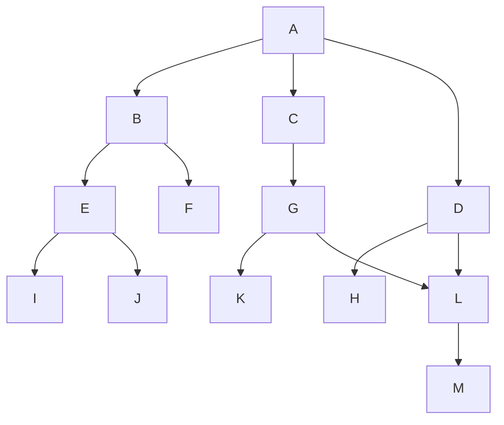

# Métodos de Búsqueda

> [!abstract] Idea general Un problema se representa como un **espacio de estados** que se recorre aplicando **reglas/operadores**, hasta llegar a un estado solución. Los _métodos de búsqueda_ son las **estrategias de control** usadas para decidir qué regla o estado elegir en cada paso.

## Representación del problema

- **Estado inicial**
- **Estados intermedios**
- **Estados finales / solución**
- **Espacio de estados** + **Operadores (reglas)**: cada regla lleva de un _estado origen (padre)_ a un _estado destino (hijo)_ mediante una acción.

### Árbol de ejemplo usado en todo el apunte



- Estado inicial: `A`
- Estados intermedios: `B, C, D, E, F, G, H, I, K, L`
- Estados solución: `J, M`

## Estrategia de control

> [!note] Definición Son las **técnicas genéricas para seleccionar reglas/estados** dentro del proceso de búsqueda.

Ciclo básico:

```
Estado inicial → Estructura de control → ¿Es solución?
        ↑                  ↓
        └──── Nuevo estado ┘
```

Dentro de la estructura de control, ante _reglas aplicables_:

- 0 reglas → no hay camino
- 1 regla → se aplica directamente
- 2+ reglas → hay que **seleccionar** cuál aplicar (aquí entra el método de búsqueda)

## Clasificación general

- **Búsqueda Ciega** (sin información del dominio)
    - Primero en Amplitud
    - Primero en Profundidad
    - Generación y Prueba
    - Bidireccional
- **Búsqueda Heurística** (con información del dominio)
    - Escalada Simple
    - Escalada por Máxima Pendiente
    - Primero El Mejor
    - Beam Search
    - A*

---

# 🔵 Búsqueda Ciega (sin información del dominio)

## Primero en Amplitud (BFS)

- Recorre **nivel por nivel**.
- Usa cola **FIFO**.
- Si el espacio es finito y hay solución, **la encuentra siempre**.
- Útil cuando hay **pocos nodos finales cercanos a la raíz**.
- ⚠️ Consume **mucha memoria**.

> [!example] Recorrido izquierda→derecha `A, B, C, D, E, F, G, H, I, J, K, L, M`

> [!example] Recorrido derecha→izquierda `A, D, C, B, H, L, G, F, E, M, L, K, J, I, M`

## Primero en Profundidad (DFS)

- Expande **una rama a la vez**.
- Usa pila **LIFO**.
- Poca memoria requerida.
- Útil cuando hay **muchos nodos solución alejados de la raíz**.
- ⚠️ No recorre todo el espacio → **no garantiza** la solución más óptima.

> [!example] Izquierda→derecha `A, B, E, I, E, J` → termina en el primer estado final hallado (J)

> [!example] Derecha→izquierda `A, D, H, D, L, M`

## Generación y Prueba

- Recorre **todos los nodos** (combina exploración total, tipo fuerza bruta).
- Permite encontrar **todos los estados solución**.
- Adecuado para **problemas sencillos**; en problemas complejos puede ser muy costoso en tiempo.

> [!example] Izquierda→derecha `A, B, E, I, E, J, E, B, F, B, A, C, G, K, G, L, M, L, G, C, A, D, L, M, L, D, H`

## Bidireccional

- Combina **dos búsquedas simultáneas**: desde el inicio hacia abajo (top-bottom) y desde el final hacia arriba (bottom-up).
- **Al menos una** de las dos debe ser en amplitud.
- Complejidad equivalente a dos búsquedas unidireccionales sobre un grafo de **la mitad de nodos**.

> [!example] Izquierda→derecha Por profundidad: `A → B → E` Por amplitud: `J → E` Resultado: `A, B, E, J`

> [!example] Derecha→izquierda Por profundidad: `A → D → H` Por amplitud: `M → L → D, G` Resultado: `A, D, L, M`

### Aplicaciones típicas (búsqueda con/sin heurística)

- Resolución de problemas de optimización
- Búsqueda de rutas de viaje
- SAGE – Whitebox Fuzzing for Security Testing (Microsoft)
- Motor de inferencias (SBC / SET)

---

# 🟢 Búsqueda Heurística (con información del dominio)

## Formas de incorporar conocimiento del dominio

1. Con una **función heurística** asociada al estado
2. Con el **costo de los caminos** aplicables

### Valores heurísticos del árbol de ejemplo

|Nodo|h|
|---|---|
|A|0|
|B|9|
|C|11|
|D|10|
|E|15|
|F|3|
|G|12|
|H|5|
|I|8|
|J|999|
|K|5|
|L|10|
|M|99|

> En estos ejemplos, **a mayor valor heurístico, más deseable es el nodo** (salvo en A*, ver más abajo).

## Escalada Simple

- Se mueve al **primer hijo** cuyo valor heurístico sea **mejor** que el del nodo actual (nunca igual).
- No hay retroceso.

> [!example] Izquierda→derecha Generados: `A, B, E, I, J` — Visitados: `A, B, E, J`

> [!example] Derecha→izquierda Generados: `A, D, H, L` — Visitados: `A, D`

## Escalada por Máxima Pendiente

- Evalúa **todos los hijos** del nodo actual y elige el **mejor de todos**.
- No hay retroceso.

> [!example] Generados: `A, B, C, D, G, K, L` — Visitados: `A, C, G`

## Primero El Mejor

- Mantiene una **lista de nodos abiertos** ordenada por prioridad (heurística).
- En cada paso, elige el **mejor nodo abierto**, aunque no sea mejor que el nodo actual.
- Ante empate, **prioriza el nodo más "viejo"**.

> [!example] Traza (heurística mayor = mejor)
> 
> |Paso|Nodo actual|Abiertos|Cerrados|
> |---|---|---|---|
> |1|A|C(11), D(10), B(9)|A|
> |2|C|G(12), D(10), B(9)|A,C|
> |3|G|D(10), L(10), B(9), K(5)|A,C,G|
> |4|D|L(10), B(9), K(5), H(5)|A,C,G,D|
> |5|L|M(99), B(9), K(5), H(5)|A,C,G,D,L|
> |6|M ✅|B(9), K(5), H(5)|A,C,G,D,L,M|

## Beam Search (N=1)

- Similar a Primero El Mejor, pero la **lista de nodos abiertos está limitada** a _N_ elementos (beam width).
- Con N=1 solo se conserva el mejor candidato en cada paso.

> [!example] Traza con N=1
> 
> |Paso|Nodo actual|Abiertos|Cerrados|
> |---|---|---|---|
> |1|A|C(11), D(10), B(9)|A|
> |2|C|G(12)|A,C|
> |3|G|L(10), K(5)|A,C,G|
> |4|L|M(99)|A,C,G,L|
> |5|M ✅|—|A,C,G,L,M|

## A*

> [!important] Fórmula `f' = h + g`
> 
> - `h`: valor heurístico del nodo
> - `g`: suma de los costos de los nodos predecesores (costo real acumulado hasta ese nodo)
> 
> En A*, se busca el **menor valor de f'** cuando la heurística representa "distancia/costo restante" — es "Primero El Mejor" + costo de las transiciones.

> [!example] Ejemplo 1 (a mayor valor, más deseable)
> 
> |Paso|Nodo actual|Abiertos|Cerrados|
> |---|---|---|---|
> |1|A|C(11-1), D(10-1), B(9-1)|A|
> |2|C|G(12-1-1), D(9), B(8)|A,C|
> |3|G|D(9), B(8), L(7), K(2)|A,C,G|
> |4|D|B(8), L(8), H(3), K(2)|A,C,G,D|
> |5|B|E(13), L(8), H(3), K(2), F(1)|A,C,G,D,B|
> |6|E|J(996), L(8), I(5), H(3), K(2), F(1)|A,C,G,D,B,E|
> |7|J ✅|L(8), I(5), H(3), K(2), F(1)|A,C,G,D,B,E,J|

> [!example] Ejemplo 2
> 
> |Paso|Nodo actual|Abiertos|Cerrados|
> |---|---|---|---|
> |1|A|D(7), C(5), B(0)|A|
> |2|D|L(6), C(5), B(0), H(-2)|A,D|
> |3|L|M(90), C(5), B(0), H(-2)|A,D,L|
> |4|M ✅|C(5), B(0), H(-2)|A,D,L,M|

---

# Tablas comparativas

## Comparación — Búsqueda Ciega

|Método|Recorre por...|Finaliza cuando...|
|---|---|---|
|Primero en Amplitud|Niveles|Recorre todo el árbol (genera todos los estados)|
|Generación y Prueba|Ramas|Recorre todo el árbol (genera todos los estados)|
|Primero en Profundidad|Ramas|Encuentra el primer Estado Final|
|Bidireccional|Niveles|Encuentra un estado intermedio común entre Estado Inicial y Estado Final (al menos uno)|

## Comparación — Búsqueda Heurística

|Método|¿Tiene retroceso?|¿Garantiza encontrar Estado Final?|Criterio de selección|Características especiales|
|---|---|---|---|---|
|Escalada Simple|No|No|Primer mejor hijo generado por el nodo actual|Solo selecciona hijos con heurística mejor que el padre (nunca igual)|
|Escalada por Máxima Pendiente|No|No|Mejor de todos los hijos del nodo actual|—|
|Primero El Mejor|No|No|Mejor nodo abierto|El nodo seleccionado puede no ser mejor que el actual|
|Beam Search|No|No|Mejor nodo abierto|Primero el Mejor + lista de nodos abiertos limitada|
|A*|No|No*|Mejor nodo abierto|Primero el Mejor + costo de las transiciones (f' = h + g)|

---

## Bibliografía / recursos

- Apunte: _"Introducción a los Métodos de Búsqueda"_
- Demo de algoritmos de búsqueda de caminos:
    - [Red Blob Games – Introduction to A*](http://www.redblobgames.com/pathfinding/a-star/introduction.html)
    - [PathFinding.js Visual](https://qiao.github.io/PathFinding.js/visual/)

## Ver también

- [[Analisis-de-Protocolos]]
- #inteligencia-artificial
- #busqueda-heurística