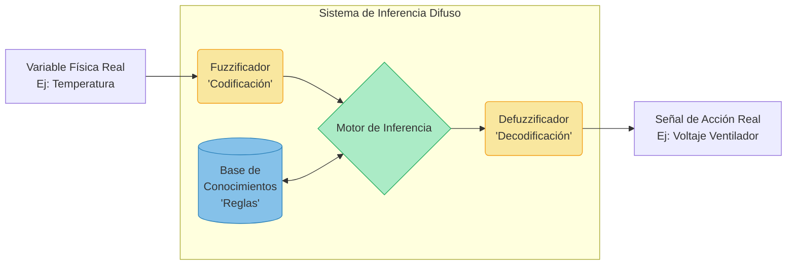
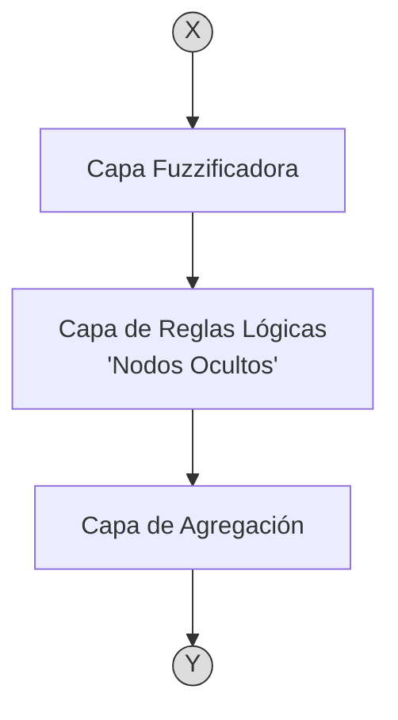

# Lógica Difusa en Inteligencia Artificial

> [!abstract] Resumen
> Apuntes consolidados sobre los modelos de representación de conocimiento, transitando desde los sistemas lógicos clásicos (Proposicional y Primer Orden) hasta el razonamiento aproximado mediante Lógica Difusa y su posterior evolución hacia sistemas híbridos (Neuro-Difusos).

## Índice de Contenidos
1. [Introducción a la Lógica en IA](#1-introducción-a-la-lógica-en-ia)
2. [Sistemas Lógicos Clásicos](#2-sistemas-lógicos-clásicos)
3. [El Problema de la Complejidad del Mundo Real](#3-el-problema-de-la-complejidad-del-mundo-real)
4. [Lógica Difusa (Fuzzy Logic)](#4-lógica-difusa-fuzzy-logic)
5. [Modelado y Operadores Difusos](#5-modelado-y-operadores-difusos)
6. [Arquitectura de Sistemas Difusos](#6-arquitectura-de-sistemas-difusos)
7. [Sistemas Neuro-Difusos](#7-sistemas-neuro-difusos)

---

## 1. Introducción a la Lógica en IA

La lógica provee los cimientos formales para modelar cómo los sistemas computacionales comprenden y procesan la información del entorno.

> [!info] Pilares de la Lógica en IA
> - **Representar:** Almacenar conocimientos estructurados en una Base de Conocimientos (BC).
> - **Deducir:** Inferir nuevos hechos y realizar conclusiones mediante un Motor de Inferencia (MI).
> - **Traducir:** Convertir la abstracción del mundo real al lenguaje matemático/computacional de los modelos de IA.

---

## 2. Sistemas Lógicos Clásicos

Antes de abordar la incertidumbre, la IA dependió de lógicas bivalentes (verdadero o falso).

### A. Lógica Proposicional
Busca evaluar la veracidad de premisas simples. Representa conocimiento
- Utiliza **letras minúsculas** ($p, q, r, s$) para representar proposiciones atómicas.
- Utiliza **operadores lógicos** booleanos: $\land$ (AND), $\lor$ (OR), $
ightarrow$ (Implicación), $\leftrightarrow$ (Bicondicional), $
eg$ (NOT).

> [!example] Ejemplo Proposicional
> - $p$: Yo estudio
> - $q$: Yo obtengo buenas calificaciones
> - $r$: Yo me divierto
> **Regla:** $[(p 
ightarrow q) \land (
eg p 
ightarrow r)] 
ightarrow (q \lor r)$

### B. Lógica de Primer Orden (LPO)
Añade expresividad para trabajar con conocimiento complejo, relaciones y cuantificadores.
- **Funciones de Verdad:** $H(x) = x 	ext{ es hombre}$, $P(x,y) = x 	ext{ se pelea con } y$.
- **Cuantificadores:** $orall$ (Para todo), $\exists$ (Existe).

> [!example] Ejemplo LPO
> "Todas las personas trazan círculos. Todos los círculos son figuras. Por lo tanto, todas las personas trazan figuras."
> $$ \left[ orall x \exists y (Px 
ightarrow T(x,y) \land Cy) \land orall x (Cx 
ightarrow Fx) 
ight] 
ightarrow orall x \exists y (Px 
ightarrow T(x,y) \land Fy) $$

### Comparativa de Lógicas Clásicas

| Característica | Lógica Proposicional | Lógica de Primer Orden |
| :--- | :--- | :--- |
| **Dominio de Valores** | Discretos (V/F) | Discretos (V/F) |
| **Complejidad** | Resuelve problemas sencillos. | Permite representar conocimiento complejo. |
| **Datos de Entrada** | Requiere datos $100\%$ precisos. | Requiere datos $100\%$ precisos. |
| **Mímesis Humana** | No imita el pensamiento humano. | No imita el pensamiento humano. |
| **Escalabilidad** | Muy difícil agregar conocimiento. | Difícil de mantener al escalar. |

---

## 3. El Problema de la Complejidad del Mundo Real

El ser humano rara vez opera con verdades absolutas. El mundo presenta matices que escapan a los sistemas discretos.

> [!warning] Factores de Incertidumbre
> 1. **Incertidumbre:** Duda o falta de seguridad. Imperfección en el estado de la naturaleza.
> 2. **Imprecisión:** Vaguedad. Desconocimiento del valor exacto (Ej: "hace mucho calor" en vez de "hace $32^\circ C$").

**Anomalías a modelar:**
- Excepciones a las reglas.
- Falta de evidencias (datos nulos).
- Información incompleta, contradictoria o errónea.
- Sistemas no deterministas.

Para lidiar con esto surgen enfoques probabilísticos (Redes Bayesianas, Cadenas de Markov) y enfoques de grados de verdad (Lógica Difusa).

> Razonamiento aproximado: Area de la IA que genera modelos que imitan el pensamiento humano. Debe lidiar con:
> - complejidad del mundo humano
> 	- no determinista
> 	- falta de evidencia
> 	- Info incompleta o contradictoria o errona
> 	- Excepciones a la regla
> - impresiciones
> - Incertidumbre

Entonces surge la **Logica** **difusa** que se mete en logica con valores continuos

| Lógica Proposicional                         | Lógica de Primer Orden                        | Lógica Difusa                                          |
| :------------------------------------------- | :-------------------------------------------- | :----------------------------------------------------- |
| Valores Discretos (VERDADERO, FALSO, ...)    | Valores Discretos (VERDADERO, FALSO, ...)     | Valores en el rango [0,00; 1,00]                       |
| Resuelve problemas sencillos                 | Permite representar conocimiento más complejo | Basado en "sentido común" y el lenguaje natural        |
| No imitan como piensan las personas muy bien | No imitan como piensan las personas muy bien  | Imita como piensan y toman las decisiones las personas |
| Necesita datos precisos                      | Necesita datos precisos                       | Tolera datos imprecisos                                |
| Difícil para agregar conocimiento            | Difícil para agregar conocimiento             | Fácil para agregar nuevo conocimiento                  |

---

## 4. Lógica Difusa (Fuzzy Logic)

Propuesta como mecanismo de **Razonamiento Aproximado**, proporciona una manera simple de obtener conclusiones a partir de entradas ambiguas, imprecisas o ruidosas.

> [!quote] Diferencia Clave
> A diferencia de la probabilidad (que mide la *posibilidad* de que ocurra un evento binario), la lógica difusa mide el **grado de pertenencia** de un individuo a una propiedad continua.

* **Valores continuos:** Transición gradual en el rango $[0.00, 1.00]$.
* **Basado en lenguaje natural:** Imita cómo las personas toman decisiones bajo "sentido común".
* **Tolerancia:** Soporta datos imprecisos y facilita agregar reglas progresivamente.

### Funciones de Pertenencia ($\mu$)
Definen en qué grado una variable "crispa" (exacta) pertenece a un conjunto difuso (etiqueta lingüística).

> [!example] Modelado de Altura
> Si definimos que una persona alta mide más de $1.80m$ y una baja menos de $1.50m$, ¿qué ocurre con alguien de $1.78m$?
> 
> En Lógica Difusa, $1.78m$ tiene pertenencia parcial a múltiples conjuntos:
> - $\mu_{ALTA}(1.78m) = 0.8$
> - $\mu_{MEDIANA}(1.78m) = 0.2$
> - $\mu_{BAJA}(1.78m) = 0.0$

$$
\mu_{ALTA}(x) = 
 egin{cases} 
1.00 & 	ext{si } x \ge 1.80 \ 
rac{x - 1.65}{1.80 - 1.65} & 	ext{si } 1.65 < x < 1.80 \ 
0.00 & 	ext{si } x \le 1.65 
\end{cases}
$$

---

## 5. Modelado y Operadores Difusos

Las operaciones lógicas clásicas se transforman para manejar grados continuos. Sean $A$ y $B$ dos conjuntos difusos:

| Operación                     | Equivalencia Clásica | Ecuación (Operadores de Zadeh)                 |
| :---------------------------- | :------------------- | :--------------------------------------------- |
| Negación                      | Not(A)               | $\mu_{A'}(x) = 1 - \mu_A(x)$                   |
| **Disyunción** (Unión)        | $A \lor B$           | $\mu_{A \cup B}(x) = \max(\mu_A(x), \mu_B(x))$ |
| **Conjunción** (Intersección) | $A \land B$          | $\mu_{A \cap B}(x) = \min(\mu_A(x), \mu_B(x))$ |
| Implicacion                   |                      |                                                |

### Flujo de Implicación (Reglas IF-THEN)
1. **Evaluar Antecedente:** Se determina la pertenencia de las variables de entrada a sus conjuntos.
	1. Agarras todo lo que hay de la izquierda del entonces y se obtiene valor de pertenencia
2. **Aplicar Operadores:** Se resuelven los AND ($\min$) y OR ($\max$) para obtener un grado único.
3. **Propagar al Consecuente:** Se "corta" o escala el conjunto de salida según el resultado del antecedente.

> [!example] Ejemplo de Implicación Compleja
> **Regla:** `SI [(alta) O (mediana)] Y (muñeca_gruesa) ENTONCES contextura_mediana`
> 
> **Entradas:** 
> - $\mu_{ALTA} = 0.8$, $\mu_{MEDIANA} = 0.2$
> - $\mu_{GRUESA} = 0.3$
> - $\mu_{PEQUEÑA} = 1$
> 
> **Cálculo:**
> $\mu_{CONTEXTURA\_MEDIANA} = \min( \max(0.8, 0.2), 0.3 )$
> $\mu_{CONTEXTURA\_MEDIANA} = \min( 0.8, 0.3 ) = 0.3$

---

## 6. Arquitectura de Sistemas Difusos

Todo sistema de control difuso sigue un pipeline específico para traducir señales del mundo real (Crisp), procesarlas mediante heurística, y emitir una acción ejecutable (Crisp).

> [!info] Etapas
> 1. **Codificación (Fuzzification):** Mapeo numérico exacto $
rightarrow$ vector de grados de pertenencia.
> 2. **Base de Reglas & MI:** Evaluación paralela de todas las reglas lógicas activas.
> 3. **Decodificación (Defuzzification):** Agregación geométrica de las salidas difusas (ej. centroide) para obtener un único valor de acción concreto.

### Aplicaciones y Limitaciones

**Casos de Éxito:**
- *Domótica/Línea Blanca:* Ciclos de lavarropas automáticos según turbidez del agua.
- *Automoción:* Control de tracción, frenado ABS, vehículos autónomos.
- *Robótica y Tráfico:* Control semafórico no lineal y navegación de agentes.
- *Medicina:* Apoyo en diagnóstico interpretando matices de síntomas.

**Críticas:**
- Carecen de capacidad de aprendizaje automático nativo. Las reglas deben ser ajustadas a mano por un experto.
- A medida que crece la dimensionalidad de las reglas, la validación matemática se complica y la performance puede ser inferior a un modelo probabilístico puro.

---

## 7. Sistemas Neuro-Difusos

Para subsanar las limitaciones de aprendizaje, surgen los modelos híbridos (ANFIS: Adaptive Neuro-Fuzzy Inference System).

> [!note] Fusión de Paradigmas
> - **Redes Neuronales:** Aportan el mecanismo de *aprendizaje por gradiente* y extracción de características/patrones desde los datos crudos.
> - **Lógica Difusa:** Aporta la *explicabilidad* (caja blanca) y la inyección inicial de *conocimiento experto* a través del razonamiento humano.

Estos modelos ajustan dinámicamente las formas de las curvas de pertenencia ($\mu$) minimizando el error iterativamente, logrando sistemas robustos y adaptativos.
> Combinan capacidad de reconocer patrones de las redes neuronales con la capacidad de razonar y simular pensamiento humano de logica difusa. Tiene
> - Reconocimiento de patrones
> - Razonamiento aproximado
> - Explicababilidad de redes neuronales