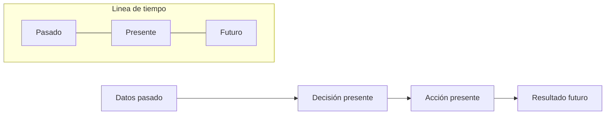
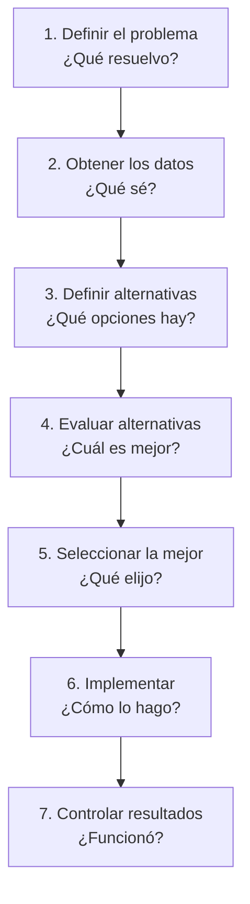
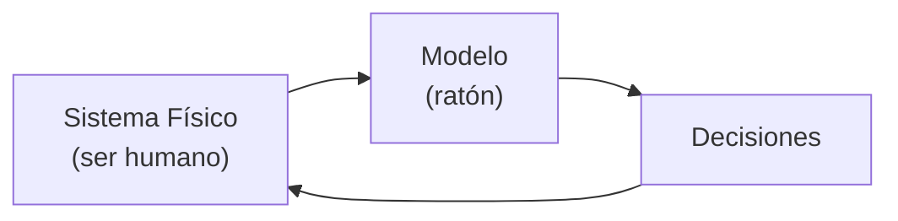
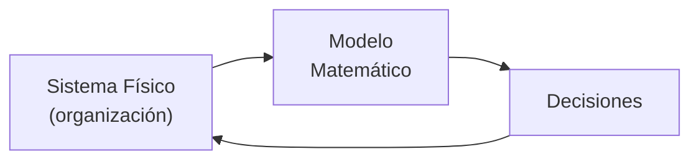
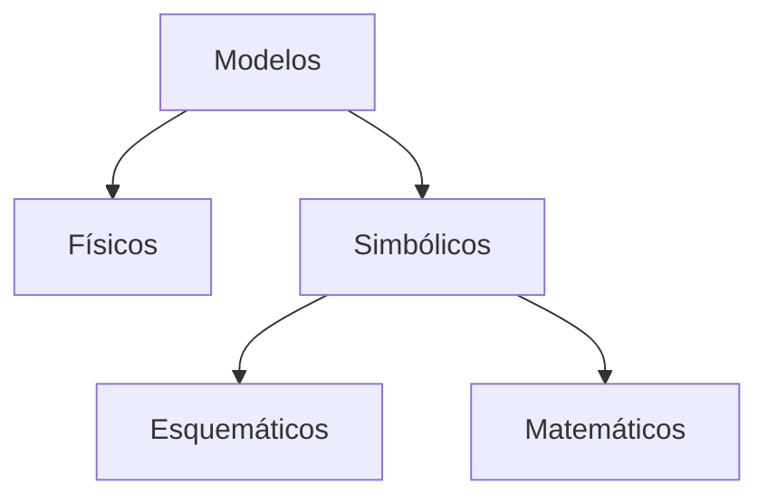
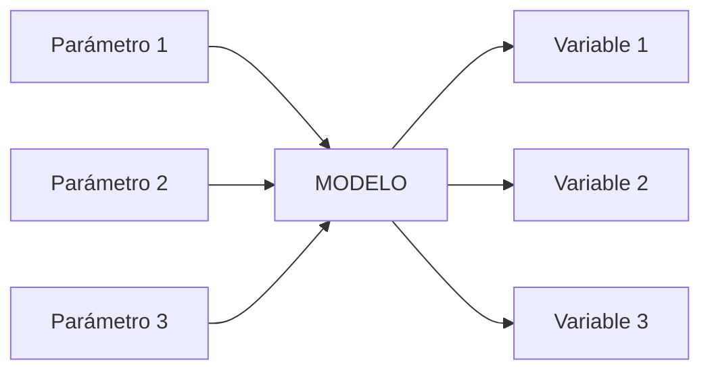
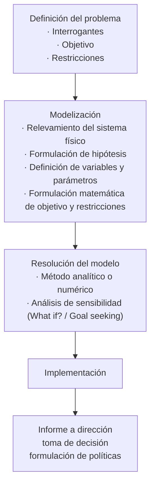
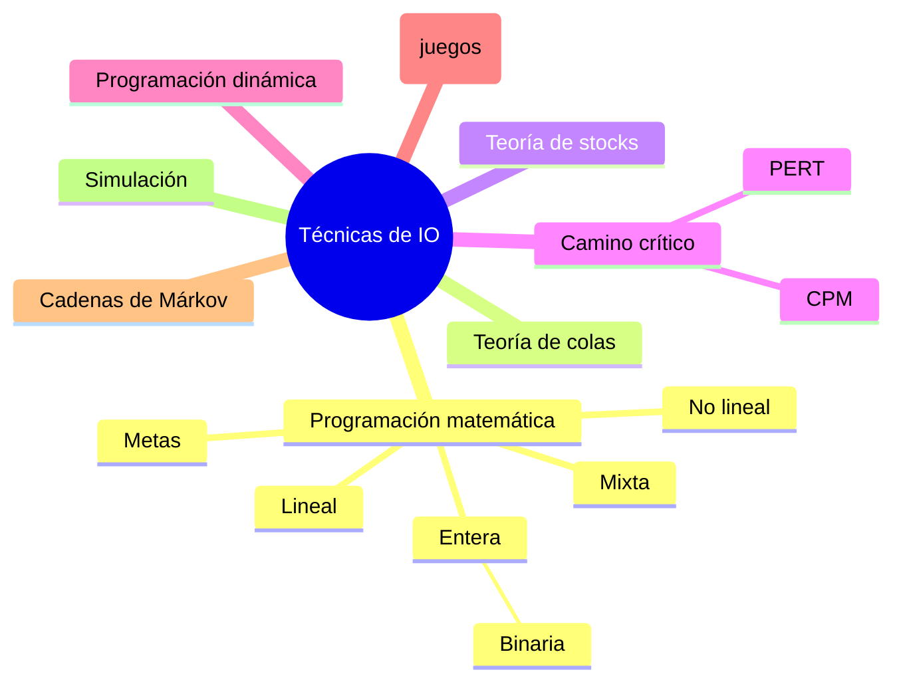

# 1. Introducción a la Investigación de Operaciones

## 1.1 Objetivos del curso

- Formar profesionales (los alumnos) capaces para decidir en sistemas empresariales complejos y cambiantes.
- Desarrollar criterios de **optimización**, **modelización** y **análisis de resultados**.
- Introducir la *metodología de decisión empresarial* y *modelos lineales*, aplicados a industrias y áreas afines.
- Capacitar en modelización con variables continuas, enteras (para cantidad de personal a asignar) y binarias (de activacion para verdadero o falso).
- Incorporar la administración de proyectos: cálculo del camino crítico e inventario.

---

# 2. Toma de decisiones

**En base a experiencia y criterios subjetivos**

- Sentido común
- Experiencia
- Connotaciones morales, éticas, religiosas, etc.

** O se puede hacer en base a técnicas y métodos cuantitativos**

- Investigación Operativa
- Modelos matemáticos
- Optimización

## 2.1 Proceso de toma de decisiones

> El proceso toma **datos del pasado**, con ellos se **decide y actúa en el presente**, y el **resultado se observa en el futuro**.

---

# 3. Administración Científica
Es un método que usa la **investigación operativa** para resolver modelos matemáticos.
Los 7 pasos:

| #   | Paso                 | Clave                             |
| --- | -------------------- | --------------------------------- |
| 1   | Definir el problema  | ¿Qué resuelvo?                    |
| 2   | Obtener los datos    | ¿Qué sé?¿A donde voy a buscar?    |
| 3   | Definir alternativas | ¿Qué opciones hay con esos datos? |
| 4   | Evaluar alternativas | ¿Cuál es mejor?                   |
| 5   | Seleccionar la mejor | ¿Qué elijo?                       |
| 6   | Implementar          | ¿Cómo lo hago?                    |
| 7   | Controlar resultados | ¿Funcionó?                        |

---

# 4. Origen histórico: la Segunda Guerra Mundial

La Investigación Operativa moderna nace basada en:

- Investigación operativa
- Investigación de operaciones

## 4.1 Pioneros de la Investigación Operativa

- George Dantzig
- Richard Bellman
- Andrei A. Markov
- A. K. Erlang
- John Little
- J. Von Neumann
- F. W. Harris

---

# 5. Definición de Investigación Operativa

> Aplicación de la ciencia moderna a problemas complejos que aparecen en la administración de sistemas integrados por:
> 
> **Hombres – Materiales – Equipos – Capital – Organización – Tecnología**
> 
> en la industria, el comercio, el gobierno y la defensa.

## 5.1 Componentes

- **Toma de decisiones**
- **Métodos matemáticos**
    - Cuantitativos (analíticos)
    - Numéricos (simulación)

## 5.2 Característica primordial

Elaboración de modelos matemáticos que, mediante la incorporación de factores de riesgo e incertidumbre, permiten:

- Evaluar decisiones
- Formular políticas
- Analizar alternativas
- Sacar conclusiones

> Modelo un pedazo de la realidad para tomar desiciones
---

# 6. Modelos

## 6.1 Concepto

- Un modelo es una **representación simplificada de la realidad**.
- Los modelos no deben ser ni tan simples que no reflejen esa realidad, ni tan complejos que sean imposibles de manejar.

## 6.2 Modelo como representación de un sistema físico

## 6.3 Razones para construir un modelo
Algunas de ellas son:
- Estudiar el comportamiento de sistemas complicados
- Predecir su futuro comportamiento
- Examinar su reacción frente a circunstancias cambiantes
- Tomar decisiones y/o sacar conclusiones

## 6.4 Clasificación de Modelos

Pueden tener mas de una clasificacion.

## 6.5 Clasificación de modelos matemáticos

| Criterio                                     | Categorías                                                  |
| -------------------------------------------- | ----------------------------------------------------------- |
| En base al tiempo                            | Históricos (retrospectivos) · Planeamiento (prospectivos)   |
| En base al objetivo                          | Optimizantes (decisionales) · Descriptivos (conclusionales) |
| En base a la certidumbre                     | Determinísticos · Aleatorios (estocásticos)                 |
| En base a la naturaleza de sus variables     | Lineales · No lineales                                      |
| En base a su evolución                       | Estáticos no cambian · Dinámicos cambian                    |
| En base al propósito de aplicación           | Propósito particular · Propósito general                    |
| En base al método de resolución              | Cuantitativos (analíticos) · Numéricos (de simulación)      |
| En base al método de búsqueda de la solución | Algorítmicos · Heurísticos                                  |

## 6.6 Esquema general de un modelo

## 6.7 Necesidades para construir un modelo
Requisitos para construir un modelo:
- Experiencia previa - No puedo modelar si no se que modelo
- Comprensión del problema: discernimiento de lo esencial a modelar
- Conocimiento aportado por el usuario - No le puedo consultar a cualquier usuario
- Aplicación de metodología adecuada: prueba y error

---

# 7. Metodología

## 7.1 Etapas detalladas

1. **Definición del problema**: 
	- interrogantes - Que no tengo? 
	- objetivo - Que quiero resolver
	- restricciones - Limitantes para modelar
2. **Modelización**: 
	- relevamiento del sistema físico (sistema real)
	- formulación de hipótesis
	- definición de variables y parámetros
	- formulación matemática de objetivo y restricciones.
3. **Resolución del modelo**:
    - Método: analítico o numérico
    - Análisis de sensibilidad: _What if?_ / _Goal seeking_ - Evaluo todos los caminos posibles
4. **Implementación del modelo**
5. **Informe a dirección**, toma de decisión, formulación de políticas.

---

# 8. Ámbito de aplicación

- Planeamiento
- Programación
- Asignación de recursos
- Control

## 8.1 Algunos ejemplos de aplicación de la Investigación Operativa

- Planeamiento y programación de la producción
- Mezcla de pintura, licores, etc.
- Distribución de productos
- Administración de stocks
- Asignación de personal
- Problemas de congestión y espera
- Evaluación de inversiones
- Optimización de medios
- Minimización de desperdicios
- Administración de proyectos

---

# 9. Técnicas frecuentes de la Investigación Operativa

- Programacion matematica
	- lineal
	- no lineal
	- mixta
	- entera
		- binaria
- Teoria de stocks
- Camino critico
	- PERT
	- cpm
- Programacion dinamica
- Teoria de decision
- Cadenas de markov
- Simulacion

---

# 10. Rol de los métodos cuantitativos / numéricos

- Guiar la toma de decisiones
- Ayudar a la toma de decisiones
- Automatizar la toma de decisiones (El modelo debe actualizarse)
- Justificar las decisiones
- Sacar conclusiones
- Formular políticas y estrategias

---

_Fuente: cátedra Investigación Operativa, UTN.BA — Mg. Ing. Andrea Zumino (act. 2026 1C)_