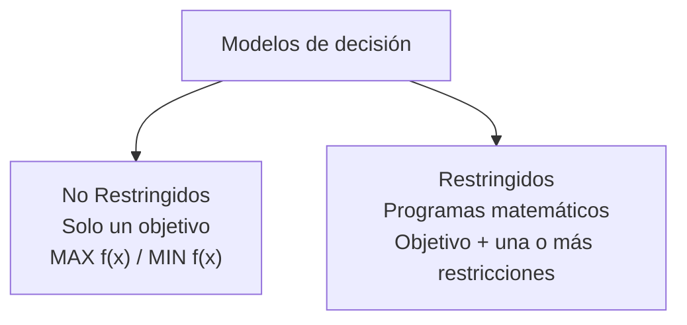
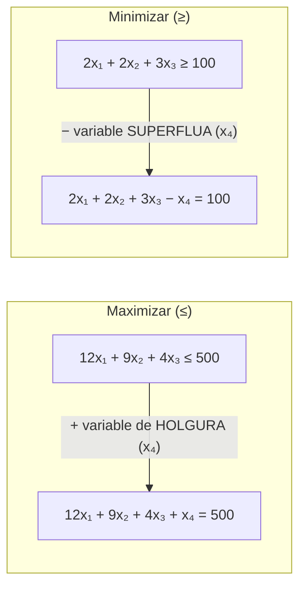
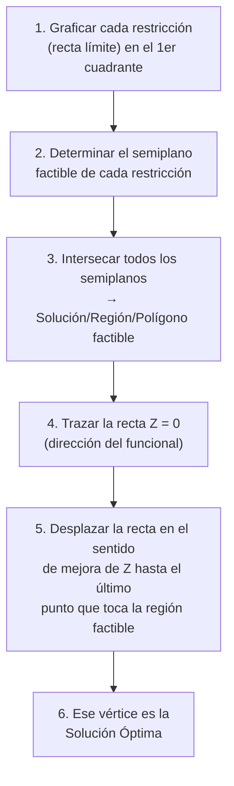
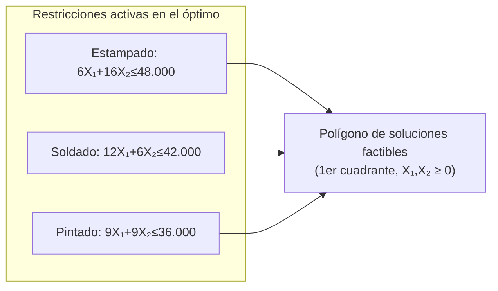
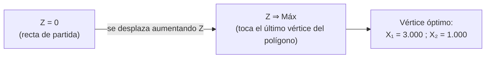

# 1. Programación matemática

Los modelos de decisión, también llamados **optimizantes**, son aquellos que formulan una **función objetivo** a maximizar o minimizar.

La resolución de estos problemas consiste en determinar el valor que deben tener las variables para alcanzar el mejor valor de la función objetivo.

- MAX f(x) (generalmente ganancias)
- MIN f(x) (generalmente recursos)
Para el mismo modelo puedo estar haciendo ambas
## 1.1 Modelos de decisión

Ejemplo de modelo **no restringido**:

$$MIN: 3 \cdot x_1 + \frac{2}{x_1} + \ln x_2 + 4 \cdot x_1 \cdot x_2$$

## 1.2 Formulación general de un programa matemático

$$MAX: \quad Z = f(x)$$ $$\text{Sujeto a:}$$ $$g_1(x) \le b_1$$ $$g_2(x) \le b_2$$ $$\dots$$ $$g_m(x) \le b_m$$

---

# 2. Programación Lineal

$$\text{Maximizar} \quad \sum c_j x_j$$ $$\text{sujeto a un conjunto de restricciones} \quad \sum a_{ij} x_j \le b_i$$ $$\text{siendo} \quad x_j \ge 0$$

## 2.1 Función objetivo

 Maximizar $$Z = \sum c_j x_j$$
Z se la conoce como funcion objetivo o del funcional
Ejemplo: $Z = 6 x_1 + 8 x_2 + 3 x_3$

- La expresión completa se llama el **funcional**.
- Los valores 6, 8 y 3 son los **coeficientes del funcional**.
- $x_1, x_2, x_3$ son las **variables de decisión**.

## 2.2 Restricciones

Conjunto de inecuaciones o ecuaciones — **condiciones de vínculo**:

$$\sum a_{ij} x_j \le b_i \qquad \sum a_{ij} x_j \ge b_i \qquad \sum a_{ij} x_j = b_i$$

### 2.2.1 Condiciones del vínculo

Ejemplo: $12 x_1 + 9 x_2 + 4 x_3 \le 500$

- $12$, $9$, $4$ → **coeficientes tecnológicos**
- $500$ → **RHS** (_Right Hand Side_, o término independiente)

## 2.3 Condiciones

- **Condiciones de las variables $x_j$**: 
	- no negatividad
	- continuidad.
- **Condiciones de los términos independientes (RHS) $b_j$**: 
	- no negatividad (en su forma estándar).

## 2.4 De inecuación a ecuación: variables slack
Pasa de una inecuacion a una ecuacion

- En **Maximizar**, se agrega una variable de **holgura** (suma) para convertir "≤" en "=".
- En **Minimizar**, se resta una variable **superflua** (excedente) para convertir "≥" en "=".
> **Canonico** es como me viene la ecuacion de una. Standard es pasarla a una **ecuacion** con coeficientes lineales y termino independiente.

---

# 3. Formas de formulación de un modelo de PL

| Forma              | Restricciones                  | Descripcion                                  |
| ------------------ | ------------------------------ | -------------------------------------------- |
| **Natural**        | Mezcla de "≤", "≥" y "="       | Como viene dado el planteo                   |
| **Canónica** (MAX) | Todas las restricciones de "≤" | Tiene todas las restricciones con MenorIgual |
| **Canónica** (MIN) | Todas las restricciones de "≥" | Tiene todas las restricciones con MayorIgual |
| **Estándar**       | Todas las restricciones de "=" | Es una ecuacion comunarda con un =           |

## 3.1 Ejemplo — Forma Natural

$$MAX: 6x_1 + 8x_2 + 3x_3$$ $$\text{Sujeto a:}$$ $$12x_1 + 9x_2 + 4x_3 \le 500$$ $$3x_1 + 15x_2 + 6x_3 \le 700$$ $$2x_1 + 2x_2 + 3x_3 \ge 100$$ $$7x_1 + 4x_2 + 3x_3 = 200$$ $$x_j \ge 0$$

## 3.2 Ejemplo — Forma Estándar

Se agregan variables slack ($x_4$, $x_5$) y superflua ($x_6$) para que todas las restricciones queden como igualdades:

$$12x_1 + 9x_2 + 4x_3 + x_4 = 500$$ $$3x_1 + 15x_2 + 6x_3 + x_5 = 700$$ $$2x_1 + 2x_2 + 3x_3 - x_6 = 100$$ $$7x_1 + 4x_2 + 3x_3 = 200$$ $$x_j \ge 0$$
> **Aclaracion**: Las variables slack estan en la forma standard multiplicadas por 0.
## 3.3 Ejemplo — Forma Canónica de Max

| Natural                            | Canónica                   |
| ---------------------------------- | -------------------------- |
| $12x_1+9x_2+4x_3 \le 500$          | $12x_1+9x_2+4x_3 \le 500$  |
| $3x_1+15x_2+6x_3 \le 700$          | $3x_1+15x_2+6x_3 \le 700$  |
| $2x_1+2x_2+3x_3 \ge 100$           | $-2x_1-2x_2-3x_3 \le -100$ |
| $7x_1+4x_2+3x_3 = 200$             | $7x_1+4x_2+3x_3 \le 200$   |
| Aca divido y multiplico por -1 ->  | $-7x_1-4x_2-3x_3 \le -200$ |

> Toda igualdad "=" se descompone en dos desigualdades ("≤" y "≥")

> Para el caso de $\ge$ multiplico por -1.
## 3.4 Ejemplo — Forma Canónica de Min

|Natural (MAX)|Canónica (MIN)|
|---|---|
|$MAX: 6x_1+8x_2+3x_3$|$MIN: -6x_1-8x_2-3x_3$|
|$12x_1+9x_2+4x_3 \le 500$|$-12x_1-9x_2-4x_3 \ge -500$|
|$3x_1+15x_2+6x_3 \le 700$|$-3x_1-15x_2-6x_3 \ge -700$|
|$2x_1+2x_2+3x_3 \ge 100$|$2x_1+2x_2+3x_3 \ge 100$|
|$7x_1+4x_2+3x_3 = 200$|$7x_1+4x_2+3x_3 \ge 200$|
||$-7x_1-4x_2-3x_3 \ge -200$|
> Para pasar de maximizacion a minimizacion multiplico por -1 la funcion objetivo
## 3.5 Forma Canónica (general)

$$MAX: c_1x_1 + c_2x_2 + c_3x_3 + \dots + c_kx_k$$ $$\text{Sujeto a:}$$ $$a_{11}x_1 + a_{12}x_2 + \dots + a_{1k}x_k \le b_1$$ $$a_{21}x_1 + a_{22}x_2 + \dots + a_{2k}x_k \le b_2$$ $$\vdots$$ $$a_{m1}x_1 + a_{m2}x_2 + \dots + a_{mk}x_k \le b_m$$ $$x_j \ge 0$$

## 3.6 Forma Estándar (general)
Agregando slack

$$MAX: c_1x_1 + c_2x_2 + \dots + c_kx_k$$ $$\text{Sujeto a:}$$ $$a_{11}x_1 + \dots + a_{1k}x_k + x_{k+1} = b_1$$ $$a_{21}x_1 + \dots + a_{2k}x_k + x_{k+2} = b_2$$ $$\vdots$$ $$a_{m1}x_1 + \dots + a_{mk}x_k + x_n = b_m$$ $$x_j \ge 0$$

## 3.7 Forma matricial extendida

| X1  | X2  | X3  |     | RHS |
| --- | --- | --- | --- | --- |
| 6   | 8   | 3   | →   | MAX |
| 12  | 9   | 4   | ≤   | 500 |
| 3   | 15  | 6   | ≤   | 700 |
| 2   | 2   | 3   | ≥   | 100 |
| 7   | 4   | 3   | =   | 200 |

---

# 4. Método Gráfico

## 4.1 Ejercicio 1 — Planteo de un caso

En un taller metalúrgico se fabrican dos tipos de piezas, **A** y **B**, que deben seguir los siguientes procesos: estampado, soldado y pintado. Los insumos de equipos son los siguientes (en segundos por pieza):

|Operación|A (seg/u)|B (seg/u)|Tiempo disponible (seg/sem)|
|---|---|---|---|
|Estampado|6|16|48.000|
|Soldado|12|6|42.000|
|Pintado|9|9|36.000|

- La utilidad unitaria es de **$4** para la pieza A y **$3** para la pieza B.
- Se desea establecer el programa semanal de producción que **maximice la utilidad** del taller respecto a las piezas consideradas.

## 4.2 Definición del problema

- **Interrogantes**: producción de piezas A y B
- **Objetivo**: maximizar utilidades
- **Restricciones**: limitación de tiempo disponible para los equipos de Estampado, Soldado y Pintado

## 4.3 Hipótesis del modelo

- Producción continua
- No se consideran feriados ni horas extra
- No hay limitaciones de despacho, almacenamiento ni demanda
- El sobrante de tiempo de los equipos no se utiliza
- No hay inflación

## 4.4 Definición de variables

- $X_1$: Producción de piezas A (piezas/sem)
- $X_2$: Producción de piezas B (piezas/sem)

## 4.5 Formulación matemática

**Funcional** $$Z = 4X_1 + 3X_2 \quad (\text{Máx.})$$

**Condiciones de vínculo** $$\text{EST) } 6X_1 + 16X_2 \le 48.000$$ $$\text{SOL) } 12X_1 + 6X_2 \le 42.000$$ $$\text{PIN) } 9X_1 + 9X_2 \le 36.000$$

**Condiciones de no negatividad** $$X_1, X_2 \ge 0$$

## 4.6 Forma matricial extendida del caso

|      | X1  | X2  | Signo | RHS    |
| ---- | --- | --- | ----- | ------ |
| Z)   | 4   | 3   |       | MAX    |
| EST) | 6   | 16  | ≤     | 48.000 |
| SOL) | 12  | 6   | ≤     | 42.000 |
| PIN) | 9   | 9   | ≤     | 36.000 |
| Var. | NN  | NN  |       |        |

## 4.7 Formulación como sistema de ecuaciones (forma estándar)
Sumo superfluo o resto slack para estandarizar
$$6X_1 + 16X_2 + X_3 = 48.000$$
$$12X_1 + 6X_2 + X_4 = 42.000$$ $$9X_1 + 9X_2 + X_5 = 36.000$$ $$X_1, X_2, X_3, X_4, X_5 \ge 0$$ $$Z = 4X_1 + 3X_2 ; (\text{Máx.})$$

### 4.7.1 Interpretación de las variables slack

- $X_3$: sobrante equipo Estampado (seg/sem)
- $X_4$: sobrante equipo Soldado (seg/sem)
- $X_5$: sobrante equipo Pintado (seg/sem)

> Cuando **maximizo** obtengo el sobrante o lo no usado para llegar al maximo
> Cuando **minimizo** obtengo el faltante o lo que me hace falta para llegar al minimo

# 5. Solución Gráfica

## 5.1 Procedimiento

## 5.2 Rectas de restricción (intersección con los ejes)

Para cada restricción se hace $X_1=0$ y $X_2=0$ alternativamente:

|Restricción|Ecuación|Si $X_1=0$ → $X_2=$|Si $X_2=0$ → $X_1=$|
|---|---|---|---|
|Estampado|$6X_1+16X_2=48.000$|3.000|8.000|
|Soldado|$12X_1+6X_2=42.000$|7.000|3.500|
|Pintado|$9X_1+9X_2=36.000$|4.000|4.000|

_(Valores de la gráfica del apunte en escala de miles: 3, 8 / 7, 3.5 / 4, 4)_

## 5.3 Región factible

El gráfico muestra el **recinto de soluciones**. Cualquiera de los puntos del polígono satisface concurrentemente las restricciones y es una **solución factible**.

## 5.4 Tipos de soluciones

- **Solución factible**: cumple simultáneamente las condiciones de vínculo (restricciones) y las condiciones de no negatividad de las variables.
- **Solución básica**: existe un número de variables iguales a 0, por lo menos igual al **grado de libertad** del sistema: $$\text{Grado de libertad} = N^\circ \text{ de incógnitas} - N^\circ \text{ de ecuaciones}$$ Para este caso: $n=5$ variables, $m=3$ restricciones → grado de libertad = 2 (se anulan 2 variables por punto).
	- Al menos n variables igual al grado de libertad se hacen 0
	- Son las intersecciones entre restricciones
- **Solución básica factible**: cumple con la doble condición de ser básica **y** ser factible (son los **vértices** del polígono).

## 5.5 Solución óptima

**Solución óptima**: la mejor solución posible entre todas las que cumplen las restricciones.

Procedimiento para maximizar $Z=4X_1+3X_2$:

1. Se traza la recta con $Z=0$: $0 = 4X_1+3X_2$ → $X_1 = -\tfrac{3}{4}X_2$
2. Se desplaza la recta paralela a sí misma en la dirección creciente de $Z$.
3. El último punto donde la recta toca el polígono (antes de dejar de intersecarlo) es la **solución óptima**.

### 5.5.1 Resultado

$$X_1 = 3.000 \qquad X_2 = 1.000$$ $$Z = 4X_1 + 3X_2 = 4(3.000) + 3(1.000) = 15.000$$

## 5.6 Análisis de variables y soluciones

- $X_1$ y $X_2$ son variables **reales** o "fuertes".
- $X_3$, $X_4$ y $X_5$ son variables **slack** o "débiles".
- Las variables slack son los sobrantes de recursos: se llaman **variables de holgura** en maximización.
- En minimización, las variables slack son los excedentes sobre los requerimientos mínimos: se llaman **variables superfluas**.

Ejemplo — sobrante en Estampado para la solución óptima:

$$6X_1 + 16X_2 + X_3 = 48.000$$ $$6(3.000) + 16(1.000) + X_3 = 48.000 ;\Rightarrow; X_3 = 14.000$$
Sobrante de 14000 de estampado

|Variable|Significado|Valor en el óptimo|
|---|---|---|
|$X_1$|Producción de A|3.000|
|$X_2$|Producción de B|1.000|
|$X_3$|Holgura Estampado|14.000|
|$X_4$|Holgura Soldado|0 (restricción activa)|
|$X_5$|Holgura Pintado|0 (restricción activa)|

---

# 6. Práctica

De la guía práctica:

- **Consigna 1**: Formular y Resolver Gráficamente → ejercicios 1.1 al 1.4
- **Consigna 3**: Resolver Gráficamente → ejercicios 3.1 al 3.4

---

_Fuente: cátedra Investigación Operativa, UTN.BA — Mg. Ing. Andrea Zumino (act. 2026 1C)_