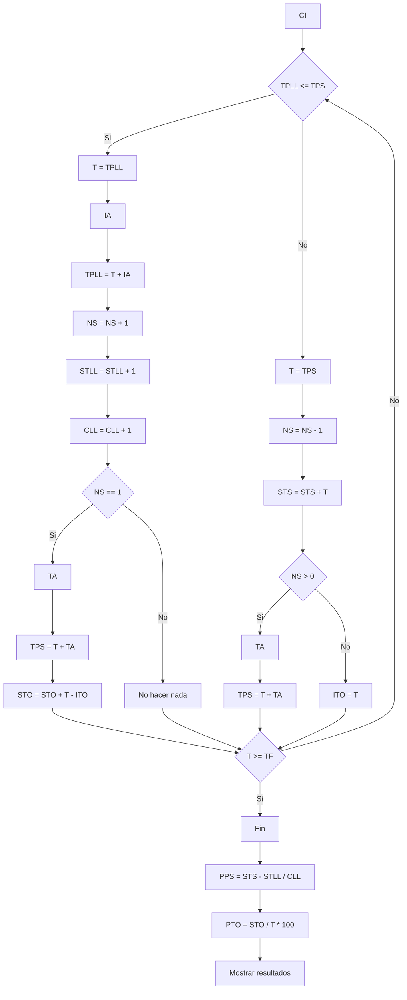

*Se tienen como datos (f.d.p.) al intervalo de arribo de los clientes a la cola y al tiempo de atencion del puesto. Se quiere determianr el promedio de permanencia de los clientes al sistema y tambien el porcentaje de tiempo ocioso del puesto de atencion. Se sabe que hay un unico puesto de atencion y que el sistema es cautivo, no hay arrepentimiento, es decir, la unica forma de salir del sistema es siendo atendido*
### Analisis previo
##### Metodologia
Evento a evento. Esto significa que hay al menos un dato que encadena eventos. En el ejemplo, IA encadena LLEGADAS.
##### Datos
- IA -> intervalo entre arribos (f.d.p.)
- TA -> tiempo de atencion (f.d.p.)
###### Variables de control
Esta implicito debido a que es una unica simulacion con un solo caso. Existe un unico puesto de atencion.
##### Variables de resultado
- PPS -> promedio de permanencia en el sistema
- PTO -> Porcentaje de tiempo ocioso del puesto de atencion
##### Eventos
- La LLEGADA del cliente al sistema. Hace que el Ns se incremente
- La SALIDA de un cliente al sistema. Hace que el Ns disminuya
##### Tabla de eventos independientes (TEI)

| Evento  | EFNOC   | EFC    | Condición |
| ------- | ------- | ------ | --------- |
| LLEGADA | LLEGADA | SALIDA | NS=1      |
| SALIDA  | ---     | SALIDA | NS > 0    |
###### Aclaraciones
1. A partir de una LLEGADA, como conozco el intervalo entre llegadas, puedo poner que el proximo evento no condicionado es esa misma llegada. En cambio, si no lo conociese, no pongo NADA
2. En EFC no puede ir llegada porque la LLEGADA se genera sin condicion. Entonces va SALIDA O VACIA. Como conozco el TA puedo aproximar la hora de salida y por ende pongo SALIDA pero con una condicion, que solo esta persona este en el sistema
3. En una salida se puede saber cuando se produce la proxima SALIDA porque conocemos el TA
##### Tabla de eventos futuros
- TPLL -> tiempo/instante de proxima llegada
- TPS -> tiempo/instante de proxima salida
### Diagrama de flujo

## Resultados

### PPS - Promedio de Permanencia en el Sistema

$$
PPS = \frac{(TS_1 - TLL_1) + (TS_2 - TLL_2) + \dots + (TS_N - TLL_N)}{CLL}
$$

$$
PPS = \frac{(TS_1 + TS_2 + \dots + TS_N) - (TLL_1 + TLL_2 + \dots + TLL_N)}{CLL}
$$

$$
PPS = \frac{STS - STLL}{CLL}
$$

- **STS**: sumatoria de los instantes de salida de los clientes  
- **STLL**: sumatoria de los instantes de llegada de los clientes  
- **CLL**: cantidad de clientes que llegaron al sistema  

Actualizaciones:
- En una **SALIDA**:  
  - `STS = STS + T`
- En una **LLEGADA**:  
  - `STLL = STLL + T`  
  - `CLL = CLL + 1`
### PTO - Porcentaje de Tiempo Ocioso

\[
PTO = \frac{STO}{T} \cdot 100
\]

- **STO**: sumatoria de todos los tiempos ociosos  
- **T**: tiempo total de simulación  
### Lógica de tiempo ocioso

El sistema queda ocioso cuando:
- Se va el último cliente  
- Es decir: cuando ocurre una **SALIDA** y `NS = 0`

Entonces:
- `ITO = T` (inicio del tiempo ocioso)

El sistema deja de estar ocioso cuando:
- Llega un nuevo cliente y es el primero  
- Es decir: cuando `NS = 1`

Tiempo ocioso acumulado:
- `T - ITO`

Actualización:
- `STO = STO + (T - ITO)`  
- Esto se hace en la rama de **LLEGADA**

### Condiciones Iniciales (CI)

- `STS = 0`
- `STLL = 0`
- `CLL = 0`
- `STO = 0`
- `T = 0`
- `ITO = 0`
- `NS = 0`
- `TPLL = 0`
- `TPS = HV`

Notas:
- El sistema empieza con una **LLEGADA**
- `HV` (High Value): valor muy grande (mayor que cualquier tiempo de la simulación)