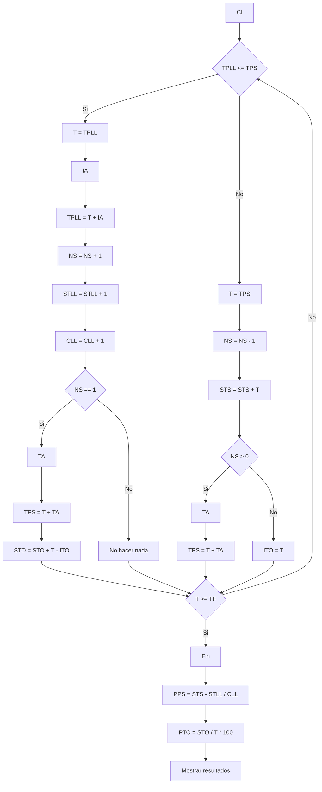

*Se tienen como datos (f.d.p.) al intervalo de arribo de los clientes a la cola y al tiempo de atencion del puesto. Se quiere determianr el promedio de permanencia de los clientes al sistema y tambien el porcentaje de tiempo ocioso del puesto de atencion. Se sabe que hay un unico puesto de atencion y que el sistema es cautivo, no hay arrepentimiento, es decir, la unica forma de salir del sistema es siendo atendido*
Se pide:
- Promedio de pertenencia en el sistema PPS
- Porcentaje de tiempo ocioso en el puesto de atención PTO
### Analisis previo
##### Metodologia
Evento a evento. Esto significa que hay al menos un dato que encadena eventos. En el ejemplo, IA encadena LLEGADAS.
##### Datos (SON FDP)
- IA -> intervalo entre arribos (f.d.p.)
	- Es evento desencadenante -> puedo resolver con EaE.
- TA -> tiempo de atencion (f.d.p.)
###### Variables de control
Esta implicito debido a que es una unica simulacion con un solo caso. Existe un unico puesto de atencion. No es un caso de simulacion.
##### Variables de resultado
- PPS -> promedio de permanencia en el sistema
- PTO -> Porcentaje de tiempo ocioso del puesto de atencion
##### Variables de estado
- Ns -> Numero de clientes en el sistema
##### Eventos
- La LLEGADA del cliente al sistema. Hace que el Ns se incremente
- La SALIDA de un cliente al sistema. Hace que el Ns disminuya
##### Tabla de eventos independientes (TEI)

| Evento  | EFNOC   | EFC    | Condición |
| ------- | ------- | ------ | --------- |
| LLEGADA | LLEGADA | SALIDA | NS=1      |
| SALIDA  | ---     | SALIDA | NS > 0    |
Ns = 1 porque es la SALIDA especifica a la LLEGADA de un cliente especifico. Entonces esa salida SOLO se genera cuando este cliente es el ultimo.
>[!IMPORTANT]
>***Generar***: Determinar el momento exacto de ocurrencia del proximo evento. Entonces SOLO PUEDO DETERMINAR EL MOMENTO DE SALIDA CUANDO Ns = 1.

>[!IMPORTANT]
>Cada vez que se produce una salida, calculo el tiempo de llegada del proximo cliente. Si existe un cliente en la fila $Ns > 0$. Entonces puedo generar el tiempo de atencion y estimar el TPS

CONDICION: Me dice bajo que condicion **puedo estimar el tiempo de ocurrencia del evento condicionado**. No me dice que va a pasar el evento me dice que puedo estimar el instante del proximo evento.

##### Tabla de eventos futuros
- TPLL -> tiempo/instante de proxima llegada. Se carga/modifica cada vez que se produce una llegada porque **una llegada es un evento encadenador**.
- TPS -> tiempo/instante de proxima salida
###### Aclaraciones
1. A partir de una LLEGADA, como conozco el intervalo entre llegadas, puedo poner que el proximo evento no condicionado es esa misma llegada. En cambio, si no lo conociese, no pongo NADA
2. En EFC no puede ir llegada porque la LLEGADA se genera sin condicion. Entonces va SALIDA O VACIA. Como conozco el TA puedo aproximar la hora de salida y por ende pongo SALIDA pero con una condicion, que solo esta persona este en el sistema
3. En una salida se puede saber cuando se produce la proxima SALIDA porque conocemos el TA

### Diagrama de flujo

##### Llegada
1. Avanzo tiempo hasta instante T = TPL
2. Genero intervalo de arribo IA
3. Sumo CLL = CLL + 1
4. Sumo STLL = STLL + T (sumo tiempo de llegada al acumulado)
5. Actualizo T = T + IA
6. Actualizo Ns = Ns + 1
7. Si Ns = 1 genero Ta=A y TPS = T = TA .
8. Agrego tiempo ocioso  STO = STO + (T - ITO)
9. Ver si fin de la simulacion
##### Salida
1. Avanzo a instante T = TPS
2. Determino tipo de evento (se que es una Salida)
3. Sumo STS = STS + T (sumo tiempo de llegada al acumulado)
4. No tiene EFNOC entonces sigo
5. Actualizo Ns = Ns - 1
6. Si Ns > 0 TPS = T + TA. Sino -> ITO = ITO + T (Sumo tiempo ocioso)
#### Errores
1. TPS no se actualiza cuando Ns <= 0 entonces queda el valor viejo y entra en un bucle infinito. En cada iteracion TPS < TPLL. Debo poner TPS = HV para evitar este problema. Ademas si Ns = 0 lo proximo que debe pasar es una llegada
2. Cuando cierro el experimento por tiempo y me queda un cliente en el sistema cargo su tiempo de entrada pero NO su tiempo de salida. Como la STLL > STS el promedio da negativo
###### Atencion
Solo cuando se produce una salida puedo generar el proximo TA. Esto se repite varios minutos mientras que T < TF (tiempo final)
## Resultados

### PPS - Promedio de Permanencia en el Sistema

$$
PPS = \frac{(TS_1 - TLL_1) + (TS_2 - TLL_2) + \dots + (TS_N - TLL_N)}{CLL}
$$

$$
PPS = \frac{(TS_1 + TS_2 + \dots + TS_N) - (TLL_1 + TLL_2 + \dots + TLL_N)}{CLL}
$$

$$
PPS = \frac{STS - STLL}{CLL}
$$

- **STS**: sumatoria de los instantes de salida de los clientes  
- **STLL**: sumatoria de los instantes de llegada de los clientes  
- **CLL**: cantidad de clientes que llegaron al sistema  

Actualizaciones:
- En una **SALIDA**:  
  - `STS = STS + T`
- En una **LLEGADA**:  
  - `STLL = STLL + T`  
  - `CLL = CLL + 1`
### PTO - Porcentaje de Tiempo Ocioso

\[
PTO = \frac{STO}{T} \cdot 100
\]

- **STO**: sumatoria de todos los tiempos ociosos  
- **T**: tiempo total de simulación  
### Lógica de tiempo ocioso

El sistema queda ocioso cuando:
- Se va el último cliente  
- Es decir: cuando ocurre una **SALIDA** y `NS = 0`

Entonces:
- `ITO = T` (inicio del tiempo ocioso)

El sistema deja de estar ocioso cuando:
- Llega un nuevo cliente y es el primero  
- Es decir: cuando `NS = 1`

Tiempo ocioso acumulado:
- `T - ITO`

Actualización:
- `STO = STO + (T - ITO)`  
- Esto se hace en la rama de **LLEGADA**

### Condiciones Iniciales (CI)

- `STS = 0`
- `STLL = 0`
- `CLL = 0`
- `STO = 0`
- `T = 0`
- `ITO = 0`
- `NS = 0`
- `TPLL = 0`
- `TPS = HV` Lo mas alto que pueda para que una salida no pase antes de una llegada

Notas:
- El sistema empieza con una **LLEGADA**
- `HV` (High Value): valor muy grande (mayor que cualquier tiempo de la simulación)