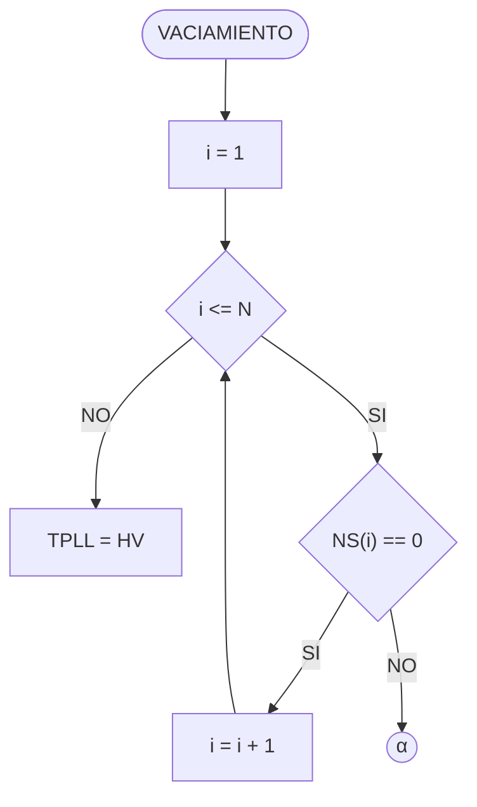
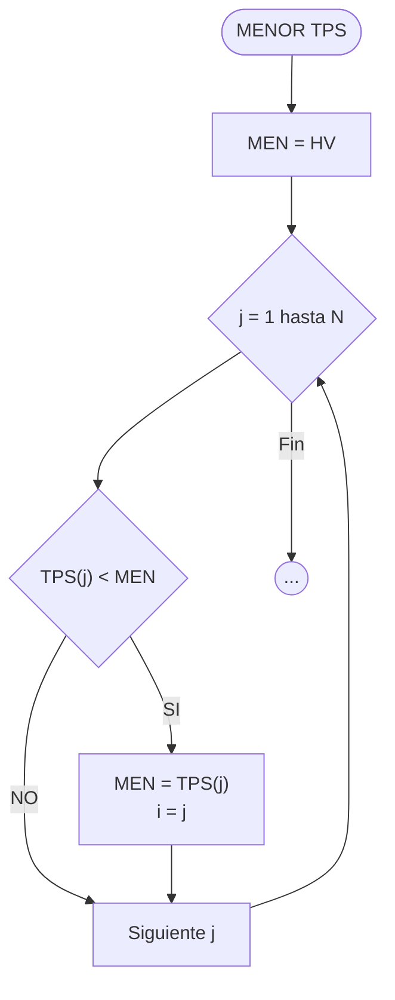

### Rutina de Vaciado

Esta rutina se ejecuta cuando el tiempo supera el tiempo final ($T > TF$) pero aún queda gente en el sistema ($NS > 0$).

Fragmento de código

- **Nota:** Si el puesto está vacío, avanzamos al siguiente. Si hay gente, se asigna $HV$ (High Value) a $TPLL$ para forzar que solo ocurran SALIDAS.
    

### Rutina Menor TPS(i)

Se utiliza para encontrar cuál de todos los puestos tiene la salida más próxima.

Fragmento de código

### Inicialización (C.I.)

- Todos los acumuladores en 0 ($SPS=0, CLL=0, T=0, NS=0, TPLL=0$).
    
- Vectores de tiempo ocioso y de estado en 0 ($STO[i]=0, NS[i]=0$).
    
- Vector de próximas salidas en High Value ($TPS[i] = HV$).

## Cálculos Finales

Al finalizar la simulación:

1. **PTO(i):** Porcentaje de Tiempo Ocioso por puesto.
    
    $$PTO(i) = \frac{STO(i) \times 100}{T}$$
    
2. **PPS:** Promedio de Permanencia General.
    
    $$PPS = \frac{SPS}{CLL}$$