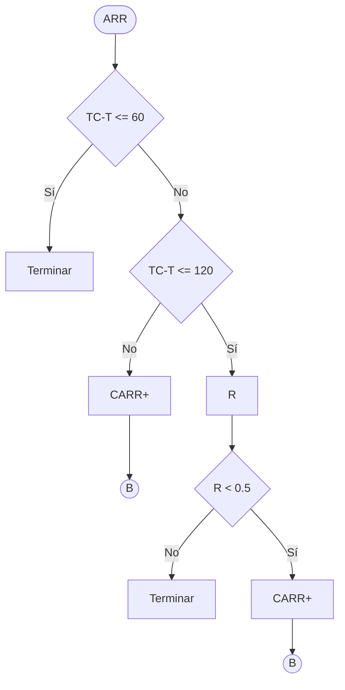

>[!IMPORTANT]
>Utilizo esta idea o metodologia solo si el tiempo de atencion se conoce en el momento en que el cliente llega al sistema, incluso si hay gente adelante en la cola.

Anteriormente, esto no se podia aplicar ya que, en el caso de una cola de suerpmercado, la persona que recien entra, no sabe cuando va a salir hasta que no es atendida en el mostrador. Para el caso de TC con un remis, por ejemplo, esto cambia:
### La nueva variable de estado TC
Se la conoce como tiempo comprometido y representa, en tiempo, la cantidad de tiempo que el servidor va a estar ocupado. Como para el caso de remis, se puede estimar con presicion el tiempo de cada viaje encolado, el TC no es mas que la suma de la duracion de dichos viajes. 
#### Calculos y formulas
- **suma de tiempo oscioso del servidor**: $STO = STO(T-TC)$ . Esto funciona para el caso en que el servidor este ocioso o al pedo, es decir cuando $T \le TC$.
- **Suma de tiempo de espera del cliente**: $STE = STE(TC - T)$. Este funciona para el caso en que el *cliente* este esperando a ser atendido y  el servidor este ocupado, es decir cuando $T \gt TC$.
- **Promedio de espera**: $PEC = STE/CLL$
- **Porcentaje de tiempo oscioso**: $STO/TC * 100$
### Arrepentimiento Con TC
El cliente puede no querer esperar x tiempo y decidir retirarse. Entonces hay que jugar con el tiempo de espera del mismo, es decir, con el (TC - T). Queda como sigue:

### Tips clase
- TC solo si puedo generar TA ni bien llega el cliente al sistema
- TC y Ns se juntan en un sistema que no es de colas. Es mas complejo
- Si el arrepentimiento va en tiempo -> TC. Si va en personas -> Ns
- Ej 12 tiene 3 eventos
- En TC NO se usa hace vaciamiento
- 