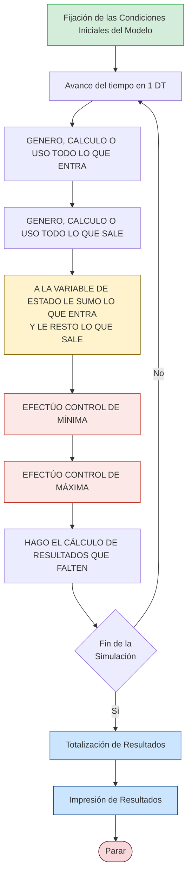

22# El TRUCO

---

## ¿Para qué sirve?

El **TRUCO** sirve para resolver los ejercicios de metodología **Δt constante**, donde siempre vamos a tener:

| Lo que ocurre                                                   | Tipo                   |
| --------------------------------------------------------------- | ---------------------- |
| Algo que **entra** al sistema                                   | ==EVENTO PROPIO==      |
| Algo que **sale** del sistema                                   | ==EVENTO PROPIO==      |
| Algo que **permanece** en el sistema durante toda la simulación | ==VARIABLE DE ESTADO== |
|                                                                 |                        |
Dichos eventos propios pueden ser:
- f.d.p
- Variable de control
- valor fijo
- La combinacion de estas
> [!info] Los eventos propios están influenciados por:
> 
> - Valores fijos
> - **Variables de control**
> - **f.d.p.**
> - (o combinaciones entre ellas)

Las **variables de estado** van aumentando o disminuyendo a medida que pasa cada Δt.

---

## Mínimos necesarios

Se debe tener como mínimo:

- Una ==VARIABLE DE ESTADO==
- Un ==EVENTO== que hace que esa ==VARIABLE DE ESTADO== **aumente**
- Un ==EVENTO== que hace que esa ==VARIABLE DE ESTADO== **disminuya**

---

## Ventajas de su uso

> ➤ Se encuentran fácilmente (casi sin leer el enunciado) las variables de estado y los eventos.

> ➤ El modelo se puede armar fácil y rápidamente.

> ➤ Resulta sencillo entender la **[[Dinámica de Sistemas]]**, dado que está basado en dicho concepto.

---

---

# Verdaderos Pasos de la Metodología Δt Constante

## Contexto

En los ejercicios de Δt constante, a lo largo de un mismo avance del tiempo suceden **eventos**, aunque no siempre se sabe cuáles suceden primero y cuáles después.

|Situación|Acción|
|---|---|
|Si se sabe que ==evento== sucede primero (ingreso o egreso de algo al sistema)|Se usan los **PASOS TRADICIONALES**|
|Si **no** se sabe exactamente cuál sucede primero|Se usan los **VERDADEROS PASOS DE LA METODOLOGÍA**|

---

## Diagrama de Flujo

---

## Notas al margen del diagrama
1. Condiciones iniciales
2. 
 
### Paso: Todo lo que ENTRA

> Se genera, calcula y se usa **todo lo que entra al sistema**. En general, se pone una **variable auxiliar**, donde se coloca en ella todo lo que entra al sistema.

### Paso: Todo lo que SALE

> Se genera, calcula y se usa **todo lo que sale del sistema**. En general, se pone una **variable auxiliar**, donde se coloca en ella todo lo que sale del sistema.

### Paso: Variable de Estado

> A la ==VARIABLE DE ESTADO== se le **suma** todo lo que entra al sistema y se le **resta** todo lo que sale del sistema.

### Paso: Resultados

> Se calculan los resultados, donde por lo general se piden:
> 
> - Cantidad de días
> - Cantidad de veces
> - Cantidad excedida
> - Ventas perdidas
> - etc.

---

## Controles - Buen lugar para generar calculos

### 🔽 CONTROL DE MÍNIMA

**Ejemplo:** la cantidad de personas no puede ser negativa.

- Si la cantidad de personas resultara temporalmente **negativa**, el CONTROL se asegura que termine quedando en **0**.
- Si resultara **positiva** (algo coherente), no se hace nada.
- Puede incluir costos de ventas no realizadas/perdidas/almacenadas

### 🔼 CONTROL DE MÁXIMA

**Ejemplo:** el volumen de agua dentro de una represa no puede ser superior al volumen de la represa.

- Si la cantidad de agua resultara temporalmente **mayor**, el CONTROL se asegura que termine siendo igual a la **capacidad de la represa**.
- Si resultara **menor** (algo coherente), no se hace nada.
- Puede incluir costo por ventas no efectuadas

> [!note] ¿Cuándo aplicar controles? Son aquellos controles donde se consideran los **límites del sistema** o la **coherencia de los valores** de las variables del sistema.