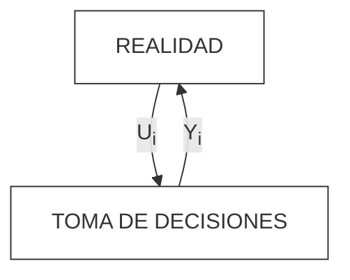

Ing. Erica Milin
> Traer para la clase que viene cartel con nombre.
   Miercoles - 18:45hs
   TP 4 - Obligatorio, aprobar si o si.
   Traer Avance del tiempo evento a evento
   TP 1 
   TP  practica + apuntes + PPT - > Luego TP 1
___

Se plantea metodo de lógica inductiva para predecir el futuro o aproximarlo. Sigue los siguientes 4 pasos: 
1. Observacion del sistema
2. Formulación de una hipótesis que explique las observaciones realizadas
3. Predicción del comportamiento del sistema en base a la hipótesis formulada mediante deducción lógica
4. Realizar experimentos para validar la hipótesis
A partir de la repetición se crean nuevas teorías que la experimentación rectifica, modifica o avala. La experimentación es cara y por ende se utiliza la simulación como sustituto.
## La Simulación
#### Caracteristicas estructurales:
- **Elementos**: Son los componentes fundamentales. Son la representacion simplificada de alguan caracteristica de la realidad del objeto de estudio
- **Relaciones entre los elementos o redes de comunicacion**: basicamente, los *elementos* estan interrelacionados tal como lo estan los objetos que representan en la realidad
- **Limites**: El sistema tiene limites que acotan al trozo de realidad que quieren estudiar.
	- Elementos endogenos: Se quedan dentro del limite y su comportamiento esta infulido por el modelo
	- Elementos exogenos: no son modificados por el modelo pero si modifican elemendos endogoenos
#### Que no es simulacion
No es una recreacion ya que la simulacion es la prediccion de un acontecimiento.
#### Definicion
###### Aproximacion a un problema
Como ataco un problema
- Analizar amtematicamente -> complejo
- Realisar experimientos sobre el problema-> peligroso, quizas ilegal o destruir el problema

Entonces realizo una simulacion: 
La simulación es una herramienta que permite construir **modelos** representativos de un sistema real y con el objetivo de tomar desiciones en la vida real. Estos modelos llevan un cierto nivel de abstracción.

###### Por que esta buena?
1. Es una herramiente matematicamente chequeada para predecir el futuro
2. No uso la realidad y por ende es menos costoso y menos riesgoso
3. Puedo contrastar el modelo con distintos escenarios o alterantivas para elegir la que me acerque mas a mi objetivo
##### Definicion formal
Segun Curchman
X simla a Y si y solo si:
	a. X e Y son sistemas formales
	b. Y es el sistema real
	c. X es una aproximacion del modelo real
	d. Las reglas de validez en X no estan exentas de error
	Y ademas:
La simulacion de un **sistema** (que no se puede manipular por costos o practicidad) es la operacion de un **modelo** (representacion del sistema) que puede estudiarse y sujetarse a manipulaciones para inferir propiedeades concernientes al  comportamiento del sistema real.
Osea puedo manipular el modelo sin tocar el sistema.

El sistema actual -> Modelo fisico
Modelo sobre sistema -> Modelo matematico

#### Propiedades de los modelos
###### Formalismo
El nivel de formalismo o presicion aumenta desde lo linguistico a lo matematico. 
Es decir, menos formal es a palabra y mas formal es matematico
###### Presicion vs exactitud
Un modelo mas preciso no siempre es mas util que uno menos preciso porque quizas es mas simple. Mucha precision puede llefvar a excesivas inexactitudes
###### El mejor modelo es el mas util
Debo identificar adecuadamente elementos cruciales y definirlos correctamente
###### **Realismo vs simplicidad**
Lo mas simple en lo mas realista posible o lo mas realista en lo mas simple posible.

### Simulacion y toma de decisiones
El objetivo es *obtener información decisoria para mejorar la toma de decisiones*.

- Ui :alternativas decisorias 
- Yi : resultados
- Variable de control -> Variable que contiene las alternativas decisorias. El valor que toma es uno de las alternativas decisorias
Tomar una decisión implica la elección entre distintas alternativas (la elección de un valor Ui entre los posibles valores de U). A cada uno de esos valores de Ui está ligado un resultado Yi, es decir existe una relación Yi = Ri(Ui)
El conocimiento de estas relaciones *Ri* permite predecir el resultado se obtiene como consecuencia de cada posible accion o Ui y asi elegir la que mejor se ajuste al objetivo
Tomar una decisión implica la elección entre distintas alternativas (la elección de un valor Ui
entre los po
sibles valores de U). A cada uno de esos valores de Ui está ligado un resultado

Yi, es decir existe una relación Yi = Ri(Ui)
**La simulacion permite unir alternativa con resultados, es decir la simulacion es Ri(U)**
#### Problema de costo
En muchos casos es dificil o imposible obtener info que permita predecir el conocimiento del sistema real. Entonces recurrimos a la simulación segun este esquema:

1. La realidad me arroja datos que meto en la hipotesis de simplificacion. Estos datos dependen de funciones de densidad de probabilidad. Con los datos pasados por la hipotesis de simplificacion creo el modelo
2. Diseño el experimento y lo realizo una vez por variable de control
3. Realizo la simulacion y tomo desiciones sobre el modelo
4. Lo contrasto con la realidad y con el mismo modelo y ajusto el modelo
5. Por ultimo interpreto resultados

### Etapas de la simulacion
No tienen un orden especifico sino que se retroalimentan y rehacen constantemente
##### Formulacion del problema
Son los objetivos que tiene que cumplir la simulacion, es decir, el problema que debe resolver, hipotesis que debe probar o efecto que debe estimarse. El problema final varía del inicial.
##### Recolección y procesamiento de la información tomada de la realidad
Formular el problema y desarrollar/formular el modelo rquieren de información que debe ser recolectada, almacendada y procesada para las necesidades del problema. Suele ser pesado y es sumamente importante ya que los modelos de simulacion son tan buenos como los datos con los que se cargan.
##### Formulación del modelo
A partir de los datos tomados de la realidad y aplicando hipotesis de simplificacion adecuada a los objetivos se formula el modelo. Empieza como escrito y termina como programa de computadora
##### Desiciones sobre modelo
El desarrollo de modelo se da por aproximaciones sucesivas. Cuando se avanza  en el mismo se realiza una evaluación de modelo y parámetore estimados y se toman decisiones para ajustarlo a los objetivos.
Finalmente se valida el modelo respecto de la realidad, es decir, la validez de las hipótesis de simplificacion usadas. El modelo puede ser perfecto pero si no es representativo de la realidad para cumplir con el objetivo no sirve
##### Decisiones sobre la realidad
Las desiciones de la realidad se toman sobre info predictiva basada en el comportamiento del modelo. Para explotarlo se debe diseñar un experimento para identificar el nivel y las combinaciones de cfactores o variables de control y orden de experimentos 

#### Mecanismo del flujo de tiempo
A lo largo del tiempo se producen eventos en el modelo que identificamos como *ei*. El avanze del tiempo se puede dar por incrementos variables de evento a evento o por incrementos constantes de tiempo
##### Incrementos variables
Tiene una **tabla de eventos Independientes** que determina instantes de prodximos eventos, tipos de eventos a ocurrir, instantes de proximos eventos no condicionados al evento actual, y un vector de estado con variables relativas a la simulacion. El paso a a paso es:
1. Fijacion de condiciones iniciales del modelo
2. Determinacion de instante de proximo evento
3. avanze de tiempo a proximo evento 
4. Determinacion de tipo de evento
5. Actualizacion del estado
6. Determinacion de instantes de futuros eventos condicionados ala actual
##### Tabla de eventos independientes
##### Incrementos constantes
###### Definicion de evento
**Evento** -> Es un hecho o acontecimiento que se produce en el sistema y tiene la capacidad de alterar al menos una de las variables de estado del sistema.
Los eventos se indican previo a todo.

La distancia de tiempo entre eventos $\Delta t$.
1. **Configuración Inicial:** Se definen las condiciones de inicio del modelo (variables, valores base y el tiempo inicial).
    
2. **Avance del Tiempo:** El reloj de la simulación avanza un intervalo fijo llamado **$\Delta T$** (por ejemplo, avanza 1 segundo o 1 minuto).
    
3. **Procesamiento de Eventos Propios:** Se analizan y ejecutan los eventos que ocurren naturalmente dentro de este nuevo intervalo de tiempo.
    
4.  **Procesamiento de Eventos Programados:** Se revisan los eventos que venían "comprometidos" de pasos anteriores (según la **Tabla de Eventos**) y que deben ejecutarse justo en este momento.
    
5. **Actualización del Estado:** Con toda la información de los pasos anteriores, se actualiza el **Vector de Estado** del modelo (es decir, cambian los valores de las variables del sistema).
    
6. **Programación Futura:** Se registran los nuevos eventos que se acaban de generar y que ocurrirán en intervalos de tiempo futuros, guardándolos en la **Tabla de Eventos**.
    
7. **Control de Ciclo:**
    
    - **NO:** Si la simulación aún no termina, el flujo regresa al **Paso 2** para avanzar otro $\Delta T$.
        
    - **SI:** Si se cumplió el tiempo total o la condición de corte, pasa al siguiente paso.
        
8. **Cierre y Resultados:** Se realizan los cálculos finales, se imprimen los resultados obtenidos y el proceso se detiene (**PARAR**).
### Clasificacion de modelos de simulacion
##### Deterministicos
Los datos son valores fijos y no funciones de densidad de probabilidad. Estos modelos pueden ser resueltos analiticamente
##### Estocásticos
Los datos son funciones de probabilidad. Estos son los que participan en las simulacion

O

##### Estaticos
Los datos no varian a trabes del tiempo. El tiempo no cambia y se considera estatico
##### Dinamicos
Son las iteraciones y datos que varian a traves del tiempo

#### Trabaajmos con
Modelos Estocasticos y dinamicos

### Analisis previo
##### Metodologia de avance de tiempo
1. Evento a evento
2. $\Delta T$ Constante
##### Clasificacion de variables
- Exogenas -> me las da el modelo y no las puedo cambiar. Son independientes de la entrada del modelo y son predeterminadas y proporcionadas independientemente del sistema a modelar. Actuan sobre el sistema pero no se ven modificadas por el.
	- Datos o exogenas no controlables. Me los da la realidad y no se pueden modificar. Generalmente son funcioness de densidad de probabilidad.
	- De control -> son las posibles alternativas, es decir, suceptibles de manipulacion o control.
- Endogenas
	- De resultados -> son los resultados o salida de sistema 
	- De estados -> Muestra como viene el sistema o el estado actual sin ver los resultados. Es como una foto del sistema en un determinado momento. Se modifica cuando ocurren determinados evento

###### Tabla de eventos independientes
Son variables que contienen el momento o instante en la que ocurre un cierto evento
<table style="border-collapse: collapse; width: 100%; text-align: center;">
  <thead>
    <tr>
      <th style="padding: 8px; border: 1px solid #999;">EVENTO</th>
      <th style="padding: 8px; border: 1px solid #999;">EFNC</th>
      <th style="padding: 8px; border: 1px solid #999;">EFC</th>
      <th style="padding: 8px; border: 1px solid #999;">Condición/es</th>
    </tr>
  </thead>
  <tbody>
    <tr>
      <td style="padding: 8px; border: 1px solid #999;">llegada</td>
      <td style="padding: 8px; border: 1px solid #999;">llegada</td>
      <td style="padding: 8px; border: 1px solid #999;">salida</td>
      <td style="padding: 8px; border: 1px solid #999;">Ns = 1</td>
    </tr>
    <tr>
      <td style="padding: 8px; border: 1px solid #999;">salida</td>
      <td style="padding: 8px; border: 1px solid #999;">-----</td>
      <td style="padding: 8px; border: 1px solid #999;">salida</td>
      <td style="padding: 8px; border: 1px solid #999;">Ns ≥ 1</td>
    </tr>
  </tbody>
</table>

- El evento futuro no condicionado tiene que ser igual al evento o nada
- El evento futuro condicionado como dice la palabra esta condicionado a que se cumpla la condicion.
##### Tabla de eventos Futuros
Es una clasificacion y se usa con Delta constante. La Tabla de Eventos Independientes (T.E.F.) permite enumerar los diferentes eventos que tiene un modelo y como se concatenan a lo largo del tiempo. Los eventos podrán ser condicionados y no condicionados, esto indica que algunos siempre ocurren  y otros sólo ocurrirán si se cumplen ciertas condiciones. Las condiciones surgen de los valores que adoptan las variables de estados entre otros
Evento | Evento F no condicionado | Evento futuro condicionado |
- Evento futuro no condicionado -> Se genera como consecuencia del evento actual. Se analiza como consecuencia de datos que brinda el modelo, es decir, a partir de ese evento ubicar en el tiempo la ocurrencia del otro
- Evento futuro condicionado -> Es la consecuencia del evento actual. 

<table style="border-collapse: collapse; width: 100%; text-align: center;">
  <thead>
    <tr>
      <th style="padding: 8px; border: 1px solid #999;">EVENTO</th>
      <th style="padding: 8px; border: 1px solid #999;">EFNC</th>
      <th style="padding: 8px; border: 1px solid #999;">EFC</th>
    </tr>
  </thead>
  <tbody>
    <tr>
      <td style="padding: 8px; border: 1px solid #999;">llegada</td>
      <td style="padding: 8px; border: 1px solid #999;">Tiempo proxima llegada</td>
      <td style="padding: 8px; border: 1px solid #999;">Tiempo proxima salida</td>
    </tr>
    <tr>
      <td style="padding: 8px; border: 1px solid #999;">salida</td>
      <td style="padding: 8px; border: 1px solid #999;">Tiempo proxima llegada</td>
      <td style="padding: 8px; border: 1px solid #999;">Tiempo proxima salida</td>
    </tr>
  </tbody>
</table>

### Sistemas discretos y continuos
#### Sistemas discretos
Avance del tiempo discretamente y puede ser:
- Evento a evento con eventos concatenadores
- Intervalos constantes donde entre intervalos ocurren eventos
#### Sistemas Continuos
Es una simulacion dinamica.
## Ejemplo COTO
### Analisis previo
##### Clasificacion de variables
1. Exogenas no controlables (datos): Intervalo entre arribl de clientes al sistema, tiempo de atencion
		Ambos tiempos los transformo en grafica para obtener la f**uncion de densidad de probabilidad** (aplico la hipotesis de simplificacion)
2. Exogenas de control : Cantidad de cajas
3. Endogenas de resultado: Promedio espera de clientes y porcentaje de tiempo ocioso de empleados
4. Endogenas de estado: Cantidad de clientes en el sistema 
##### Eventos
1. Una llegada de una persona a la cola
2. Que una persona salga de la cola
