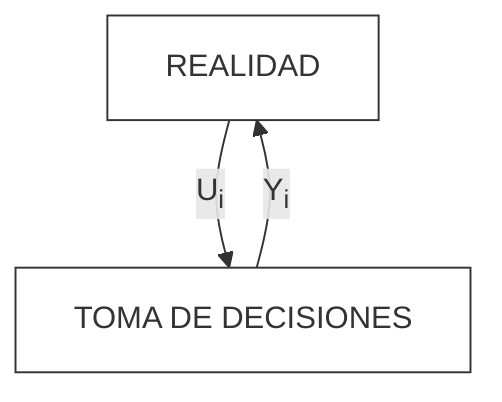
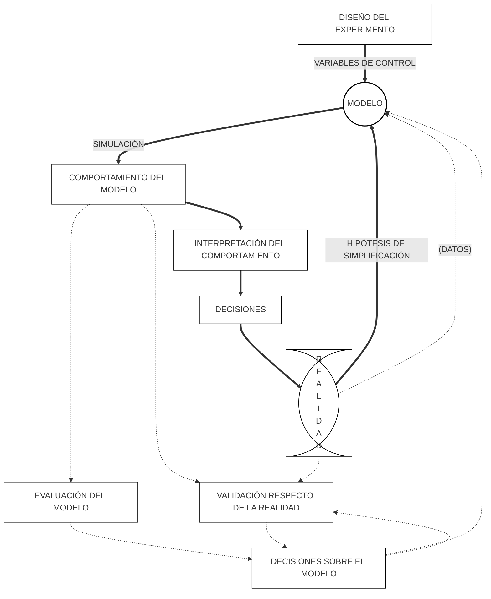

Se plantea metodo de lógica inductiva para predecir el futuro o aproximarlo. Sigue los siguientes 4 pasos: 
1. Observacion del sistema
2. Formulación de una hipótesis que explique las observaciones realizadas
3. Predicción del comportamiento del sistema en base a la hipótesis formulada mediante deducción lógica
4. Realizar experimentos para validar la hipótesis
A partir de la repetición se crean nuevas teorías que la experimentación rectifica, modifica o avala. La experimentación es cara y por ende se utiliza la simulación como sustituto.
## La Simulación
La simulación es una técnica que permite construir **modelos** de un sistema real y operarlos (realizar experimentos) en hipotéticas condiciones exteriores con el objetivo de predecir el comportamiento esperado del sistema real a partir de la información generada en el **modelo**. Estos modelos llevan un cierto nivel de abstracción.
### Simulacion y toma de decisiones
El objetivo es *obtener información decisoria para mejorar la toma de decisiones*.

- Ui :alternativas decisorias 
- Yi : resultados
Tomar una decisión implica la elección entre distintas alternativas (la elección de un valor Ui entre los posibles valores de U). A cada uno de esos valores de Ui está ligado un resultado Yi, es decir existe una relación Yi = Ri(Ui)
El conocimiento de estas relaciones *Ri* permite predecir el resultado se obtiene como consecuencia de cada posible accion o Ui y asi elegir la que mejor se ajuste al objetivo
Tomar una decisión implica la elección entre distintas alternativas (la elección de un valor Ui
entre los po
sibles valores de U). A cada uno de esos valores de Ui está ligado un resultado

Yi, es decir existe una relación Yi = Ri(Ui)
#### Problema de costo
En muchos casos es dificil o imposible obtener info que permita predecir el conocimiento del sistema real. Entonces recurrimos a la simulación segun este esquema:

### Etapas de la simulacion
No tienen un orden especifico sino que se retroalimentan y rehacen constantemente
##### Formulacion del problema
Son los objetivos que tiene que cumplir la simulacion, es decir, el problema que debe resolver, hipotesis que debe probar o efecto que debe estimarse. El problema final varía del inicial.
##### Recolección y procesamiento de la información tomada de la realidad
Formular el problema y desarrollar/formular el modelo rquieren de información que debe ser recolectada, almacendada y procesada para las necesidades del problema. Suele ser pesado y es sumamente importante ya que los modelos de simulacion son tan buenos como los datos con los que se cargan.
##### Formulación del modelo
A partir de los datos tomados de la realidad y aplicando hipotesis de simplificacion adecuada a los objetivos se formula el modelo. Empieza como escrito y termina como programa de computadora
##### Desiciones sobre modelo
El desarrollo de modelo se da por aproximaciones sucesivas. Cuando se avanza  en el mismo se realiza una evaluación de modelo y parámetore estimados y se toman decisiones para ajustarlo a los objetivos.
Finalmente se valida el modelo respecto de la realidad, es decir, la validez de las hipótesis de simplificacion usadas. El modelo puede ser perfecto pero si no es representativo de la realidad para cumplir con el objetivo no sirve
##### Decisiones sobre la realidad
Las desiciones de la realidad se toman sobre info predictiva basada en el comportamiento del modelo. Para explotarlo se debe diseñar un experimento para identificar el nivel y las combinaciones de cfactores o variables de control y orden de experimentos 

#### Mecanismo del flujo de tiempo
A lo largo del tiempo se producen eventos en el modelo que identificamos como *ei*. El avanze del tiempo se puede dar por incrementos variables de evento a evento o por incrementos constantes de tiempo