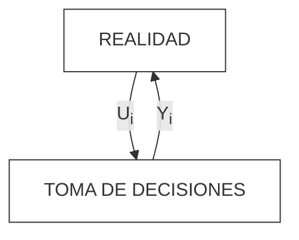

Ing. Erica Milin
> Traer para la clase que viene cartel con nombre.
   Miercoles - 18:45hs
   TP 4 - Obligatorio, aprobar si o si.
   Traer Avance del tiempo evento a evento
   TP 1 
   TP  practica + apuntes + PPT - > Luego TP 1
___

Se plantea metodo de lógica inductiva para predecir el futuro o aproximarlo. Sigue los siguientes 4 pasos: 
1. Observacion del sistema
2. Formulación de una hipótesis que explique las observaciones realizadas
3. Predicción del comportamiento del sistema en base a la hipótesis formulada mediante deducción lógica
4. Realizar experimentos para validar la hipótesis
A partir de la repetición se crean nuevas teorías que la experimentación rectifica, modifica o avala. La experimentación es cara y por ende se utiliza la simulación como sustituto.
## La Simulación
#### Que no es simulacion
No es una recreacion ya que la simulacion es la prediccion de un acontecimiento.
#### Definicion
###### Aproximacion a un problema
Como ataco un problema
- Analizar amtematicamente -> complejo
- Realisar experimientos sobre el problema-> peligroso, quizas ilegal o destruir el problema

Entonces realizo una simulacion: 
La simulación es una herramienta que permite construir **modelos** representativos de un sistema real y con el objetivo de tomar desiciones en la vida real. Estos modelos llevan un cierto nivel de abstracción.

##### Definicion formal
Segun Curchman
X simla a Y si y solo si:
a. X e Y son sistemas formales
b. Y es el sistema real
c. X es una aproximacion del modelo real
d. Las reglas de validez en X no estan exentas de error
Y ademas:
La simulacion de un **sistema** (que no se puede manipular por costos o practicidad) es la operacion de un **modelo** (representacion del sistema) que puede estudiarse y sujetarse a manipulaciones para inferir propiedeades concernientes al  comportamiento del sistema real.
Osea puedo manipular el modelo sin tocar el sistema.

El sistema actual -> Modelo fisico
Modelo sobre sistema -> Modelo matematico

#### Realismo vs simplicidad
Lo mas simple en lo mas realista posible o lo mas realista en lo mas simple posible.
###### Por que esta buena?
1. Es una herramiente matematicamente chequeada para predecir el futuro
2. 
### Simulacion y toma de decisiones
El objetivo es *obtener información decisoria para mejorar la toma de decisiones*.

- Ui :alternativas decisorias 
- Yi : resultados
- Variable de control -> Variable que contiene las alternativas decisorias. El valor que toma es uno de las alternativas decisorias
Tomar una decisión implica la elección entre distintas alternativas (la elección de un valor Ui entre los posibles valores de U). A cada uno de esos valores de Ui está ligado un resultado Yi, es decir existe una relación Yi = Ri(Ui)
El conocimiento de estas relaciones *Ri* permite predecir el resultado se obtiene como consecuencia de cada posible accion o Ui y asi elegir la que mejor se ajuste al objetivo
Tomar una decisión implica la elección entre distintas alternativas (la elección de un valor Ui
entre los po
sibles valores de U). A cada uno de esos valores de Ui está ligado un resultado

Yi, es decir existe una relación Yi = Ri(Ui)
**La simulacion permite unir alternativa con resultados, es decir la simulacion es Ri(U)**
#### Problema de costo
En muchos casos es dificil o imposible obtener info que permita predecir el conocimiento del sistema real. Entonces recurrimos a la simulación segun este esquema:

1. La realidad me arroja datos que meto en la hipotesis de simplificacion. Estos datos dependen de funciones de densidad de probabilidad. Con los datos pasados por la hipotesis de simplificacion creo el modelo
2. Diseño el experimento y lo realizo una vez por variable de control
3. Realizo la simulacion y tomo desiciones sobre el modelo
4. Lo contrasto con la realidad y con el mismo modelo y ajusto el modelo
5. Por ultimo interpreto resultados

### Etapas de la simulacion
No tienen un orden especifico sino que se retroalimentan y rehacen constantemente
##### Formulacion del problema
Son los objetivos que tiene que cumplir la simulacion, es decir, el problema que debe resolver, hipotesis que debe probar o efecto que debe estimarse. El problema final varía del inicial.
##### Recolección y procesamiento de la información tomada de la realidad
Formular el problema y desarrollar/formular el modelo rquieren de información que debe ser recolectada, almacendada y procesada para las necesidades del problema. Suele ser pesado y es sumamente importante ya que los modelos de simulacion son tan buenos como los datos con los que se cargan.
##### Formulación del modelo
A partir de los datos tomados de la realidad y aplicando hipotesis de simplificacion adecuada a los objetivos se formula el modelo. Empieza como escrito y termina como programa de computadora
##### Desiciones sobre modelo
El desarrollo de modelo se da por aproximaciones sucesivas. Cuando se avanza  en el mismo se realiza una evaluación de modelo y parámetore estimados y se toman decisiones para ajustarlo a los objetivos.
Finalmente se valida el modelo respecto de la realidad, es decir, la validez de las hipótesis de simplificacion usadas. El modelo puede ser perfecto pero si no es representativo de la realidad para cumplir con el objetivo no sirve
##### Decisiones sobre la realidad
Las desiciones de la realidad se toman sobre info predictiva basada en el comportamiento del modelo. Para explotarlo se debe diseñar un experimento para identificar el nivel y las combinaciones de cfactores o variables de control y orden de experimentos 

#### Mecanismo del flujo de tiempo
A lo largo del tiempo se producen eventos en el modelo que identificamos como *ei*. El avanze del tiempo se puede dar por incrementos variables de evento a evento o por incrementos constantes de tiempo
### Clasificacion de modelos de simulacion
##### Deterministicos
Los datos son valores fijos y no funciones de densidad de probabilidad
##### Estocásticos
Los datos son funciones de probabilidad

O

##### Estaticos
Los datos no varian a trabes del tiempo es estagtico
##### Dinamicos
Son las iteraciones y datos que varian a traves del tiempo

#### Trabaajmos con
Modelos Estocasticos y dinamicos

### Analisis previo
##### Metodologia de avance de tiempo
1. Evento a evento
2. $\delta T$ Constante
##### Clasificacion de variables
- Exogenas -> me las da el modelo y no las puedo cambiar
	- Datos o exogenas no controlables
	- De control -> son las posibles alternativas
- Endogenas 
	- De resultados -> son los resultados o salida de sistema 
	- De estados -> Muestra como viene el sistema o el estado actual sin ver los resultados. Se modifica cuando ocurren determinados evento
	- s

##### Definicion de evento
**Evento** -> Es un hecho o acontecimiento que se produce en el sistema y tiene la capacidad de alterar al menos una de las variables de estado del sistema.
Los eventos se indican previo a todo.
###### Tabla de eventos futuros
Son variables que contienen el momento o instante en la que ocurre un cierto evento
Evento | Evento F no condicionado | Evento futuro condicionado | Concicion
##### Tabla de eventos Independientes
Es una clasificacion y se usa con Delta constante
Evento | Evento F no condicionado | Evento futuro condicionado |
> Ver nombres de eventos
Evento futuro no condicionado -> Se genera como consecuencia del evento actual. Se analiza como consecuencia de datos que brinda el modelo, es decir, a partir de ese eento ubicar en el tiempo la ocurrencia del otro
Evento futuro condicionado -> Es la consecuencia del evento actual. 

### Sistemas discretos y continuos
#### Sistemas discretos

O
#### Sistemas Continuos

## Ejemplo COTO
### Analisis previo
##### Clasificacion de variables
1. Exogenas no controlables (datos): Intervalo entre arribl de clientes al sistema, tiempo de atencion
		Ambos tiempos los transformo en grafica para obtener la f**uncion de densidad de probabilidad** (aplico la hipotesis de simplificacion)
2. Exogenas de control : Cantidad de cajas
3. Endogenas de resultado: Promedio espera de clientes y porcentaje de tiempo ocioso de empleados
4. Endogenas de estado: Cantidad de clientes en el sistema 
##### Eventos
1. Una llegada de una persona a la cola
2. Que una persona salga de la cola
