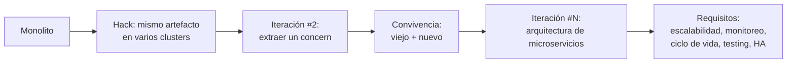

# Microservicios

> [!info] Nota de contexto 
> Este documento resume una presentación sobre la evolución de aplicaciones **monolíticas** hacia **microservicios**, usando como caso de estudio un sistema de venta online (estilo Amazon/Garbarino). Se agregaron explicaciones de conceptos técnicos para facilitar la comprensión.

---

## 1. Aplicaciones monolíticas

Son aplicaciones que fueron concebidas para ser **"toda la solución"**.

- Quizás el contexto inicial era correcto, y luego el mismo cambió, agregando cada vez más responsabilidades sobre la app.
- La app va creciendo en volumen, features, cantidad, etc. Cuando nos percatamos, por lo general, ya tenemos un problema entre manos.

> [!tip] ¿Qué es un monolito? 
> Un **monolito** es una aplicación cuyo código (UI, lógica de negocio, acceso a datos, etc.) se despliega como **un único artefacto** (por ejemplo un `.war` o `.jar`). Todo corre en el mismo proceso.

### 1.1. Ventajas de las aplicaciones monolíticas

1. Simpleza - Agregar algo a la aplicacion es agregar al monolito
2. Baja latencia - Suele tener menos saltos en red y saco cosas (autenticacion, cola de mensajes, etc) de red
3. Único artefacto deployable
4. En pequeña escala, aprovecha bien el uso de los recursos - Tiene menos overhead porque si tenes que levantar cada servicio cada uno requiere mas cosas
5. Es fácil agregar una funcionalidad que haga uso de algo que ya existe:
    - Base de datos
    - Librerías
    - Servicios ya implementados

### 1.2. Problemas de las aplicaciones monolíticas

1. Deploys muy grandes → resta agilidad porque tengo que buildear, compilar, pasar el CI todo de vuelta en toda la aplicacion gigante por quizas algo que es minimo. 
2. No escala en gente → 10+ personas tocando el mismo binario = problemas -> No se adapta a las estructuras organizacionales.
3. Tiempos altos de test, build, release y deploy
4. Código legacy conviviendo con código nuevo → difícil de evolucionar la app
5. Choque entre dependencias cuando el proyecto se hace con versiones distintas de las dependencias. Tambien chocan versiones de lenguaje o apis o asi.
6. Un problema en la aplicación puede arrastrar **todas** las funcionalidades - Si se rompe la app se rompen todos los servicios o flujos:
    - GC storm
    - Leak de memoria
    - Leak de hilos / hilos bloqueados
    - Uso incorrecto o intensivo de CPU
7. Las fronteras entre módulos no son del todo claras - Me genera problemas de herencia multiple y referencias recursivas
8. Si se cae el servidor se caen todos los serivcios
9. Al escalar se escala todo
10. El testeo es mas complicado

> [!note] Conceptos técnicos del punto 5
> 
> - **GC storm**: situación en la que el _Garbage Collector_ (recolector de basura, en lenguajes como Java) se ejecuta de forma constante e intensiva tratando de liberar memoria, consumiendo CPU y "congelando" la aplicación (pausas largas, _stop-the-world_).
> - **Leak de memoria (memory leak)**: memoria que se reserva y nunca se libera correctamente, haciendo que el consumo crezca hasta agotar los recursos disponibles.
> - **Leak de hilos / hilos bloqueados (thread leak)**: hilos (threads) que quedan "colgados" esperando un recurso que nunca llega, agotando el pool de hilos disponibles y dejando la app sin capacidad de atender nuevas peticiones.
> 
> Como todo corre en el mismo proceso, cualquiera de estos problemas afecta a **toda** la aplicación, no solo al módulo que lo originó.

### 1.3. Problemas de las aplicaciones monolíticas (continuación)

1. Funcionalidades diferentes pueden requerir infraestructura diferente:
    - Tipo de servidor (memoria, CPU, disco)
2. Funcionalidades diferentes pueden requerir configuraciones diferentes:
    - JVM args - Como configuro mi jvm segun que necesite cada modulo
    - Características del sistema operativo
    - Versión de la JRE, etc.
    - Librerías externas (por ejemplo DLLs en Windows)
3. Toda la aplicación está hecha con tecnologías similares:
    - Es una verdad a medias, pero sí comparten un mismo _stack_ (por ejemplo Java, Groovy)
    - No se puede mezclar libremente PHP con Java, Ruby y .NET dentro del mismo monolito
    - ¿Qué pasa con las bases de datos? (suele haber una única base compartida)
	    - Cuando no es una unica base compartida no alcanza un solo ORM para hablar con ambas bases de datos. Se complejiza mucho

### 1.4. Deploys en aplicaciones monolíticas

1. Al momento del deploy tiene que haber un técnico de cada feature:
    - Mirar logs
    - Testear funcionalidad
    - Saber qué hacer en caso de encontrar un problema
	    - Quizas un rollback
2. ¿Cada cuánto son los deploys?
	1. No puedo desplegar todos los dias porque dependo de disponibilidad de features
3. ¿Deploys disruptivos o no? ¿Puedo hacer un deploy fácil?
	1. Si no tiene retrocompatibilidad tengo un problema si sale mal
	2. Tengo que ver que no se cruze con otra parte del equipo
4. ¿En qué momento del día puedo hacer un deploy?

---

## 2. Approach intermedio: Hack

Antes de pasar a microservicios "puros", existe un approach intermedio:

- Se replica el mismo artefacto monolítico o distinto en distintos **clusters**.
- Un **balanceador** enruta el tráfico según la ruta solicitada (por ejemplo `/ServicioA` a un cluster y `/ServicioB` a otro).

> [!note] ¿Por qué es un "hack"? 
> Es un paso intermedio: no se separa realmente el código ni las responsabilidades, sino que se distribuye la **carga** del mismo monolito en distintos clusters según el tipo de request. Ayuda a escalar horizontalmente sin rediseñar la arquitectura, pero no resuelve los problemas de acoplamiento interno.

---

## 3. Ejemplo de un sistema monolítico

**Caso de estudio:** Sistema de venta online (similar a Garbarino / Amazon, etc.)

### 3.1. Capas / responsabilidades del sistema

1. Acceso al catálogo (base de datos) o servicio de terceros
2. Agregado de políticas comerciales (markup, promociones, restricciones)
3. Facetado (filtros, categorías, etc.), incluye orden por usuario
4. Destacados
5. Sirve un Front
6. Header: login / sesión, carrito de compras
7. Footer: contenido estático, newsletter (suscripción)
8. Búsqueda de productos

---

## 4. Iteración #1: Sistema monolítico

- Todo el código está en un solo artefacto / deployable (WAR, JAR, etc.)
- **1 gran equipo** de 30 personas
- **1 gran subida** cada 2 / 3 meses
- **1 gran ciclo de bugfixing** el mes siguiente a la subida

```
APLICACIÓN → DB
```

---

## 5. Sobre la forma de trabajo

> [!quote] ¿Cómo se come un elefante? Un elefante se come pedazo a pedazo.

- El modelo **iterativo e incremental** permite agregar valor mientras la rueda sigue girando.
- No es posible detener la máquina para hacerla de nuevo.
- Por eso hay que ir evolucionando la arquitectura **componente a componente**.

---

## 6. Iteración #2: Empiezo a pensar en microservicios

Se toma un **"concern"** (aspecto/responsabilidad) del sistema. Por ejemplo: el catálogo.

> El concern debe ser algo complejo, como su propia bd, consulta a api externa, requiera mucha memoria, etc.

1. Se crea una "caja" (servicio nuevo) que resuelve esa parte, se prueba y se compara contra la implementación anterior.
2. Se integra desde la aplicación monolítica, sin eliminar todavía lo viejo.
3. Se balancea el tráfico desde la aplicación monolítica:
    - Rollout por algún aspecto, o por un porcentaje de tráfico va al nuevo servicio.
4. Finalmente, se deja de usar lo viejo y se elimina.

> [!tip] Concern Un **"concern"** es una responsabilidad o aspecto específico del sistema (por ejemplo: catálogo, sesión, personalización) que puede aislarse y convertirse en un servicio independiente.

### 6.1. Diagrama de la iteración #2

```
Catálogo (nuevo) ←http→ APLICACIÓN (←→ Catálogo viejo)
```

- Aplicacion no sabe sobre la implementacion de catalogo, no conoce si tiene base de datos o que. Unicamente conoce el *contrato*

---

## 7. Sobre los refactors de arquitectura

1. Algunos refactors son **disruptivos**: no pueden convivir con el modelo anterior.
2. Idealmente deberíamos evitar este tipo de cambios, pero no siempre es posible.
3. Cuando **sí se puede** convivir: usar **A/B Testing** + rollout paulatino, evaluando cómo responde el sistema.
4. Cuando **no se puede** convivir: poner mucho énfasis en el testing (funcional, de carga, etc.).
5. Otras tareas incluyen la **migración de datos**: los dos modelos pueden convivir por un tiempo.
	1. Debo conciliar la base de datos con alguna herramienta de migracion o similar.
6. Se pueden hacer cosas que no gustan, **de forma temporal**:
    - Por ejemplo, integración de apps a través de la capa de datos.
7. El tiempo que toma refactorizar **tiene costo**.

> [!note] A/B Testing 
> Técnica que consiste en mostrar dos versiones (A y B) de una misma funcionalidad a distintos segmentos de usuarios, para comparar métricas (performance, conversión, errores) antes de migrar completamente a la nueva versión.

---

## 8. Iteración #N: Arquitectura refactorizada

Diagrama final con los distintos componentes: Front, Destacados, Facetado, Políticas Comerciales, Datos, Catálogo, Servicios externos de catálogo, Header y footer, Sesión y usuario, Usuarios, P13N.

![[Pasted image 20260908200131.png|558]]

> [!important] Ventaja principal de microservicios
> Cada Servicio tiene su propio ciclo de vida donde cada uno deployea, cambia, etc siempre y cuando cumpla con la interfaz


### 8.1. Observaciones sobre la arquitectura final

#### 8.1.1. Sesión y usuario es _cross_ a todo

- El componente de **Sesión y usuario** es transversal (cross-cutting): lo consumen prácticamente todos los demás módulos (Front, Destacados, Facetado, Políticas Comerciales).
- Puede que la respuesta a cada usuario dependa de su tipo y por ende necesita comunicarse con este servicio. Es un SPOF
- Tendría que existir una autenticación entre servicios. 
	- Suele utilizar TLS entre servicios donde cada uno tiene su certificado. 
	- Los equipos no suelen hacer esto, sino que se encarga el **equipo de infra/seguridad**
	- Esto puede escalar con apiTokens, permisos, roles y recursos, etc.

> [!note] Cross-cutting concern 
> Se le llama así a una funcionalidad que atraviesa múltiples módulos del sistema (por ejemplo autenticación, logging, sesión), en lugar de pertenecer a uno solo.

#### 8.1.2. P13N (Personalización)

- Seguramente la aplicación de **personalización (P13N)** sea invocada desde muchos lugares para alimentarla (recolectar datos de comportamiento del usuario).
- Tiene su propia persistencia
- Debe tener un proceso de analiticas para ser construido a partir de la ingesta de datos (cronjob)
- Suele usarse para recomendaciones, settings, perfil de usuario, etc

#### 8.1.3. Bases de datos

- Se tienen **muchas bases de datos diferentes** (una por servicio: Pol. Com., Catálogo, Usuarios, P13N).
- Esto permite tener **diferentes esquemas y tecnologías** según la necesidad de cada servicio (patrón conocido como _"database per service"_).
- Tengo problemas con IDs entre servicios y tengo que analizarlo

#### 8.1.4. Cantidad de aplicaciones

- Se pasa a tener **8 aplicaciones**.
- Todas requieren **monitoreo**.
- Todas requieren funcionalidades out of the box
- Cada una tiene su **ciclo de vida propio** (se puede deployar, escalar y versionar de forma independiente).

#### 8.1.5. Integraciones por Web Services (WS)

- Cada app expone sus funcionalidades como **servicios** (APIs).
- **No hay acceso directo vía capa de datos** entre servicios.
- Solo la aplicación "dueña" de una base de datos la conoce y accede a ella.

> [!warning] ¿Por qué evitar el acceso directo a la base de otro servicio? 
> Si dos servicios comparten la misma base de datos, quedan **acoplados**: un cambio en el esquema de uno puede romper al otro. Por eso la buena práctica es que cada servicio sea el único dueño de su base y exponga su información solo a través de una API.

#### 8.1.6. Aprovechar diferentes apps

- Es más fácil reutilizar _concerns_ de diferentes apps desde otras.
- Ejemplo: un **front mobile** puede consumir directamente servicios como Destacados y Facetado, sin pasar por el front web.

#### 8.1.7. Manejo de errores y desbordes

¿Cómo se manejan los errores entre aplicaciones? (apps caídas, etc.)
	- Antes era con excepciones y error handling
	- Ahora necesito eso y tambien herramientas a nivel negocio cuando un concern se cae
Para resolverlo puedo usar:
1. Límites establecidos de carga (por ejemplo, máximo de requests aceptados).
2. **Timeouts** entre cajas: muchas veces se olvidan configurar, y cuando hay un problema, "explota" todo.
3. **Circuit breaker**: Anulo al cliente por x tiempo cuando me da timeout reiteradamente y asi puedo seguir usando el resto del concern. Luego de x tiempo vuelvo a preguntar
4. **Reintentos** y herramientas de arquitectura que ayuden (colas, bases de datos intermedias, etc.).
5. **Backpressure**: si una app está caída y sus clientes no reaccionan, los errores se propagan a través de todo el stack. Se puede implementar con:
   - Cola de mensajes
   - Buffer en memoria de lo que llega
   - Negociar que tan rapido le pego al servidor

> [!note] Timeout
>  Tiempo máximo que un servicio espera la respuesta de otro antes de considerar la llamada como fallida. Sin timeouts configurados correctamente, una app lenta puede bloquear indefinidamente a las que dependen de ella.

#### 8.1.8. Backpressure

- **Problema original**: una app falla o responde lento.
- **Problema autogenerado**: cantidad excesiva de requests (los clientes reintentan sin control, agravando la situación).
- **Control de backpressure**: mecanismos como _circuit breaker_, _blacklist_, etc.

> [!note] Backpressure y Circuit Breaker
> 
> - **Backpressure**: fenómeno en el que un sistema recibe más carga de la que puede procesar, y esa saturación se "propaga hacia atrás" en la cadena de llamadas, afectando a los servicios que lo invocan.
> - **Circuit breaker** (disyuntor/cortacircuitos): patrón de diseño que detecta cuando un servicio está fallando repetidamente y "corta" temporalmente las llamadas hacia él, devolviendo un error rápido en lugar de esperar timeouts, dándole tiempo al servicio afectado para recuperarse.

---

## 9. Problemas de microservicios: no todo es bueno

### 9.1. Responsabilidades poco claras

Algunas responsabilidades no son tan claras como para determinar si van en una caja u otra:

- Los destacados que llevan políticas comerciales: ¿cómo y dónde se cargan?
- Para personalizar la presentación: ¿qué parte le corresponde al front y qué parte a P13N?
- Las políticas comerciales influyen en los ítems a traer del proveedor externo: ¿quién toma esta decisión, PolCom o Catálogo?

### 9.2. Overhead por saltos y distribución

- Antes había **una sola llamada** (cliente → app) y, a lo sumo, acceso a datos.
- Ahora hay **múltiples llamadas internas** para resolver un mismo pedido:
    - Más tiempo de respuesta al cliente.
    - Más overhead en la red (se multiplica varias veces la carga interna).

### 9.3. Redundancia de tareas

- Para resolver algunos pedidos, es necesario invocar varias veces al mismo servicio desde diferentes lugares.
    - Ejemplo: **Destacados** y **Facetado** llaman ambos a **Políticas Comerciales**.
- Algunas aplicaciones son invocadas varias veces (desde varios lugares, o desde la misma aplicación), agregando overhead por tareas repetidas.

### 9.4. Mayor complejidad del sistema en general

Si bien las aplicaciones individuales son más simples, el sistema **en conjunto** es más complejo:

1. Un pedido se resuelve con la colaboración entre varias aplicaciones. Complicado de coordinar y tengo que testear entre varios equipos.
2. Si una aplicación falla, el sistema entero puede funcionar de forma incorrecta.
3. Definir la interacción entre aplicaciones (API) puede ser engorroso.
4. Si se desea cambiar la API de una aplicación, hay que coordinar con los clientes de esa API.
5. De forma análoga, si se necesitan más datos de una aplicación, hay que coordinar con el equipo responsable -> Cambio de API -> compatibilidad compleja para distintos servicios

### 9.5. Complejidad a nivel management

1. Se transforma un gran equipo en equipos más pequeños, pero hay que diseñar una nueva estructura organizacional.
2. A veces es difícil balancear las tareas de todo el stack de forma pareja: algún equipo puede quedar sobrecargado y otro sin trabajo suficiente.
3. Algunas aplicaciones tienen mucha carga de trabajo en un momento dado, y poca en otro → se necesita **flexibilidad** con los equipos.
    - No todas las organizaciones están preparadas para este nivel de agilidad.

### 9.6. Otros problemas

1. Hay que tener cuidado de no "pasarse del otro lado": aplicaciones muy livianas, con muy poca responsabilidad (ver _"servicios anémicos"_ más abajo).
2. Manejar **transacciones distribuidas** es un gran problema; a veces es tan caro que es mejor no atacarlo directamente. Como manejas consistencia entre persistencias de distintos servicios?
3. Dependiendo de qué tan alineados se quiera que estén los equipos, se necesita más trabajo para que, por ejemplo, sigan las mismas convenciones de código y utilicen las mismas herramientas.
    - Por otro lado, esto puede ser un punto a favor de la **experimentación**.

> [!note] Transacción distribuida 
> Una transacción que involucra cambios de estado en **más de un servicio/base de datos**. A diferencia de una transacción local (que puede garantizarse con ACID en una sola base), coordinar que todos los pasos se confirmen o se reviertan juntos entre distintos servicios es complejo y costoso (por ejemplo, patrones como _Saga_ o _2PC - two-phase commit_).

---

## 10. Requisitos de microservicios

No todas las organizaciones están preparadas para dar el salto a microservicios. Algunas recomendaciones y requisitos:

### 10.1. Provisionamiento rápido

- Es necesario poder escalar rápidamente "donde aprieta el zapato" (donde hay cuellos de botella).
- Esta idea se lleva muy bien con las infraestructuras **cloud** (escalar horizontalmente es mas sencillo) , que aprovechan la **escalabilidad elástica**.

> [!note] Escalabilidad elástica 
> Capacidad de una infraestructura (típicamente en la nube) de aumentar o disminuir automáticamente la cantidad de recursos (servidores, instancias) según la demanda real, sin intervención manual.

### 10.2. Malas prácticas de microservicios

> [!danger] Evitar
> 
> 1. Preferir **SDKs sobre APIs** (compartir clientes de código en lugar de interfaces bien definidas). Usar SDK genera acoplamiento y dependencia de la tecnología.
> 2. Tener un **ambiente compartido** por varios microservicios.
> 3. Mensajería **sin versionar** o no retrocompatible.
> 4. Irse para el otro extremo: crear **"servicios anémicos"**.
> 5. Tener servicios **"olvidados"** que igual están en el camino crítico del negocio.

> [!note] Servicio anémico 
> Un servicio tan pequeño y con tan poca lógica/responsabilidad propia que no aporta valor real como componente independiente; termina generando más overhead (llamadas de red, mantenimiento, deploys) del que justifica su función.

> [!note] SDK vs API
> 
> - **API**: contrato de comunicación (por ejemplo REST/HTTP) que define cómo interactuar con un servicio, independientemente del lenguaje o implementación.
> - **SDK**: librería de código concreta que un equipo distribuye para que otros la usen directamente. Si se prioriza compartir SDKs por sobre definir buenas APIs, se genera acoplamiento fuerte a una tecnología/versión específica.

### 10.3. Escalabilidad
Principalmente horizontal

1. Agregar nodos al cluster para replicar servicios.
2. Incorporar esos servers a **PROD** (producción).
3. Balancear la carga de forma fácil y dinámica - el cliente no se entera.

### 10.4. Monitoreo

- No es lo mismo mirar **una** aplicación que mirar **ocho**.
- Ahora hay más puntos de falla y más aplicaciones para seguir.
- Lo que antes se hacía de forma rudimentaria (logs, comandos en el servidor, JMX, etc.) ya no alcanza.
- Se necesitan **herramientas específicas** para monitorear:
    - Alarmas **reactivas y proactivas**, pero no manuales.
    - Dependiendo de la importancia del negocio, puede requerirse monitoreo **7x24**.
- Necesito mecanismos de trazabilidad de requests desde front. 
	- Esta pasa por multiples servicios y debo tener en cuenta
- Estas herramientas de monitoreo cross, si se caen se rompe todo

> [!note] JMX **Java Management Extensions**: 
> tecnología de Java que permite exponer métricas y operaciones de administración de una aplicación (memoria, hilos, etc.) para poder monitorearla o gestionarla en tiempo de ejecución.

> [!definition] APM
> Aplication per monitoring. Me sirve para monitorear con KPIS a los servicios, servidores, pods, etc. Cuando levanto mi app, debo levantar algun SDK binarios que se meten en la app y permiten monitorearla. Entonces todos los servicios salen con esa SDK


### 10.5. Ciclo de vida

1. Para tener más equipos, estos necesitan ser **independientes** en su ciclo de vida.
2. **A nivel de procesos**: que cada equipo pueda completar todo su ciclo sin intervención externa.
3. **A nivel técnico**: esquema de deploy rápido, ya que más aplicaciones implican más deploys.
4. Poder realizar **deploys no disruptivos** de forma fácil y segura:
    - ¿A qué hora? cuando quiera
    - ¿De qué forma?
    - ¿Qué pasa si algo sale mal? ¿Hay rollback? Si, suele ser muy barato

### 10.6. Testing

1. Es necesario poder probar de forma **rápida y barata**. Testing mas localizado
2. Mantener ambientes actualizados para múltiples aplicaciones puede ser un dolor de cabeza.
3. Contar con un ambiente de **"BETA"** simple, dinámico y consistente (que no se rompa):
    - Por ejemplo, activable mediante un _header_ HTTP.
> **Beta** es el ambiente de sandbox que copia produccion y sirve para probar los microservicios. Como cualquiera puede deployar en cualquier momento puedo provocar que se rompa todo.
### 10.7. Disponibilidad

> [!quote] "Una cadena es tan fuerte como su eslabón más débil"

1. ¿Qué pasa si una de las aplicaciones falla?
    - ¿Cómo se maneja un eventual fallo? Tengo que estar preparado para esto (circuit breaker, retries, etc.)
    - Mecanismos de control de backpressure, etc.
2. Es necesario estar preparado para una eventual caída de un servidor o una app.
3. Todas las aplicaciones **críticas** tienen que ser **HA (High Availability)**.
	1. Tenes que tener todos los componentes replicados
	2. Tenes que tener disponibilidad por region
4. Esto también aplica a las bases de datos.

> [!note] HA (High Availability) Alta disponibilidad: 
> propiedad de un sistema que le permite seguir funcionando (o recuperarse muy rápido) ante fallas de hardware, software o red, típicamente mediante redundancia (múltiples instancias, réplicas de datos, balanceo de carga automático).

---

## 11. Resumen visual del recorrido



---

## 12. Conclusiones clave

1. La migración de monolito a microservicios es un proceso **incremental**, no un "big bang".
2. Los microservicios resuelven problemas de escalabilidad de equipos y de infraestructura, pero **agregan complejidad distribuida** (red, monitoreo, transacciones, coordinación entre equipos).
3. No conviene adoptar microservicios sin antes tener resueltos ciertos **requisitos de madurez**: escalabilidad elástica, monitoreo robusto, ciclos de deploy independientes, testing ágil y alta disponibilidad.
4. Hay un punto medio a evitar en ambos extremos: ni monolitos gigantes e inmanejables, ni microservicios "anémicos" con demasiado overhead.