# Diagramas de Bloques en el Dominio de Laplace

> [!info] Sobre esta nota Todos los diagramas están hechos con **Mermaid** (nativo de Obsidian, no requiere plugins). Cada bloque representa una función de transferencia $G(s)$, $H(s)$, etc. Las señales que viajan por las flechas son transformadas de Laplace de las variables temporales: $R(s)$, $C(s)$, $E(s)$, etc.

---

## 0. Elementos básicos del diagrama

| Símbolo                     | Nombre                            | Significado                                                                              |
| --------------------------- | --------------------------------- | ---------------------------------------------------------------------------------------- |
| Rectángulo con $G(s)$       | **Bloque**                        | Multiplica la señal de entrada por su función de transferencia: $Y(s) = G(s) \cdot U(s)$ |
| Círculo con $\pm$           | **Punto de suma / comparador**    | Suma o resta algebraicamente dos o más señales                                           |
| Punto negro sobre una línea | **Punto de toma (pickoff point)** | La misma señal se deriva sin alterarse hacia dos o más destinos                          |
| Flecha                      | **Señal**                         | Siempre es unidireccional; representa una variable en el dominio $s$                     |

> [!tip] Regla de oro En diagramas de bloques **el orden de los bloques en cascada no importa** (son lineales e invariantes en el tiempo), pero **sí importa la posición relativa de sumadores y puntos de toma**. Casi todos los "trucos" de esta nota sirven para mover sumadores/puntos de toma sin cambiar la función de transferencia global.

---

## 1. Bloques en Serie (Cascada)

Cuando la salida de un bloque alimenta directamente la entrada del siguiente, sin sumadores ni tomas en el medio, se multiplican las funciones de transferencia.

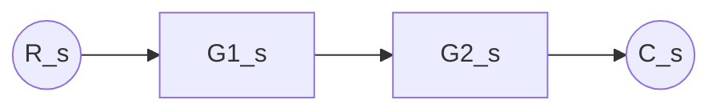

**Equivale a:**

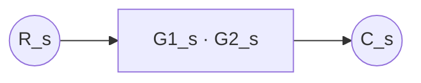

$$ C(s) = G_1(s),G_2(s),R(s) \quad \Rightarrow \quad G_{eq}(s) = G_1(s),G_2(s) $$

> [!note] Justificación breve $C(s) = G_2(s)\big[G_1(s)R(s)\big] = G_1(s)G_2(s)R(s)$. Como la multiplicación de funciones de transferencia (números en $s$, no operadores temporales) es conmutativa, **el orden de bloques en cascada se puede invertir sin alterar el resultado**, siempre que no haya nada "enganchado" entre ellos.

---

## 2. Bloques en Paralelo

Cuando la misma entrada llega a varios bloques y sus salidas se suman (o restan) en un único punto.

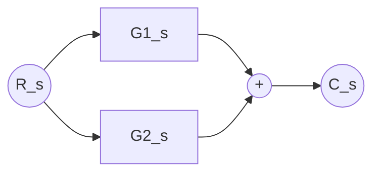

**Equivale a:**

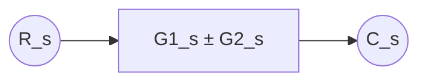

$$ G_{eq}(s) = G_1(s) \pm G_2(s) $$

> [!note] Justificación breve Por superposición (el sistema es lineal): $C(s) = G_1(s)R(s) \pm G_2(s)R(s) = \big[G_1(s) \pm G_2(s)\big]R(s)$.

---

## 3. Reducción de un Lazo de Realimentación (Feedback)

Es la regla más usada en control. Un bloque directo $G(s)$ con una realimentación $H(s)$ que vuelve a un comparador.

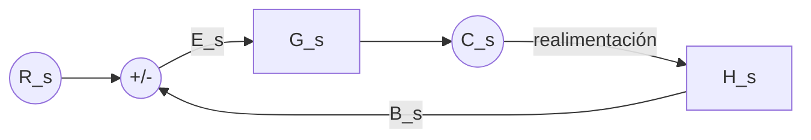

**Equivale a (lazo cerrado):**

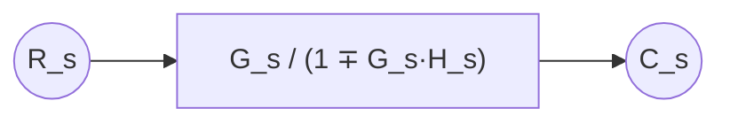

$$ \frac{C(s)}{R(s)} = \frac{G(s)}{1 \mp G(s)H(s)} $$

- **Signo menos abajo (denominador $1+GH$)** → realimentación **negativa** (la resta en el sumador es $-$).
- **Signo más abajo (denominador $1-GH$)** → realimentación **positiva** (la suma en el sumador es $+$).

> [!note] Justificación breve $E(s) = R(s) \mp H(s)C(s)$ y $C(s) = G(s)E(s)$. Reemplazando: $C(s) = G(s)\big[R(s) \mp H(s)C(s)\big] \Rightarrow C(s)\big[1 \pm G(s)H(s)\big] = G(s)R(s)$, de donde se despeja la fórmula. **El signo que queda en el denominador es el opuesto al del sumador.**

> [!tip] Caso particular: realimentación unitaria Si $H(s) = 1$ (realimentación directa, sin sensor con dinámica), la fórmula queda $\dfrac{C(s)}{R(s)} = \dfrac{G(s)}{1+G(s)}$. Es el caso más común en los primeros ejercicios del curso.

---

## 4. Mover un Punto de Suma

A veces conviene "correr" un sumador antes o después de un bloque para poder aplicar las reglas 1-3. La clave es que **la señal que se suma tiene que quedar multiplicada o dividida por el bloque que se cruzó**, para que el resultado final no cambie.

### 4.a Mover el sumador hacia **atrás** (antes del bloque)

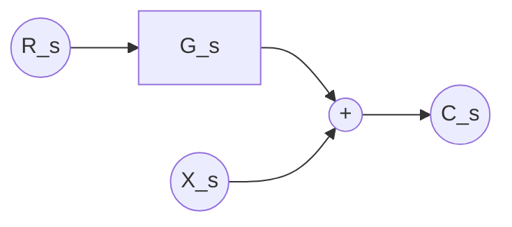

**Equivale a:**

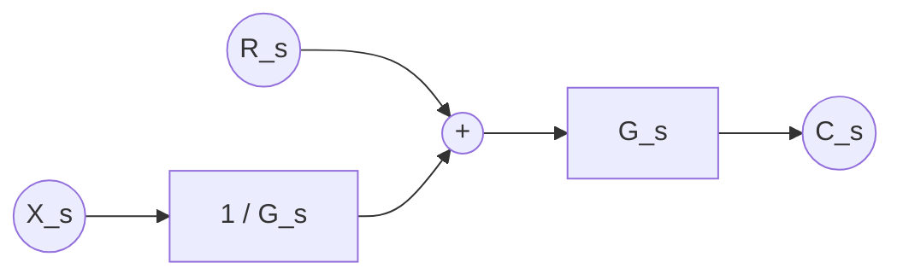

> [!note] Truco Si el sumador "salta" hacia atrás de un bloque $G(s)$, la señal que entraba después ahora debe pasar por $1/G(s)$ **antes** de sumarse, para compensar.

### 4.b Mover el sumador hacia **adelante** (después del bloque)

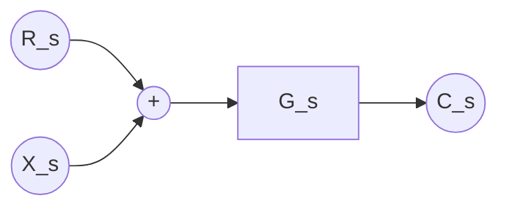

**Equivale a:**

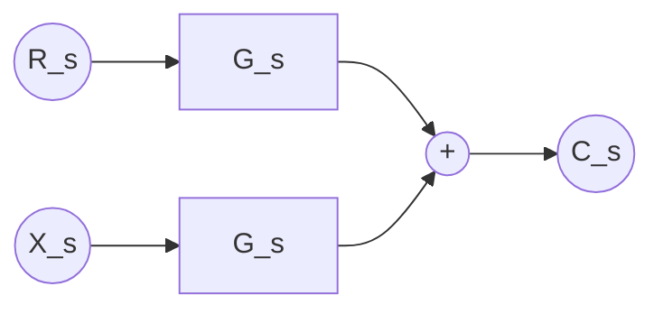

> [!note] Truco Si el sumador "salta" hacia adelante de un bloque $G(s)$, la señal que ya sumaba ahora debe multiplicarse por $G(s)$ para compensar el bloque que se saltó.

---

## 5. Mover un Punto de Toma (Pickoff Point)

Mismo espíritu que el punto de suma: al mover el punto de toma respecto de un bloque, hay que compensar la rama derivada con $G(s)$ o $1/G(s)$.

### 5.a Mover el punto de toma hacia **atrás** (antes del bloque)

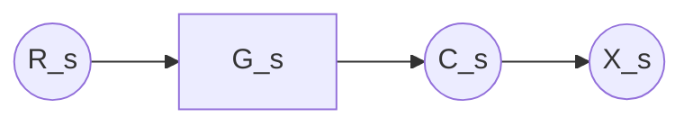

**Equivale a:**

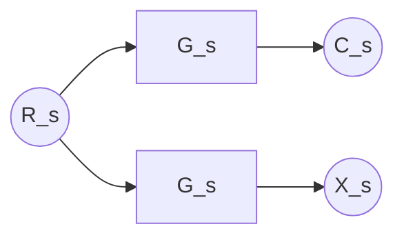

> [!note] Truco Si la toma se mueve hacia atrás del bloque (toma la señal antes de pasar por $G(s)$ en vez de después), la rama derivada debe multiplicarse por $G(s)$ para seguir representando la misma señal que antes.

### 5.b Mover el punto de toma hacia **adelante** (después del bloque)

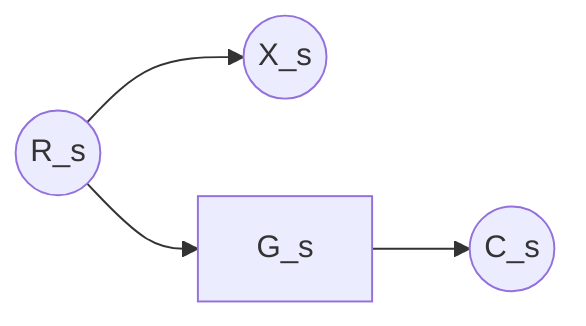

**Equivale a:**

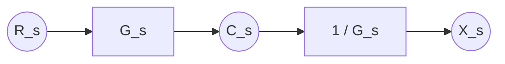

> [!note] Truco Si la toma se mueve hacia adelante del bloque, la rama derivada debe pasar por $1/G(s)$ para "deshacer" el bloque que ahora está de más.

---

## 6. Tabla resumen (chuleta rápida)

|Situación|Transformación|
|---|---|
|Bloques en serie|$G_{eq} = G_1 G_2 \cdots G_n$|
|Bloques en paralelo (mismo sumador)|$G_{eq} = G_1 \pm G_2 \pm \cdots$|
|Lazo de realimentación negativa|$G_{eq} = \dfrac{G}{1+GH}$|
|Lazo de realimentación positiva|$G_{eq} = \dfrac{G}{1-GH}$|
|Realimentación unitaria ($H=1$)|$G_{eq} = \dfrac{G}{1+G}$|
|Mover sumador hacia atrás de $G$|La rama que se suma se divide por $G$|
|Mover sumador hacia adelante de $G$|La rama que se suma se multiplica por $G$|
|Mover toma hacia atrás de $G$|La rama derivada se multiplica por $G$|
|Mover toma hacia adelante de $G$|La rama derivada se divide por $G$|

> [!warning] Trampa clásica de examen Nunca combines dos bloques en "serie" si entre ellos hay un **punto de toma** o un **sumador con otra entrada externa**. Primero hay que mover ese punto de toma o sumador hacia afuera del tramo que querés simplificar.

---

## 7. Ejemplos Resueltos

### Ejemplo 1 — Lazo simple con realimentación no unitaria

**Diagrama original:**

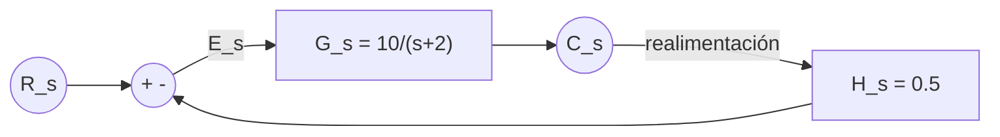

**Paso 1 — aplicar la regla de feedback (Sección 3):**

$$ \frac{C(s)}{R(s)} = \frac{G(s)}{1+G(s)H(s)} = \frac{\dfrac{10}{s+2}}{1+\dfrac{10}{s+2}\cdot 0.5} = \frac{10}{s+2+5} = \frac{10}{s+7} $$

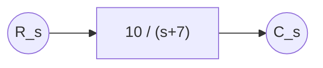

---

### Ejemplo 2 — Punto de toma dentro del lazo (hay que moverlo primero)

**Diagrama original:** un lazo de posición donde la realimentación se toma **entre** dos bloques en cascada, no a la salida final.

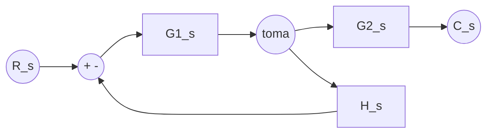

**Paso 1 — no se puede reducir el lazo así, porque la realimentación no sale de $C(s)$.** Movemos el punto de toma **hacia adelante**, del otro lado de $G_2(s)$ (regla 5.b), para que quede tomando la salida real $C(s)$:

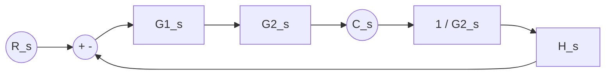

**Paso 2 — ahora sí es un lazo estándar** con bloque directo $G_1(s)G_2(s)$ (serie) y realimentación equivalente $H(s)/G_2(s)$:

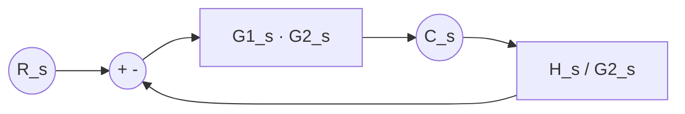

**Paso 3 — aplicar la regla de feedback:**

$$ \frac{C(s)}{R(s)} = \frac{G_1G_2}{1+G_1G_2\cdot \dfrac{H}{G_2}} = \frac{G_1G_2}{1+G_1H} $$

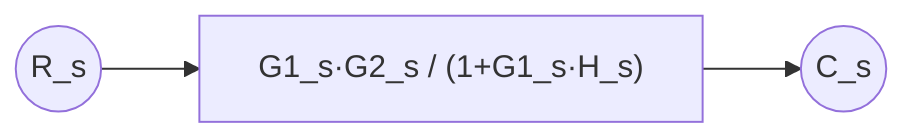

> [!tip] Lección del ejemplo 2 Cuando el punto de toma no coincide con la salida final, **siempre conviene moverlo primero** (regla 5) para poder usar la fórmula estándar del lazo (regla 3). Es el error más común: aplicar $G/(1+GH)$ directamente sin fijarse de dónde sale realmente $H(s)$.

---

### Ejemplo 3 — Combinación de paralelo + lazo (control con prealimentación)

**Diagrama original:** dos caminos directos en paralelo ($G_1$ y $G_2$) antes de entrar a un lazo con $H(s)$.

```mermaid
flowchart LR
    R((R_s)) --> S1(("+")) --> S2(("+ -")) --> G3["G3_s"] --> C((C_s))
    R --> G1["G1_s"] --> S1
    C --> H["H_s"] --> S2
```

_(Nota: en este ejemplo $G_1(s)$ sería una prealimentación directa que se suma antes del comparador, y $S1$ luego entra al sumador principal $S2$.)_

**Paso 1 — combinar $R(s)$ directo con la rama de $G_1(s)$ (regla 2, paralelo):**

$$ S_1(s) = R(s) + G_1(s)R(s) = \big[1+G_1(s)\big]R(s) $$

```mermaid
flowchart LR
    R((R_s)) --> GP["1 + G1_s"] --> S2(("+ -")) --> G3["G3_s"] --> C((C_s))
    C --> H["H_s"] --> S2
```

**Paso 2 — aplicar la regla de feedback al lazo restante:**

$$ \frac{C(s)}{R(s)} = \frac{\big[1+G_1(s)\big]G_3(s)}{1+G_3(s)H(s)} $$

```mermaid
flowchart LR
    R((R_s)) --> GEQ["(1+G1_s)·G3_s / (1+G3_s·H_s)"] --> C((C_s))
```

> [!tip] Lección del ejemplo 3 Cuando hay ramas en paralelo **fuera** del lazo de realimentación, conviene resolverlas primero (reduciéndolas a un solo bloque equivalente) y recién después atacar el lazo. Ir de "afuera hacia adentro" simplifica mucho el álgebra.

---

## 8. Checklist para resolver un diagrama en el parcial

1. Identificar si hay puntos de toma o sumadores **enredados** dentro de un tramo que parece serie o paralelo → moverlos primero (Secciones 4 y 5).
2. Reducir cascadas y paralelos que queden "limpios" (Secciones 1 y 2).
3. Identificar el lazo de realimentación resultante y aplicar $G/(1\pm GH)$ (Sección 3), prestando atención al signo del sumador.
4. Repetir el proceso: cada reducción puede dejar un nuevo lazo o cascada para simplificar, hasta llegar a un único bloque $R(s) \rightarrow C(s)$.
5. Verificar dimensional y físicamente que el resultado tenga sentido (por ejemplo, orden del denominador, ganancia en DC con $s=0$, etc.).

## Notas relacionadas

- `[[Función de Transferencia]]`
- `[[Estabilidad de Sistemas]]` — una vez reducido el diagrama a $C(s)/R(s)$, el denominador da el polinomio característico.
- `[[Regla de Mason]]` — método alternativo (fórmula de ganancia de Mason) para diagramas muy enredados, sin necesidad de reducir paso a paso.