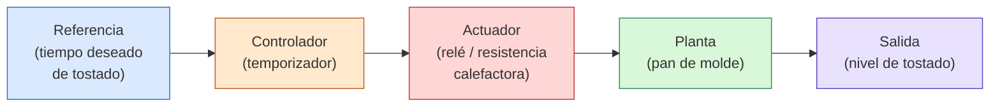
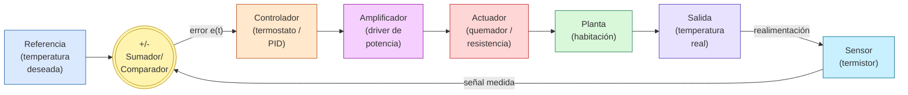

## 1. Ejemplo de Sistema de Lazo Abierto

**Caso:** tostadora eléctrica controlada por temporizador.

En un sistema de **lazo abierto**, la señal de control se calcula únicamente en base a la entrada de referencia, **sin medir la salida real** ni corregir el resultado. No hay realimentación (feedback).

### Descripción de cada elemento

|Elemento|Rol en este ejemplo|Función general|
|---|---|---|
|**Referencia (R)**|Tiempo de tostado seleccionado por el usuario en la perilla|Es la entrada deseada del sistema (setpoint)|
|**Controlador (C)**|Temporizador mecánico/electrónico|Genera la señal de mando a partir de la referencia, sin conocer el estado real del proceso|
|**Actuador (A)**|Relé que energiza la resistencia|Ejecuta físicamente la acción de control (enciende/apaga el calentamiento)|
|**Planta (P)**|El pan dentro de la tostadora|El proceso físico que se quiere controlar|
|**Salida (Y)**|Nivel de tostado final del pan|Resultado real del proceso, **no se mide ni se realimenta**|

> [!warning] Limitación clave Si el pan es más grueso, está congelado, o la tensión de línea varía, el sistema **no se entera** y no corrige nada: el resultado puede salir muy tostado o crudo, porque no hay sensor que compare la salida con la referencia.

---

## 2. Ejemplo de Sistema de Lazo Cerrado

**Caso:** control de temperatura de una habitación con termostato (calefacción).

En un sistema de **lazo cerrado**, la salida se mide con un sensor y esa medición se compara continuamente contra la referencia, generando una señal de **error** que corrige la acción de control. Hay realimentación negativa.

### Descripción de cada elemento

|Elemento|Rol en este ejemplo|Función general|
|---|---|---|
|**Referencia (R)**|Temperatura seteada en el termostato (ej. 22°C)|Entrada deseada del sistema (setpoint)|
|**Sumador/Comparador**|Circuito o algoritmo que resta la temperatura medida a la deseada|Calcula la señal de error: e(t) = R − Y|
|**Controlador (C)**|Termostato electrónico (o un PID en un sistema más sofisticado)|Decide cuánta acción de control aplicar en base al error|
|**Amplificador**|Driver o etapa de potencia|Eleva la señal de control (baja potencia) a un nivel capaz de mover al actuador|
|**Actuador**|Quemador de gas o resistencia eléctrica|Ejecuta la acción física de calentar|
|**Planta (P)**|La habitación (su masa térmica, aislación, pérdidas)|Proceso físico cuya variable de salida se quiere regular|
|**Salida (Y)**|Temperatura real de la habitación|Resultado medible del proceso|
|**Sensor**|Termistor / termopar|Mide la salida real y la convierte en señal para realimentar al comparador|

> [!success] Ventaja clave Si se abre una puerta y la habitación se enfría, el **sensor** detecta la caída de temperatura, el **comparador** genera un error mayor, y el **controlador** ordena más calefacción hasta volver a la referencia. El sistema se **autocorrige** ante perturbaciones, algo que el lazo abierto no puede hacer.

---

## Comparación rápida

|'|Lazo Abierto|Lazo Cerrado|
|---|---|---|
|Realimentación|No tiene|Sí tiene|
|Sensor de salida|No|Sí|
|Corrige perturbaciones|No|Sí|
|Complejidad / costo|Menor|Mayor|
|Ejemplo típico|Tostadora, lavarropas por tiempo, semáforo de tiempo fijo|Termostato, control de velocidad de motor con tacómetro, control de crucero|

---

## Notas para ampliar esta nota en Obsidian

- Podés usar `[[ ]]` para linkear esta nota con otras como `[[Función de Transferencia]]` o `[[Estabilidad de Sistemas]]`.
- Si querés simular la respuesta temporal (escalón, error en régimen permanente, etc.), el plugin **Mathjax / LaTeX** (nativo de Obsidian) te permite escribir las ecuaciones de la planta y el controlador directamente en la nota, por ejemplo:

$$ G(s) = \frac{K}{\tau s + 1} $$

- Para diagramas de bloques más complejos con múltiples lazos anidados, Mermaid también soporta subgrafos (`subgraph`), útil si más adelante agregás un lazo de realimentación secundario (cascada). 