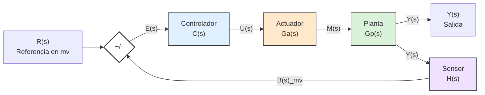

##### Ejemplo caldera
Basicamente la caldera es la planta y entra fuego por abajo que se intensifica o baja segun la entrada de gas que es controlada por un controlador entonces:
Controlador: controlador que recibe data de sensor
Actuador: valvula de flujo de gas
Planta: La propia caldera a la que quiero indicar temperatura de agua
Sensor: que sensa la temperatura y realimenta al controlador

>[!Important] Derivacion
>Luego de la planta sale una **derivacion**, donde para la salida y para el sensor sale *exactamente lo mismo*.

>[!explanation]
>Es importante tambien saber que la referencia esta dada en, por ejemplo, Mv o milivolt, donde
>antes existe un elemento de ajuste como una perilla que transforma a milivolt. Luego la salida del sensor es tambien en mv. Ambas entradas se suman/restan en el comparador y el controlador actua en flujo de que tanto mv reciba.
>

#### Punto suma
En un lugar donde se sume/reste algo es importante que se ingrese **La misma medida**, sea mv, grados, temperatura o lo que sea

Todo esto tambien tiene delay de compensacion, no es instantaneo. Entonces para este caso la temperatura no llega al valor deseado instantaneamente, sino que lo hace de forma quizas:
- Logaritmica
- Logaritmica que crece muy rapido
- logiaritmica sinusoidal, pasandome del valor buscado
Entre otras. Todo depende de la velocidad que necesite o si se puede pasar de temperatura mi variable de control

#### Diagrama de bloques en lazo cerrado
![[Pasted image 20260821195521.png]]

La referencia entra al punto suma y es restada por la salida de H(s) o sensor entonces queda $$e(t) = r(t) - b(t)$$
#### Ecuaciones diferenciales aplicadas a control - Los sistemas matematicos
**Son solo para sistemas de lazos cerrados**
Cada caja termina siendo una ecuacion diferencial donde es necesario utilizar laplace para resolverlas.
Una descripción cuantitativa del comportamiento de un sistema, deducida de leyes de conservación: Newton, Kirchhoff, balance de masa y energía.
Una descripción cuantitativa del comportamiento de un sistema, deducida de leyes de conservación: Newton, Kirchhoff, balance de masa y energía.

#### Linealidad de un sistema
- Homogeneidad: escalar la entrada escala la salida.
- Aditividad: la respuesta a una suma es la suma de las respuestas.
##### El problema
Casi nunca se labura con linealidad porque hay saturacion, friccion, etc.
Entonces terminamos trabajando con tramos que se aproximan a la linealidad y se trabaja en entornos centrados a un punto. 
### Respuestas a sistemas matematicos
Existen dos familias de respuesta que podemos encontrar
#### Respuesta a ecuaciones diferenciales o sistemas de primer orden
Nunca oscila, la respuesta es una exponencial que se acerca asintoticamenta a un valor final. Por ejemplo, nivel de un tanque o carga de capacitor
#### Respuesta a ecuaciones diferenciales o sistemas de segundo orden
El sistema puede oscilar y por ende tener un impulso por sobre el valor que se busca alcanzar o input. La respuesta entonces puede ser:
- Sobreamortiguado: lenta y sin sobrepico
- Critico: La mas rapida posible que no sobrepasa el valor final
- Subamortiguado: Es rapido pero oscila y sobrepico, es decir, se pasa del nivel buscado
![[Pasted image 20260821200548.png]]

##### Caso 1 — Tanque de agua con flotante (1er orden)

**Ecuación diferencial:** la variación del nivel es proporcional a lo que falta para llegar a la consigna.

$$\frac{dh(t)}{dt} = K \cdot (h_{ref} - h(t))$$

**Solución** (partiendo del tanque vacío, `h(0) = 0`):

$$h(t) = h_{ref} \cdot (1 - e^{-K t})$$

- El factor `1/K` fija la velocidad del transitorio: a mayor `K`, más rápido se llena.
- En `t = 3/K` el nivel alcanza ≈95 % del valor final — la firma típica de un sistema de primer orden (y del RLC sobreamortiguado, más adelante).
- Analogía cotidiana: el tanque del inodoro, que sube rápido al principio y se demora en los últimos centímetros.

---

##### Caso 2 — Circuito RLC serie (2do orden)

![[Pasted image 20260821200807.png]]

**Ley de tensiones de Kirchhoff:**

$$v_i(t) = v_R(t) + v_L(t) + v_C(t)$$
Donde:
- $v_i(t)$ es entrada del sistema 
- $v_c(t)$ es la salida de sistema
**Relaciones constitutivas:**

$$v_R = R*i(t) \qquad v_L = L*\frac{di(t)}{dt} \qquad i(t) = C*\frac{dv_C(t)}{dt}$$

**Sustituyendo todo en función de la salida `v_C(t)`:**

$$v_i = L C \frac{d^2 v_C}{dt^2} + R C \frac{d v_C}{dt} + v_C$$

Es una ecuación diferencial ordinaria de **segundo orden**. Resolverla en el tiempo para cada tipo de entrada (escalón, rampa, senoidal) es engorroso, y peor si se acoplan más mallas → esto motiva pasar al dominio de Laplace.

#### Resolucion por laplace
La transformada traslada una función del dominio del tiempo `t` al dominio complejo `s = σ jω`:
$$\mathcal{L}{f(t)} = F(s) = \int_0^\infty f(t),e^{-st},dt$$

>Asi podemos siplificar el analisis de un modelo fisico que este dado en ecuaciones diferenciales de primer o segundo orden.

**Diccionario de traducción** (con condiciones iniciales nulas, es decir, el sistema parte del reposo: tanque vacío, capacitor descargado, resorte sin deformar):

|Operación en el tiempo|Operación en `s`|
|---|---|
|`a·f(t) + b·g(t)`|`a·F(s) + b·G(s)` (linealidad)|
|`df(t)/dt`|`s·F(s)` (si `f(0)=0`)|
|`d²f(t)/dt²`|`s²·F(s)`|
|`∫ f(t) dt`|`F(s)/s`|

**Derivar = multiplicar por `s`. Integrar = dividir por `s`.** Así, ecuaciones diferenciales se convierten en álgebra de polinomios.
> Solo se puede aplicar a sistemas **lineales** e **invariantes** en el tiempo
#### La funcion de transferencia
Función de transferencia

$$G(s) = \frac{Y(s)}{X(s)} \qquad \Rightarrow \qquad Y(s) = G(s) \cdot X(s)$$

Cociente entre la transformada de la salida y la de la entrada, **bajo condiciones iniciales estrictamente nulas**, es decir, que en t=0, las corrientes, voltages, etc iniciales estan en 0

- Es una **propiedad del sistema**: depende de la física y los parámetros, no de la entrada aplicada.
- Solo se aplica a sistemas **LTI**.
- Describe la relación entrada-salida, pero **no** el estado interno.
- No sirve si las condiciones iniciales no son nulas.

> [!tip] Analogía para Sistemas de Información La función de transferencia es como la **API de un sistema**: una caja negra con una entrada, una salida, y un contrato bien definido entre ambas. No importa la implementación interna.

**Convención de nomenclatura de la cátedra** (importante para la Clase 2):

- `G(s)` → plantas, controladores y ramas directas.
- `H(s)` → **exclusivamente** el bloque de realimentación.
> La magia esta en transformar multiples G(s) de cada planta, controlador y rama directa en una unica G(s)
#### Continuacion de ejemplo RLC en laplace

Partiendo de la ecuación diferencial 
$$v_i = L C \frac{d^2 v_C}{dt^2} + R C \frac{d v_C}{dt} + v_C$$ y aplicando la transformada con condiciones iniciales nulas:

$$V_i(s) = LCs^2 V_C(s) + RCs,V_C(s) + V_C(s) = \left[LCs^2 + RCs + 1\right]V_C(s)$$

$$G(s) = \frac{V_C(s)}{V_i(s)} = \frac{1}{LCs^2 + RCs + 1}$$

Forma canónica de un sistema de segundo orden. Nótese que la corriente `i(t)` desaparece del resultado: la dinámica depende únicamente de `R`, `L` y `C` — es una propiedad del circuito, no de la señal aplicada.

#### Polos, ceros y estabilidad

**Criterio de estabilidad:** el sistema es estable si **todos sus polos tienen parte real negativa** (semiplano izquierdo del plano complejo `s = σ + jω`).

- **Ceros:** raíces del numerador → modifican la forma del transitorio.
- **Polos:** raíces del denominador → determinan estabilidad y tipo de respuesta.

### Ejemplo numérico

Con `R = 20 Ω`, `L = 10 H`, `C = 0,1 F`:

$$LC = 1 \qquad RC = 2$$ $$G(s) = \frac{1}{s^2 + 2s + 1} = \frac{1}{(s+1)^2}$$

- **Ceros:** ninguno (numerador constante).
- **Polos:** uno doble, real, en `s = −1`.
- Al estar en el semiplano izquierdo → **sistema estable**.
- Polo doble real → respuesta **críticamente amortiguada** (el retorno más rápido posible sin sobrepico).
#### Entonces

1. **La realimentación es la idea central:** medir la salida, compararla con la referencia y corregir el error permite automatizar con inmunidad a perturbaciones. Watt ya lo hacía con hierro.
2. **La física se escribe como ecuaciones diferenciales:** todo sistema dinámico se modela desde leyes de conservación.
3. **Laplace es el puente:** convierte cálculo diferencial en álgebra de polinomios.
4. **Los polos hablan:** su ubicación dice de inmediato si el sistema es estable y qué tipo de transitorio va a tener.
##### Ejemplo lavarropas - Que sistemas de control tiene?
- El lavado de ropa: Sistema de **lazo abierto** ya que lava pero no tiene retroalimentacion sobre que tanto o tan limplia queda la ropa
- Control de ingreso de agua para que no se pase. Hay que saber que mientras mas ropa, menos agua puedo meter. Entonces es un sistema de **lazo cerrado**. 
- Control de temperatura de agua: Depende si recibe agua fria y caliente pero en general son de lazo abierto porque mide poco
- Control de desagote: No suele haber mucha validacion
- Suavizante: lazo abierto

### Para diferenciar
- Lazo abierto, en algun momento determinado corto la entrada
- Lazo cerrado, hago alguna validacion