Si estamos ante un sistema de control y queremos modelarlo lo tenemos que hacer mediante bloques y segmentos de union.

# Los cuatro elementos

## 1. Flecha de señal

Representa una **variable que viaja en un único sentido**.

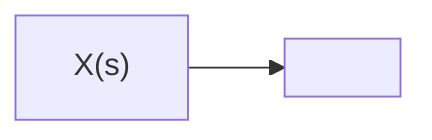

> [!IMPORTANT]  
> No existen flechas bidireccionales.

---

## 2. Bloque de función

Contiene la **función de transferencia** del componente. La salida es la entrada por su contenido.

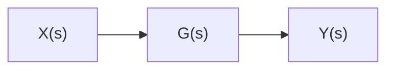

### Regla del bloque

La salida se obtiene multiplicando la entrada por la función de transferencia:

$Y(s)=G(s)⋅X(s) ------- Y(s) = G(s) \cdot X(s)$

> [!TIP]  
> Toda la física real del componente está escondida dentro del bloque.  
> Por eso podemos operar sobre el diagrama sin volver a las ecuaciones diferenciales.

---

## 3. Punto suma

Permite **sumar o restar algebraicamente dos o más señales**.

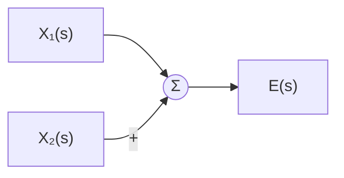

También puede tener ramas con signo negativo:

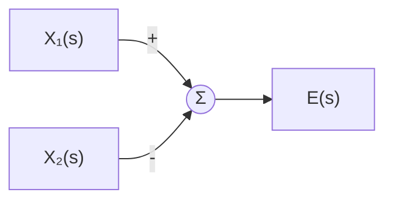

### Regla del punto suma

Es **imprescindible anotar explícitamente el signo de cada rama que entra**.

> [!WARNING]  
> La enorme mayoría de los errores de resolución vienen de un **signo perdido en un comparador**.

---

## 4. Bifurcación

Una bifurcación **reparte una señal sin modificarla**.

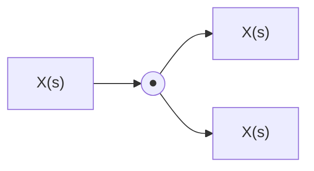

> [!IMPORTANT]  
> **Bifurcar no divide la señal: la duplica.**
> 
> Cada rama se lleva el **valor completo**, no una fracción.

---

# Reglas de lectura

## Regla general del bloque

Cuando una señal atraviesa un bloque:

$Y(s)=G(s)⋅X(s)$$$\boxed{Y(s) = G(s) \cdot X(s)}$$

Es decir:

**Entrada → función de transferencia → salida**


---

## Resumen de los cuatro elementos

| Elemento          | Función                                     |
| ----------------- | ------------------------------------------- |
| ➡️ **Flecha**     | Transporta una variable en un único sentido |
| ▣ **Bloque**      | Representa una función de transferencia     |
| ⊕ **Punto suma**  | Suma o resta señales                        |
| ● **Bifurcación** | Duplica una señal en varias ramas           |

---

# Convención de notación del curso

- **$G(s)$**: se utiliza para **ramas directas, plantas y controladores**. Va de izquierda a derecha
    
- **$H(s)$**: se utiliza **exclusivamente para realimentación**. Son ganancias y van de derecha a izquierda
    

> [!NOTE]  
> Esta convención permite identificar rápidamente qué representa cada bloque dentro de un diagrama de control.

# Bloques en serie (cascada)

En una conexión **en serie**, la salida de un bloque alimenta directamente la entrada del siguiente, **sin bifurcaciones intermedias**.

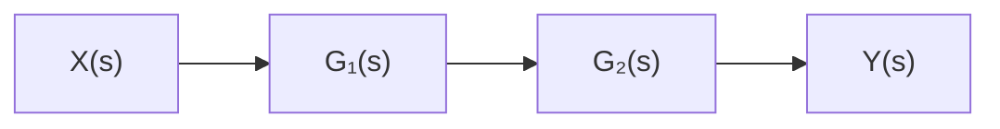

## Deducción con la variable intermedia $M(s)$

Primero analizamos cada bloque por separado:

M(s)=G1(s)⋅X(s)
M(s) = G_1(s) \cdot X(s)

Luego:

Y(s)=G2(s)⋅M(s)
Y(s) = G_2(s) \cdot M(s)

Reemplazando $M(s)$:

Y(s)=G2(s)⋅G1(s)⋅X(s)
Y(s) = G_2(s) \cdot G_1(s) \cdot X(s)

Por lo tanto, el **bloque equivalente** es:

Geq(s)=G1(s)⋅G2(s)
\boxed{G_{eq}(s) = G_1(s) \cdot G_2(s)}

> [!NOTE]  
> En sistemas lineales, el orden no altera el producto:
> 
> G1(s)G2(s)=G2(s)G1(s)G_1(s)G_2(s) = G_2(s)G_1(s)
> 
> Por lo tanto, podemos multiplicar las funciones de transferencia en cualquier orden.

---

# Bloques en paralelo

Dos bloques están en **paralelo** cuando reciben exactamente la **misma entrada** y sus salidas confluyen en un punto suma.

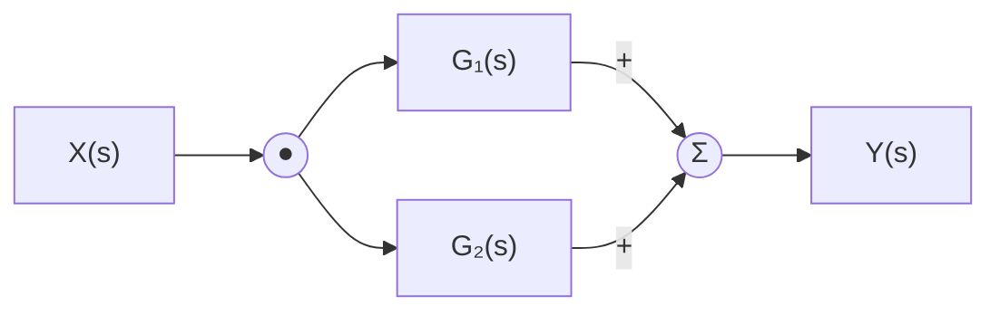

> [!IMPORTANT]  
> Ambos bloques reciben **exactamente la misma entrada**.

---

## Deducción con dos variables intermedias

Para el primer bloque:

M(s)=G1(s)⋅X(s)
M(s) = G_1(s) \cdot X(s)

Para el segundo:

N(s)=G2(s)⋅X(s)
N(s) = G_2(s) \cdot X(s)

Las dos salidas se combinan en el punto suma:

Y(s)=M(s)+N(s)
Y(s) = M(s) + N(s)

Reemplazando:

Y(s)=G1(s)X(s)+G2(s)X(s)
Y(s) = G_1(s)X(s) + G_2(s)X(s)

Factorizando la entrada común:

Y(s)=[G1(s)+G2(s)]X(s)
Y(s) = [G_1(s) + G_2(s)]X(s)

Por lo tanto, el **bloque equivalente** es:

Geq(s)=G1(s)+G2(s)
\boxed{G_{eq}(s) = G_1(s) + G_2(s)}

### Si el punto suma tiene una resta

Si una de las ramas entra con signo negativo:

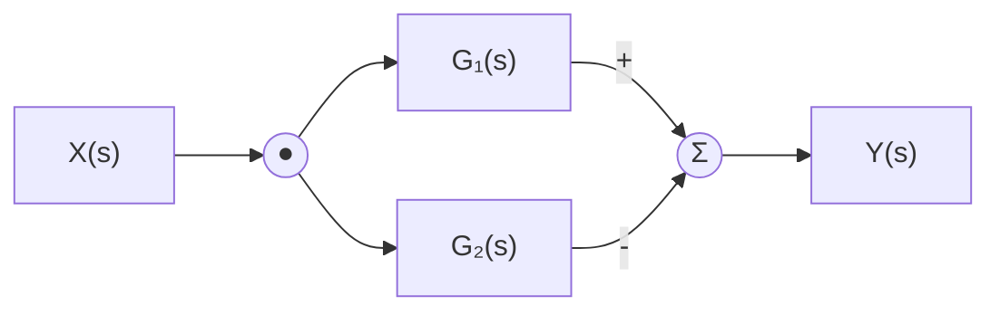

Entonces:

Y(s)=M(s)−N(s)Y(s) = M(s) - N(s)

y el bloque equivalente pasa a ser:

Geq(s)=G1(s)−G2(s)\boxed{G_{eq}(s) = G_1(s) - G_2(s)}

---

# Resumen

|Configuración|Bloque equivalente|
|---|---|
|**Serie / cascada**|$G_{eq}(s)=G_1(s)G_2(s)$|
|**Paralelo, suma**|$G_{eq}(s)=G_1(s)+G_2(s)$|
|**Paralelo, resta**|$G_{eq}(s)=G_1(s)-G_2(s)$|

> [!TIP]  
> **Regla rápida:**
> 
> - 🔗 **Serie → multiplicar**
>     
> - ➕ **Paralelo → sumar**
>     
> - ➖ **Paralelo con signo negativo → restar**


# Realimentación negativa

## Planteo y despeje

El sistema tiene una **entrada de referencia** $\theta_i(s)$, una función de transferencia directa $G(s)$ y una realimentación dada por $H(s)$.

> [!IMPORTANT]  
> En el punto suma, la realimentación **entra restando**:
> 
> E(s)=θi(s)−B(s)E(s) = \theta_i(s) - B(s)

---

## Las tres ecuaciones del lazo

Podemos describir todo el sistema utilizando tres ecuaciones:

### 1. Bloque directo

La salida del bloque $G(s)$ es:

θo(s)=G(s)⋅E(s)\theta_o(s) = G(s) \cdot E(s)

### 2. Bloque de realimentación

La señal que vuelve al punto suma es:

B(s)=H(s)⋅θo(s)B(s) = H(s) \cdot \theta_o(s)

### 3. Punto suma

Como la realimentación es negativa:

E(s)=θi(s)−B(s)E(s) = \theta_i(s) - B(s)

---

# Sustitución

Partimos de:

θo(s)=G(s)⋅E(s)\theta_o(s) = G(s) \cdot E(s)

Reemplazamos $E(s)$:

θo(s)=G(s)[θi(s)−B(s)]\theta_o(s) = G(s)[\theta_i(s) - B(s)]

Como:

B(s)=H(s)θo(s)B(s) = H(s)\theta_o(s)

tenemos:

θo(s)=G(s)[θi(s)−H(s)θo(s)]\theta_o(s) = G(s)[\theta_i(s) - H(s)\theta_o(s)]

Distribuyendo:

θo(s)=G(s)θi(s)−G(s)H(s)θo(s)\theta_o(s) = G(s)\theta_i(s) - G(s)H(s)\theta_o(s)

Agrupamos los términos que contienen $\theta_o(s)$:

θo(s)+G(s)H(s)θo(s)=G(s)θi(s)\theta_o(s) + G(s)H(s)\theta_o(s) = G(s)\theta_i(s)

Factorizamos:

θo(s)[1+G(s)H(s)]=G(s)θi(s)\theta_o(s)[1 + G(s)H(s)] = G(s)\theta_i(s)

Finalmente:

θo(s)θi(s)=G(s)1+G(s)H(s)\boxed{ \frac{\theta_o(s)}{\theta_i(s)} = \frac{G(s)}{1+G(s)H(s)} }

---

# Resultado y regla de signos

## Fórmula canónica: realimentación negativa

Para un sistema con **realimentación negativa**:

Geq(s)=G(s)1+G(s)H(s)\boxed{ G_{eq}(s) = \frac{G(s)} {1+G(s)H(s)} }

La relación entrada-salida queda:

θo(s)θi(s)=G(s)1+G(s)H(s)\boxed{ \frac{\theta_o(s)}{\theta_i(s)} = \frac{G(s)} {1+G(s)H(s)} }

---

## Si la realimentación fuera positiva

Si en lugar de restar, la realimentación **entrara sumando**, tendríamos:

E(s)=θi(s)+B(s)E(s) = \theta_i(s) + B(s)

Repitiendo el mismo procedimiento:

Geq(s)=G(s)1−G(s)H(s)\boxed{ G_{eq}(s) = \frac{G(s)} {1-G(s)H(s)} }

Por lo tanto:

|Tipo de realimentación|Denominador|
|---|---|
|**Negativa** → entra restando|$1 + G(s)H(s)$|
|**Positiva** → entra sumando|$1 - G(s)H(s)$|

---

# Regla para no equivocarse

> [!WARNING]  
> **El signo del denominador es siempre el OPUESTO al signo con el que la realimentación entra al punto suma.**

- **Entra restando** → realimentación negativa → denominador **$1 + GH$**
- **Entra sumando** → realimentación positiva → denominador **$1 - GH$**

### 🧠 Regla rápida

signo en denominador=opuesto al signo de entrada\boxed{ \text{signo en denominador} = \text{opuesto al signo de entrada} }

---

# Aclaración importante

> [!important] Realimentacion positiva  
> **Realimentación positiva no significa automáticamente inestabilidad.**
> 
> Si la ganancia de lazo se mantiene por debajo de $1$, el sistema puede ser estable.
> 
> La realimentación positiva se utiliza, por ejemplo, en **osciladores** y **circuitos con histéresis**.

---

## Desplazamiento de sumadores y bifurcadores sin alterar el sistema
Que pasa cuando el diagrama es complicado de analizar? Hago movimientos algebraicos

# Mover un punto suma

Mover un punto suma dentro de un diagrama de bloques permite **simplificar la estructura del sistema sin cambiar su comportamiento**.

La idea fundamental es:

> [!IMPORTANT]  
> La señal resultante debe ser **idéntica antes y después del movimiento**.

---

## Hacia adelante

Cuando movemos el punto suma **hacia adelante**, pasa a estar **después de un bloque $G$**.

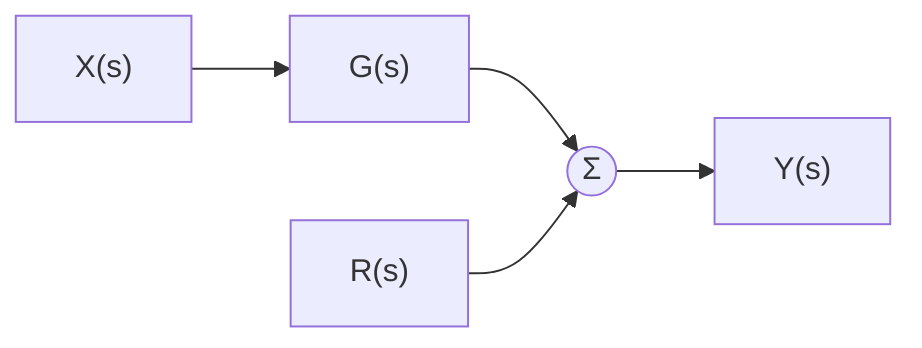

Para conservar el mismo resultado, la rama lateral que originalmente entraba al sumador debe **multiplicarse por $G$**:

rama nueva=G⋅rama original\boxed{\text{rama nueva} = G \cdot \text{rama original}}

### ¿Por qué?

La señal de la rama principal ahora ya pasó por $G$.  
Para que ambas contribuciones sigan teniendo el mismo efecto en el punto suma, la rama lateral también debe compensar ese cambio.

---

## Hacia atrás

Cuando movemos el punto suma **hacia atrás**, pasa a estar **antes de un bloque $G$**.

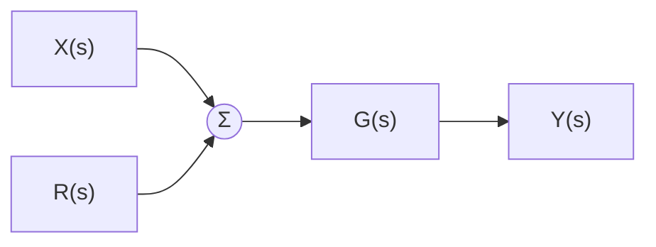

Ahora la rama lateral debe **dividirse por $G$**:

rama nueva=rama originalG\boxed{\text{rama nueva} = \frac{\text{rama original}}{G}}

### ¿Por qué?

La rama ahora atraviesa el bloque $G$, cuando antes no lo hacía.  
Por lo tanto, debemos dividirla por $G$ para compensar la multiplicación que sufrirá después.

---

# Regla rápida para puntos suma

|Movimiento|Compensación de la rama|
|---|---|
|**Hacia adelante** → después de $G$|$\times G$|
|**Hacia atrás** → antes de $G$|$\div G$|

> [!TIP]  
> Pensalo como una compensación:
> 
> **Mover hacia adelante → multiplicar.**  
> **Mover hacia atrás → dividir.**

---

# Sumadores adyacentes

Dos puntos suma **consecutivos** pueden intercambiarse libremente sin alterar el resultado.

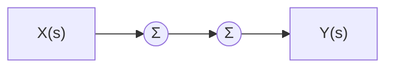

Se pueden intercambiar:


Siempre que se mantengan correctamente los signos de las ramas.

---

# Mover una bifurcación

Una **bifurcación** permite extraer una copia de una señal para enviarla por otra rama.

El principio es el mismo que con los puntos suma:

> [!IMPORTANT]  
> La señal resultante debe ser **idéntica antes y después del movimiento**.

---

## Hacia adelante

Cuando movemos la bifurcación **hacia adelante**, pasando de estar antes de $G$ a estar después de $G$:

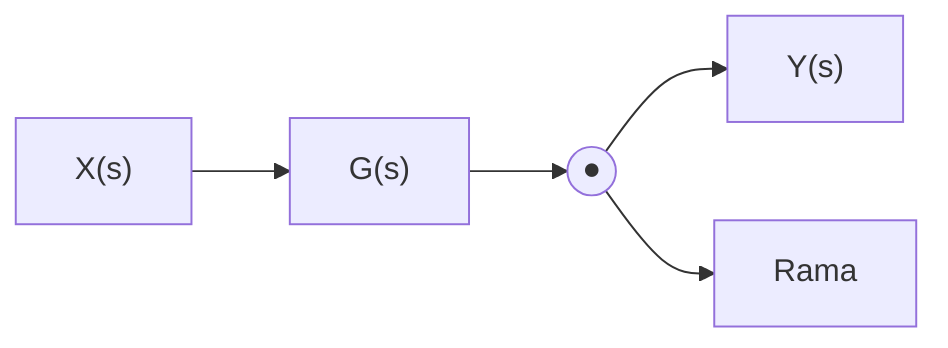

La rama que se bifurca debe **dividirse por $G$**:

rama nueva=rama originalG\boxed{ \text{rama nueva} = \frac{\text{rama original}}{G} }

### ¿Por qué?

La señal que ahora extraemos **ya pasó por el bloque $G$**.  
Debemos devolverla a su valor original dividiendo por $G$.

---

## Hacia atrás

Cuando movemos la bifurcación **hacia atrás**, pasando de estar después de $G$ a estar antes:

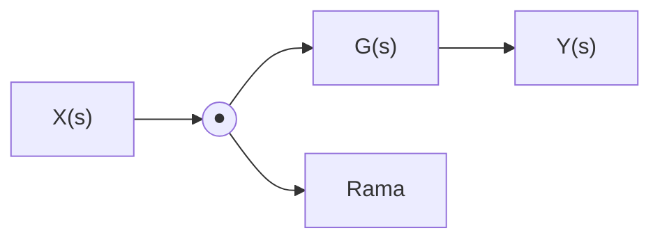

La rama bifurcada debe **multiplicarse por $G$**:

rama nueva=G⋅rama original\boxed{ \text{rama nueva} = G \cdot \text{rama original} }

### ¿Por qué?

Ahora la señal se extrae **antes de atravesar $G$**, por lo que debemos simular el efecto que tendría al pasar por el bloque.

---

# Regla rápida para bifurcaciones

|Movimiento|Compensación de la rama|
|---|---|
|**Hacia adelante** → después de $G$|$\div G$|
|**Hacia atrás** → antes de $G$|$\times G$|

> [!TIP]  
> Acá la regla es **opuesta a la de los puntos suma**:
> 
> **Bifurcación hacia adelante → dividir.**  
> **Bifurcación hacia atrás → multiplicar.**

---

# 🧠 Cómo no memorizar las reglas

No hace falta aprenderse una tabla de memoria.

> [!IMPORTANT]  
> **Escribí la ecuación del nodo antes y después del movimiento y elegí la compensación necesaria para que ambas ecuaciones sean iguales.**

El principio subyacente siempre es el mismo:

Sen˜al antes del movimiento=Sen˜al despueˊs del movimiento\boxed{\text{Señal antes del movimiento} = \text{Señal después del movimiento}}

La compensación simplemente sirve para que **mover elementos del diagrama no modifique el comportamiento del sistema**.

### Resumen general

|Elemento|Hacia adelante|Hacia atrás|
|---|--:|--:|
|**Punto suma**|$\times G$|$\div G$|
|**Bifurcación**|$\div G$|$\times G$|

> [!NOTE]  
> Una buena forma de recordarlo es pensar **qué le pasa a la señal al atravesar $G$**:
> 
> - Si la señal **ahora atraviesa $G$ y antes no** → compensá con $\div G$.
>     
> - Si la señal **deja de atravesar $G$** → compensá con $\times G$.

# Principio de superposición

## El principio y el método

> [!IMPORTANT]  
> En un **sistema lineal e invariante en el tiempo**, la respuesta a varias entradas simultáneas es igual a la **suma de las respuestas individuales**.

En este caso tenemos **dos entradas**:

- **Referencia o setpoint:** $\theta_i(s)$
    
- **Perturbación:** $\theta_p(s)$
    

---

## Procedimiento

Para analizar el efecto de cada entrada por separado:

### Paso 1 — Pasivar la perturbación

Hacemos:

θp(s)=0\theta_p(s) = 0

y calculamos la salida debida **solo al setpoint**.

### Paso 2 — Pasivar el setpoint

Hacemos:

θi(s)=0\theta_i(s) = 0

y calculamos la salida debida **solo a la perturbación**.

### Paso 3 — Sumar las respuestas

La salida total es la suma algebraica de ambas respuestas:

θo(s)=θo1(s)+θo2(s)\theta_o(s) = \theta_{o1}(s) + \theta_{o2}(s)

> [!NOTE]  
> **Pasivar** significa simplemente poner esa entrada en cero y **borrar esa flecha del diagrama**.

---

# Aplicación al lazo con perturbación

El sistema tiene una entrada de referencia $\theta_i(s)$ y una perturbación $\theta_p(s)$ que se introduce entre los bloques $G_1(s)$ y $G_2(s)$.

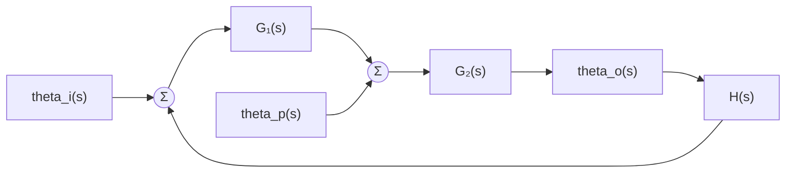

La realimentación entra **restando** en el primer punto suma.

---

# 1. Respuesta al setpoint

Para analizar únicamente el efecto del setpoint:

θp(s)=0\theta_p(s) = 0

La perturbación queda anulada y nos queda un lazo de realimentación estándar:

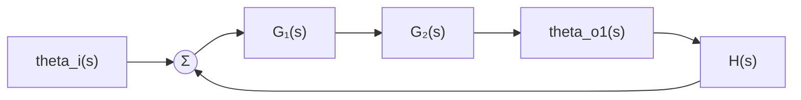

La función de transferencia equivalente del lazo es:

θo1(s)=G1(s)G2(s)1+G1(s)G2(s)H(s)θi(s)\boxed{ \theta_{o1}(s) = \frac{G_1(s)G_2(s)} {1+G_1(s)G_2(s)H(s)} \theta_i(s) }

---

# 2. Respuesta a la perturbación

Ahora pasivamos el setpoint:

θi(s)=0\theta_i(s) = 0

La perturbación entra **después de $G_1(s)$**, por lo que la rama directa desde la perturbación hasta la salida contiene solamente $G_2(s)$.

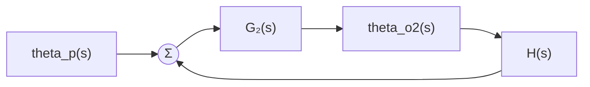

El lazo de realimentación **sigue estando completo**, por lo que el denominador continúa siendo:

1+G1(s)G2(s)H(s)1+G_1(s)G_2(s)H(s)

Entonces:

θo2(s)=G2(s)1+G1(s)G2(s)H(s)θp(s)\boxed{ \theta_{o2}(s) = \frac{G_2(s)} {1+G_1(s)G_2(s)H(s)} \theta_p(s) }

> [!IMPORTANT]  
> Aunque $G_1(s)$ no esté en la **rama directa** de la perturbación, sí participa en el **lazo de realimentación**.  
> Por eso aparece en el denominador.

---

# 3. Salida total

Por el principio de superposición:

θo(s)=θo1(s)+θo2(s)\theta_o(s) = \theta_{o1}(s)+\theta_{o2}(s)

Reemplazando ambas respuestas:

θo(s)=G1(s)G2(s)1+G1(s)G2(s)H(s)θi(s)+G2(s)1+G1(s)G2(s)H(s)θp(s)\theta_o(s) = \frac{G_1(s)G_2(s)} {1+G_1(s)G_2(s)H(s)} \theta_i(s) + \frac{G_2(s)} {1+G_1(s)G_2(s)H(s)} \theta_p(s)

Como tienen el mismo denominador:

θo(s)=G1(s)G2(s)θi(s)+G2(s)θp(s)1+G1(s)G2(s)H(s)\boxed{ \theta_o(s) = \frac{ G_1(s)G_2(s)\theta_i(s) + G_2(s)\theta_p(s) } { 1+G_1(s)G_2(s)H(s) } }

---

# 🧠 Idea clave

El principio de superposición permite estudiar un sistema con varias entradas **una entrada a la vez**:

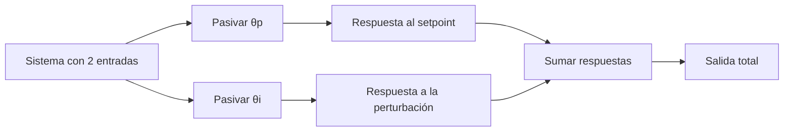

> [!TIP]  
> **Regla práctica:**
> 
> 1. Elegí una entrada.
>     
> 2. Poné las demás en **cero**.
>     
> 3. Resolvé el sistema.
>     
> 4. Repetí para cada entrada.
>     
> 5. **Sumá todas las respuestas.**
>     
> 
> Esto funciona porque estamos trabajando con un **sistema lineal**.


# Principio de superposición

## El principio y el método

> [!IMPORTANT]  
> En un **sistema lineal e invariante en el tiempo**, la respuesta a varias entradas simultáneas es igual a la **suma de las respuestas individuales**.

En este caso tenemos **dos entradas**:

- **Referencia o setpoint:** $\theta_i(s)$
    
- **Perturbación:** $\theta_p(s)$
    

---

## Procedimiento

Para analizar el efecto de cada entrada por separado:

### Paso 1 — Pasivar la perturbación

Hacemos:

θp(s)=0\theta_p(s) = 0

y calculamos la salida debida **solo al setpoint**.

### Paso 2 — Pasivar el setpoint

Hacemos:

θi(s)=0\theta_i(s) = 0

y calculamos la salida debida **solo a la perturbación**.

### Paso 3 — Sumar las respuestas

La salida total es la suma algebraica de ambas respuestas:

θo(s)=θo1(s)+θo2(s)\theta_o(s) = \theta_{o1}(s) + \theta_{o2}(s)

> [!NOTE]  
> **Pasivar** significa simplemente poner esa entrada en cero y **borrar esa flecha del diagrama**.

---

# Aplicación al lazo con perturbación

El sistema tiene una entrada de referencia $\theta_i(s)$ y una perturbación $\theta_p(s)$ que se introduce entre los bloques $G_1(s)$ y $G_2(s)$.


La realimentación entra **restando** en el primer punto suma.

---

# 1. Respuesta al setpoint

Para analizar únicamente el efecto del setpoint:

θp(s)=0\theta_p(s) = 0

La perturbación queda anulada y nos queda un lazo de realimentación estándar:

```mermaid
flowchart LR
    Ti["theta_i(s)"] --> S(("Σ"))
    S --> G1["G₁(s)"]
    G1 --> G2["G₂(s)"]
    G2 --> To["theta_o1(s)"]

    To --> H["H(s)"]
    H --> S
```

La función de transferencia equivalente del lazo es:

θo1(s)=G1(s)G2(s)1+G1(s)G2(s)H(s)θi(s)\boxed{ \theta_{o1}(s) = \frac{G_1(s)G_2(s)} {1+G_1(s)G_2(s)H(s)} \theta_i(s) }

---

# 2. Respuesta a la perturbación

Ahora pasivamos el setpoint:

θi(s)=0\theta_i(s) = 0

La perturbación entra **después de $G_1(s)$**, por lo que la rama directa desde la perturbación hasta la salida contiene solamente $G_2(s)$.

```mermaid
flowchart LR
    Tp["theta_p(s)"] --> S(("Σ"))
    S --> G2["G₂(s)"]
    G2 --> To["theta_o2(s)"]

    To --> H["H(s)"]
    H --> S
```

El lazo de realimentación **sigue estando completo**, por lo que el denominador continúa siendo:

1+G1(s)G2(s)H(s)1+G_1(s)G_2(s)H(s)

Entonces:

θo2(s)=G2(s)1+G1(s)G2(s)H(s)θp(s)\boxed{ \theta_{o2}(s) = \frac{G_2(s)} {1+G_1(s)G_2(s)H(s)} \theta_p(s) }

> [!IMPORTANT]  
> Aunque $G_1(s)$ no esté en la **rama directa** de la perturbación, sí participa en el **lazo de realimentación**.  
> Por eso aparece en el denominador.

---

# 3. Salida total

Por el principio de superposición:

θo(s)=θo1(s)+θo2(s)\theta_o(s) = \theta_{o1}(s)+\theta_{o2}(s)

Reemplazando ambas respuestas:

θo(s)=G1(s)G2(s)1+G1(s)G2(s)H(s)θi(s)+G2(s)1+G1(s)G2(s)H(s)θp(s)\theta_o(s) = \frac{G_1(s)G_2(s)} {1+G_1(s)G_2(s)H(s)} \theta_i(s) + \frac{G_2(s)} {1+G_1(s)G_2(s)H(s)} \theta_p(s)

Como tienen el mismo denominador:

θo(s)=G1(s)G2(s)θi(s)+G2(s)θp(s)1+G1(s)G2(s)H(s)\boxed{ \theta_o(s) = \frac{ G_1(s)G_2(s)\theta_i(s) + G_2(s)\theta_p(s) } { 1+G_1(s)G_2(s)H(s) } }

---

# 🧠 Idea clave

El principio de superposición permite estudiar un sistema con varias entradas **una entrada a la vez**:

```mermaid
flowchart LR
    A["Sistema con 2 entradas"] --> B["Pasivar θp"]
    A --> C["Pasivar θi"]
    B --> D["Respuesta al setpoint"]
    C --> E["Respuesta a la perturbación"]
    D --> F["Sumar respuestas"]
    E --> F
    F --> G["Salida total"]
```

> [!TIP]  
> **Regla práctica:**
> 
> 1. Elegí una entrada.
>     
> 2. Poné las demás en **cero**.
>     
> 3. Resolvé el sistema.
>     
> 4. Repetí para cada entrada.
>     
> 5. **Sumá todas las respuestas.**
>     
> 
> Esto funciona porque estamos trabajando con un **sistema lineal**.


# Efecto de las perturbaciones: lazo abierto vs. lazo cerrado

## En lazo abierto

En un sistema **sin realimentación**, la salida es simplemente la suma de los efectos producidos por cada entrada:

θo(s)=G1(s)G2(s)θi(s)+G2(s)θp(s)\boxed{ \theta_o(s) = G_1(s)G_2(s)\theta_i(s) + G_2(s)\theta_p(s) }

Podemos separar las dos contribuciones:

```mermaid
flowchart LR
    I["theta_i(s)"] --> G1["G₁(s)"]
    G1 --> G2["G₂(s)"]
    G2 --> O1["Efecto del setpoint"]

    P["theta_p(s)"] --> G2P["G₂(s)"]
    G2P --> O2["Efecto de la perturbación"]

    O1 --> S(("Σ"))
    O2 --> S
    S --> O["theta_o(s)"]
```

---

## El efecto de la perturbación

Si nos interesa únicamente cuánto afecta la perturbación a la salida, tenemos:

error(s)=G2(s)θp(s)\boxed{ \text{error}(s) = G_2(s)\theta_p(s) }

Esto significa que la perturbación entra directamente a través de la planta $G_2(s)$.

### Características

- La perturbación se multiplica directamente por la **ganancia de la planta**.
    
- No existe ningún término que la atenúe.
    
- Cualquier perturbación externa se propaga íntegramente hacia la variable controlada.
    

> [!WARNING]  
> En lazo abierto **nadie corrige la perturbación** porque el sistema no utiliza la salida para modificar su comportamiento.

### Consecuencia práctica

Imaginemos una estufa eléctrica sin termostato:

> Si se abre una ventana, la temperatura comienza a bajar y **el sistema no hace nada para compensarlo**.

La desviación permanece hasta que alguien interviene.

---

# En lazo cerrado

Con la **realimentación cerrada**, la salida total obtenida anteriormente es:

θo(s)=G1(s)G2(s)θi(s)+G2(s)θp(s)1+G1(s)G2(s)H(s)\boxed{ \theta_o(s) = \frac{ G_1(s)G_2(s)\theta_i(s) + G_2(s)\theta_p(s) }{ 1+G_1(s)G_2(s)H(s) } }

El término:

1+G1(s)G2(s)H(s)1+G_1(s)G_2(s)H(s)

es el **factor de realimentación** que aparece debido al lazo cerrado.

---

## El efecto de la perturbación

Para estudiar únicamente la perturbación, hacemos:

θi(s)=0\theta_i(s)=0

Entonces:

error(s)=G2(s)1+G1(s)G2(s)H(s)θp(s)\boxed{ \text{error}(s) = \frac{G_2(s)} {1+G_1(s)G_2(s)H(s)} \theta_p(s) }

Comparando:

### Lazo abierto

error(s)=G2(s)θp(s)\text{error}(s)=G_2(s)\theta_p(s)

### Lazo cerrado

error(s)=G2(s)1+G1(s)G2(s)H(s)θp(s)\text{error}(s) = \frac{G_2(s)} {1+G_1(s)G_2(s)H(s)} \theta_p(s)

La diferencia fundamental es el denominador adicional:

1+G1G2H\boxed{1+G_1G_2H}

---

## ¿Qué logra la realimentación?

> [!IMPORTANT]  
> El efecto de la perturbación queda **atenuado por el factor de realimentación**.

El controlador detecta que la perturbación provocó una desviación en la salida y actúa para **contrarrestarla**.

En términos conceptuales:

```mermaid
flowchart LR
    P["Perturbación"] --> S["Cambio en la salida"]
    S --> D["Sensor / realimentación"]
    D --> C["Controlador detecta el error"]
    C --> A["Acción correctiva"]
    A --> S
```

Por eso, un sistema en lazo cerrado puede **rechazar perturbaciones externas**.

---

# Consecuencia práctica

Volvamos al ejemplo de la estufa con termostato:

> Si se abre una ventana, la temperatura comienza a caer.
> 
> El sensor detecta la disminución de temperatura y el sistema **aumenta la acción de calentamiento automáticamente**.

La perturbación sigue existiendo, pero su efecto sobre la salida se reduce.

---

# 🧠 Comparación

||**Lazo abierto**|**Lazo cerrado**|
|---|---|---|
|Realimentación|❌ No|✅ Sí|
|Efecto de perturbación|$G_2\theta_p$|$\frac{G_2}{1+G_1G_2H}\theta_p$|
|Corrección automática|❌|✅|
|Atenuación de perturbaciones|❌|✅|
|Detecta desviaciones|❌|✅|

> [!TIP]  
> **Idea clave para recordar:**
> 
> **Lazo abierto:** la perturbación entra → afecta directamente a la salida.
> 
> **Lazo cerrado:** la perturbación entra → afecta a la salida → la realimentación detecta el cambio → el controlador intenta compensarlo.
> 
> Por eso la realimentación convierte al sistema en un **mecanismo de rechazo de perturbaciones**.
> 
> Lo malo es que puede hacer que mi sistema se vaya al carajo

## Reduccion del sistema algebraicamente
Tiene pasos:
