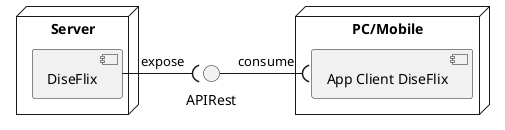

## Diagrama de arquitectura
Comunica que partes tiene el sistema y como se comunican. Esta compuesto por la mezcla entre **diagrama de despliegue** y **diagrama de componentes**. Se dice que es un diagrama de *mayor nivel* que el diagrama de clases. Los componentes que lo forman son:
### Nodos
```plantuml
node "server"
```
Tienen connotacion fisica y hablan de un agente de computo. Suele ser una computadora/vm. Dentro de un servidor pueden correr uno o mas **componentes**
### Componente
```plantuml
component "componente" as componente
componente - interfaz : expone interfaz
```
Son software que ejecutan dentro de algun nodo. Es un proceso u aplicacion java. Expone diversas interfaces u formas de comunicarse con otros componentes. La idea basica es que luego otro componente *consume* dicha interfaz.
## Arquitectura web
Es una arquitectura que se maneja en la web donde el cliente tiene codigo js y el servidor sirve servicios al mismo.


Desde el cliente "App Client" corro la UI en el navegador del PC/Mobile. Es codigo js. La comunicacion se realiza mediante el protocolo http.
#### El servidor
Es un proceso levantado en el nodo servidor que se va a quedar escuchando peticiones http.

### Casos de uso y actores en arquitectura
Los actores NO son clases como tal. Si bien se pueden llegar a ser clases por algun requerimiento de diseño, no se realiza como tal el `actor.ejecutarCasoDeUso()`. El caso de uso como tal es demasiado complejo como para devolver una coleccion de series. Estoy asignando responsabilidades a entidades de dominio que no le corresponden.
### Capas
De aca vamos de arriba hacia abajo, es decir, la capa de entidades de dominio desconoce la existencia de alguien por encima de el. Sin embargo, la capa de persistencia si conoce a dichas entidades y puede tratar con ellas. Esto es el acoplamiento unidireccional
#### Entidades
Son las entidades de dominio comunes. Estas NO ejecutan los casos de uso como tal, sino que se encargan de aplicar ciertas validaciones de logica de negocios.

#### Capa de persistencia o datos 
Es una capa de objetos (repositorios) que se encarguen de la persistencia de otros objetos. Naturalmente, distintas implementaciones de este repositorio usan distintas estrategias: en memoria, en archivos o en base de datos. Sin embargo, todas deben realizar las operaciones basicas de CRUD y por ende es conveniente tener una interfaz que permita llevar esto a cabo:
```java
public interface ISeriesRepository{
	public Serie findById(Long id);
	public List<Serie> findAll(Long id);
	public void save(Serie serie);
	public void delete(Serie serie); 
}
```
Esta es la aplicacion de un *patron strategy* que permite hacer que diversas implementaciones del repositorio, se obliguen a seguir esta interfaz, sin importar donde o como persistan realmente.

###### Multiples repositorios
Al mismo tiempo, la idea de repositorio es por elemento de dominio o clase: yo tengo un repositorio de series donde guardo series y otro repositorio de generos donde guardo generos. Esto no implica que quizas no se guarden en el mismo lugar.
###### Multiples Interfaces
Otra cuestion es que la interfaz puede tambien cambiar por entidad de dominio segun los metodos que este permitiendo o con los que este trabajando. Por ejemplo, en el caso de una serie puedo buscar por si tiene o es de un genero, cosa que en el repositorio de generos no necesito. Con esto estamos aplicando:
- Patron strategy -> tengo los metodos pero segun quien los implemente tengo una estrategia distinta para persistir (en memoria, bd, archivos)
- LSP -> Porque la interfaz que implementa cada repositorio es la suficiente para ocupar el lugar de su padre u otra implementacion
- Dependency inversion -> En vez de depender directamente de implementaciones de repositorio concretas, dependo de interfaces. Así puedo cambiar lo concreto sin romper lo demás.
#### Services
Tiene la responsabilidad de orquestar los casos de uso. Aca codeo el flujo de cada caso de uso por metodo. Tambien tienen la responsablidad de revisar con usuarios y permisos la ejecucion de cada caso de uso, es decir, puede un usuario visualizador publicar una serie? NO!
Para implementar los casos de uso, el service requiere conocer al repositorio para obtener los datos y manipularlos. Entonces tengo
```java
public interface ISeriesService{
	public List<?> buscarTodos();
}

public class SeriesService{
	private ISeriesRepository seriesRepository; // dependency inversion + LSP
	
	@Override
	public List<?> buscarTodos(){
		List<Serie> series = this.seriesrepository.findAll();
		
	}
}
```
##### Interfaz para el service
Al tipar el repositorio de Series como interfaz, me hago agnostico de su implementacion y si usa memoria u otra cuestion. Ahora el service tambien implementa una interfaz de si mismo. Esto es por el principio de la inversion de dependencia. Esto es porque el controller (modulo de mas alto nivel) no debe depender del modulo de mas bajo nivel (service) directamente sino que a traves de sus interfaces.

##### Cuestiones de dominio
La serie es la responsable entonces de indicar cuantas visualizaciones/vistas tuvo en total y por ende la cantiad de horas. Por eso es su responsabilidad manejar la cantidad de visualizaciones y horas vistas con
```java
public class Serie{
	private Long duracionEnMinutos;
	private Long vistas = 0;
	
	public Long horasVistas(){
		return this.Vistas * this.duracionEnMinutos / 60
	}
	
	public void sumarVistas(Integer cantidad){
		this.vistas += cantidad;
	}
	
}
```

##### Encapsulamiento en capas
Las capas tambien se manejan con encapsulamiento y por ende, solo quiero entregar la informacion justa y necesaria. Esta situacion se repite entre front y back. Por ende el service va a encapsular lo que entra y lo que sale del back mediante **DTOs** resguardando mis entidades de dominio.
###### DTO
Son value object, es decir, objetos efimeros e inmutables. Estos se limitan a formatear informacion para ser transmitida a otra parte del sistema o a un usuario. Existe su version input y output. Los input son clases con el formato json en la que me van a llegar los datos y output lo mismo para la salida.
Los outputDTO tambien se van a encargar de enviar la **informacion extra** como horasVistas para poder ser consultadas por el front.
Al mismo tiempo necesito mappers para pasar de inputDTO a clase de dominio y para pasar de clase de dominio a outputDTO.
Las razones de uso de DTOs son:
- Encapsulamiento
- Validacion de datos de entrada
##### Service semilla
Es logica de creacion de objetos basicos que necesito. Pueden ser objetos de prueba o algo mas complejo como objetos base para que mi sistema funcione.

##### Politicas de acceso
Que usuario tiene acceso a que recurso y de que manera depende directamente del service.

#### Controllers
Van a ser el link o el lugar donde se esperan las llamadas del front al back. Exteriorizan el comportamiento de mi componente para ser usado por terceros, no lo implementa. En cada caso cambia pero puede ser mediante una API rest.
Similar con service, es una clase controller por entidad de dominio. Al mismo tiempo no hace falta que implemente una determinada interfaz porque cada implementacion, salvando las distancias, se maneja con un protocolo y una interfaz especificas. Entonces la interface como tal no se requiere.

# Cliente-servidor, arquitectura web y api rest

## Cliente - Servidor
Es un modelo de comunicacion donde un cliente solicita recursos a un servidor y el servidor los sirve o provee a traves de una interfaz de red. Participan 2 componentes:
- El servidor: componente que  provee servicios a traves de una interfaz
- El cliente: Usa dichos servicios como parte de su operacion con el acceso al servidor. El cliente se conecta con el servidor y tiene responsabilidad de interfaz grafica.
#### El intercambio
Puede ser una aplicacion web, mobile o navegador que consume servicios del servidor. Este los procesa y devuelve una respuesta. Se comunican con el protocolo http. Division de responsabilidades:
- El cliente se enfoca mas (generalmente) en la interfaz
- El servidor en la logica y datos