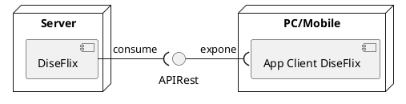

Comunica que partes tiene el sistema y como se comunican. Esta compuesto por la mezcla entre **diagrama de despliegue** y **diagrama de componentes**. Se dice que es un diagrama de *mayor nivel* que el diagrama de clases. Los componentes que lo forman son:
### Nodos
```plantuml
node "server"
```
Tienen connotacion fisica y hablan de un agente de computo. Suele ser una computadora/vm. Dentro de un servidor pueden correr uno o mas **componentes**
### Componente
```plantuml
component "componente" as componente
componente - interfaz : expone interfaz
```
Son software que ejecutan dentro de algun nodo. Es un proceso u aplicacion java. Expone diversas interfaces u formas de comunicarse con otros componentes. La idea basica es que luego otro componente *consume* dicha interfaz.
## Arquitectura web
Es una arquitectura que se maneja en la web donde el cliente tiene codigo js y el servidor sirve servicios al mismo.

```plantuml
@startuml
skinparam componentStyle uml2
skinparam shadowing false
skinparam rectangleStyle rounded

node "PC/Mobile" {
    component "App Client DiseFlix" as Client
}

node "Server" {
    component "DiseFlix" as ServerApp
}

interface "APIRest" as APIRest

' Provided interface (lollipop)
ServerApp -( APIRest : consume

' Required interface (socket)
Client )- APIRest : expone

@enduml

```

Desde el cliente "App Client" corro la UI en el navegador del PC/Mobile. Es codigo js. La comunicacion se realiza mediante el protocolo http.
#### El servidor
Es un proceso levantado en el nodo servidor que se va a quedar escuchando peticiones http.

### Casos de uso y actores en arquitectura
Los actores NO son clases como tal. Si bien se pueden llegar a ser clases por algun requerimiento de diseño, no se realiza como tal el `actor.ejecutarCasoDeUso()`. El caso de uso como tal es demasiado complejo como para devolver una coleccion de series. Estoy asignando responsabilidades a entidades de dominio que no le corresponden.
### Capas
De aca vamos de arriba hacia abajo, es decir, la capa de entidades de dominio desconoce la existencia de alguien por encima de el. Sin embargo, la capa de persistencia si conoce a dichas entidades y puede tratar con ellas. Esto es el acoplamiento unidireccional
#### Entidades
Son las entidades de dominio comunes. Estas NO ejecutan los casos de uso como tal, sino que se encargan de aplicar ciertas validaciones de logica de negocios.

#### Capa de persistencia o datos 
Es una capa de objetos (repositorios) que se encarguen de la persistencia de otros objetos. Naturalmente, distintas implementaciones de este repositorio usan distintas estrategias: en memoria, en archivos o en base de datos. Sin embargo, todas deben realizar las operaciones basicas de CRUD y por ende es conveniente tener una interfaz que permita llevar esto a cabo:
```java
public interface ISeriesRepository{
	public Serie findById(Long id);
	public List<Serie> findAll(Long id);
	public void save(Serie serie);
	public void delete(Serie serie); 
}
```
Esta es la aplicacion de un *patron strategy* que permite hacer que diversas implementaciones del repositorio, se obliguen a seguir esta interfaz, sin importar donde o como persistan realmente.

###### Multiples repositorios
Al mismo tiempo, la idea de repositorio es por elemento de dominio o clase: yo tengo un repositorio de series donde guardo series y otro repositorio de generos donde guardo generos. Esto no implica que quizas no se guarden en el mismo lugar.
###### Multiples Interfaces
Otra cuestion es que la interfaz puede tambien cambiar por entidad de dominio segun los metodos que este permitiendo o con los que este trabajando. Por ejemplo, en el caso de una serie puedo buscar por si tiene o es de un genero, cosa que en el repositorio de generos no necesito. Con esto estamos aplicando:
- Patron strategy -> tengo los metodos pero segun quien los implemente tengo una estrategia distinta para persistir (en memoria, bd, archivos)
- LSP -> Porque la interfaz que implementa cada repositorio es la suficiente para ocupar el lugar de su padre u otra implementacion
- Dependency inversion -> En vez de depender directamente de implementaciones de repositorio concretas, dependo de interfaces. Así puedo cambiar lo concreto sin romper lo demás.
#### Services
Tiene la responsabilidad de orquestar los casos de uso. Aca codeo el flujo de cada caso de uso por metodo. Tambien tienen la responsablidad de revisar con usuarios y permisos la ejecucion de cada caso de uso, es decir, puede un usuario visualizador publicar una serie? NO!
Para implementar los casos de uso, el service requiere conocer al repositorio para obtener los datos y manipularlos. Entonces tengo
```java
public interface ISeriesService{
	public List<?> buscarTodos();
}

public class SeriesService{
	private ISeriesRepository seriesRepository; // dependency inversion + LSP
	
	@Override
	public List<?> buscarTodos(){
		List<Serie> series = this.seriesrepository.findAll();
		
	}
}
```
##### Interfaz para el service
Al tipar el repositorio de Series como interfaz, me hago agnostico de su implementacion y si usa memoria u otra cuestion. Ahora el service tambien implementa una interfaz de si mismo. Esto es por el principio de la inversion de dependencia. Esto es porque el controller (modulo de mas alto nivel) no debe depender del modulo de mas bajo nivel (service) directamente sino que a traves de sus interfaces. Por ejemplo, si el service requiere conectarse con otro componente para informar algo pero eso no modifica el output, es conveniente manejarse con multiples implementaciones e interfaces

##### Cuestiones de dominio
La serie es la responsable entonces de indicar cuantas visualizaciones/vistas tuvo en total y por ende la cantiad de horas. Por eso es su responsabilidad manejar la cantidad de visualizaciones y horas vistas con
```java
public class Serie{
	private Long duracionEnMinutos;
	private Long vistas = 0;
	
	public Long horasVistas(){
		return this.Vistas * this.duracionEnMinutos / 60
	}
	
	public void sumarVistas(Integer cantidad){
		this.vistas += cantidad;
	}
	
}
```

##### Encapsulamiento en capas
Las capas tambien se manejan con encapsulamiento y por ende, solo quiero entregar la informacion justa y necesaria. Esta situacion se repite entre front y back. Por ende el service va a encapsular lo que entra y lo que sale del back mediante **DTOs** resguardando mis entidades de dominio.
###### DTO
Son value object, es decir, objetos efimeros e inmutables. Estos se limitan a formatear informacion para ser transmitida a otra parte del sistema o a un usuario. Existe su version input y output. Los input son clases con el formato json en la que me van a llegar los datos y output lo mismo para la salida.
Los outputDTO tambien se van a encargar de enviar la **informacion extra** como horasVistas para poder ser consultadas por el front.
Al mismo tiempo necesito mappers para pasar de inputDTO a clase de dominio y para pasar de clase de dominio a outputDTO.
Las razones de uso de DTOs son:
- Encapsulamiento
- Validacion de datos de entrada
##### Service semilla
Es logica de creacion de objetos basicos que necesito. Pueden ser objetos de prueba o algo mas complejo como objetos base para que mi sistema funcione.

##### Politicas de acceso
Que usuario tiene acceso a que recurso y de que manera depende directamente del service.

#### Controllers
Van a ser el link o el lugar donde se esperan las llamadas del front al back. Exteriorizan el comportamiento de mi componente para ser usado por terceros, no lo implementa. En cada caso cambia pero puede ser mediante una API rest.
Similar con service, es una clase controller por entidad de dominio. Al mismo tiempo no hace falta que implemente una determinada interfaz porque cada implementacion, salvando las distancias, se maneja con un protocolo y una interfaz especificas. Entonces la interface como tal no se requiere.

# Cliente-servidor, arquitectura web y api rest

## Cliente - Servidor
Es un modelo de comunicacion donde un cliente solicita recursos a un servidor y el servidor los sirve o provee a traves de una interfaz de red. Participan 2 **componentes**:
- El servidor: componente que  provee servicios a traves de una interfaz de red
- El cliente: Usa dichos servicios como parte de su operacion con el acceso al servidor. El cliente se conecta (inicia la comunicacion) con el servidor a travez de la interfaz de red y tiene responsabilidad de interfaz grafica.

#### El intercambio - relacion
- El cliente puede ser una aplicacion web, mobile o navegador que consume servicios del servidor. 
- El servidor procesa peticiones del cliente y devuelve una respuesta. 
- Se comunican con el protocolo http/s. 
- Division de responsabilidades:
	- El cliente se enfoca mas (generalmente) en la interfaz (frontend)
	- El servidor en la logica y datos (backend)
#### Clasificacion segun responsabilidades
Se distinguen tipos de cliente-servidor segun las responsabilidades de cada componente:
##### Cliente Activo, Servidor Pasivo
El cliente es quien posee la mayor lógica de negocio.  Son aplicativos muy pesados y requiero mas recursos del usuario. Una computadora con pocos recursos esta limitada. El servidor limita su funcionalidad a la persistencia.
##### Cliente Pasivo, Servidor Pasivo
Ambos componentes poseen baja lógica de negocio o simplemente son considerados “componentes intermedios” de algo “más grande”. Los componentes no hacen casi nada sino que son intermedios o pasamanos de otros componentes
##### Cliente Pasivo, Servidor Activo (“Cliente liviano”)
El servidor posee la mayor lógica de negocio; mientras que el cliente se limita a presentar los datos. Implica que la generacion de vistas es del parte del servidor y el cliente solo la muestra. Ademas, ante cada interaccion se "recarga" la pagina. Esto es porque ante cada interaccion el cliente envia al servidor una peticion informando de la interaccion y este ultimo vuelve a entregar una vista de 0.
##### Ventajas
- Mantenibilidad: Los cambios en funcionalidad se hacen solo del lado del servidor. En cliente pesado hay que modificar la aplicacion cliente tambien
- Seguridad: Como los recursos estan centralizados en el servidor y el cliente no puede "puentear" nada es mas seguro
##### Desventajas
- Eficiencia: Tiempo de respuesta bajo por un solo servidor
- Disponibilidad: Unico punto de fallo por ser un solo servidor
##### Cliente Activo, Servidor Activo (“Cliente pesado”)
La lógica de negocio está distribuida en ambos componentes.  El cliente posee la lógica de presentación de los datos. El cliente tiene tambien mucho codigo y genera sus propias vistas. Solo pide al servidor datos, no vistas. Ante una interaccion, la vista no se recarga sino que se vuelve a renderizar del lado del cliente. Ojo tambien puede que el cliente pida algo al servidor pero esto no ocurre siempre con cada interaccion.
##### Desventajas
- Mantenibilidad: Los cambios en funcionalidades tienen el problema de que al haber 2 componentes ejecutables implica que hay que modificar los 2 teniendo en cuenta aspectos de cliente como resolucion, recursos, etc.
- Seguridad:  No puedo confiar de lo que llegue del cliente ya que alguien que sepa un poco puede modificar el codigo quitando validaciones por ejemplo.
### Protocolo HTTP
Es el **hyperTextTransferProtocol** y transmite hipertexto plano. Es un protocolo de comunicacion basado en cliente-servidor y define como se intercambian los datos en la red. Funciona sobre TCP y a traves de una web.
##### Paso a paso
1. Un cliente, que puede ser un navegador, app mobile o app web, hace una *http request* al servidor web porque necesita acceder a un recurso. 
2. El servidor web procesa la solicitud y responde con una *respuesta/response http* que contiene los datos solicitados por el cliente + un codigo de estado.
#### Versiones
- HTTP: Transmite los datos en texto plano. No es seguro, cualquier persona que intercepte el datagrama puede leer lo que dice el body de la peticion
- HTTPS: Transmite los datos encriptados fin a fin. Para esto utiliza TLS/SSL brindando confidencialidad e integridad.
#### Verbos
Son acciones que viajan con mi http request para tratar de una forma al recurso que accedo. Estos verbos son:
- GET: Solicita un recurso sin modificarlo
- POST: Enviar datos al servidor para que sean procesados. Generalmente, "crea" una nueva instancia de recurso
- PUT: Cambia totalmente un recurso especifico
- PATCH: Cambia parcialmente un recurso
- DELETE: elimina un recurso
##### Codigos de estado
- 1xx : Respuestas informativas. Indica que la petición ha sido recibida y se está procesando.
- 2xx : Respuestas correctas. Indica que la petición ha sido procesada correctamente.
	- 200: La solicitud se proceso con exito
	- 201: Se dio de alta un recurso
- 3xx : Respuestas de redirección. Indica que el cliente necesita realizar más acciones para finalizar la petición. Es decir, junto con la redireccion llega la url a la que debe redireccionarse y luego hacer un GET o POST o lo que sea requerido. Esto ultimo lo hace el navegador solo
- 4xx : Errores causados por el cliente. Indica que ha habido un error en el procesado de la petición a causa de que el cliente ha hecho algo mal.
	- 404: La ruta que se quiere acceder no existe
	- 401: No autorizado por falta de autenticacion
	- 403: No autorizado por falta de privilegios
	- 409: Error de procesado, se espera un tipo de dato pero se entrego otro o se esta pisando un recurso existente. Es decir, un conflicto
	- 400: el cliente mando algo mal de tipo formato o que falto algo.
- 5xx : Errores causados por el servidor. Indica que ha habido un error en el procesado de la petición a causa de un fallo en el servidor.

## Arquitectura web
Son los principios, tecnologias y estructuras que indican como se organizan y comunican los componentes de una app web. Tambien se entiende por el conjunto de componentes que forman una aplicacion accesible desde la web. Se basa en la interaccion entre clientes y servidores varios (no solo usuario final con unico servidor) usando el protocolo http que distribuyen informacion y ejecutan apps en la web.
-  Aplicacion web: Aplicacion accesible desde un navegador en la web.
Es basicamente un frontend o cliente ejecutando en un navegador que se comunica con un servidor usando http.

## API
Es una interfaz de programacion de aplicaciones que va a brindar funcionalidades, herramientas, definiciones y protocolos que se usan para integrar aplicaciones. Permite que un producto o servicio se comunique con otro sin saber como se implementa internamente. Facilita la integracion de servicios o componentes de sistemas. Existen distintos tipos segun lo que se requiera:
### Clasificacion de APIs
Las APIs ademas pueden ser tan pequeñas como `stream` en Java y mas grandes tambien
##### Local
Proporciona servicios de SO, bibliotecas o middleware. Es decir cada biblioteca expone su API para que pueda ser consumida por el usuario de dicha biblioteca.
##### Web
Proporciona servicios entre componentes distribuidos y en general sobre http. Normalmente tenemos cliente servidor donde el servidor expone esta interfaz o API y el cliente la consume. 
##### Programa
Proporciona la posibilidad de ejecucion de codigo entre componentes distribuidos de forma remota.
#### Tipo de API segun usuario
- Publica -> para que lo use todo el mundo
- Partner -> para un tercero 
- Privada -> interna, para un equipo
Esta clasificacion orienta a como va a estar construida la API.
# API rest
Son APIs web que se manejan con el enfoque de diseño REST. Indica la utilizacion concreta de formatos de rutas y verbos para acceder a determinados recursos. Toda entidad va a ser manejada mediante una URI (identificador uniforme de recursos). Para intercambiar recursos utiliza:
- JSON
- XML
### Recursos Web REST
Son como exponemos los recursos en una arquitectura web con REST.
- Cuando diseñamos un Sistema con arquitectura Web debemos pensar en qué recursos vamos a permitir manipular.
- Podemos decir que un Recurso es una entidad que puede ser manipulada: puede ser dada de alta, modificada, eliminada o listada (buscada). CRUD
- Para poder identificar qué recursos debe exponer un Sistema se deben tener en cuenta los casos de uso.
Las rutas llevan el nombre del recurso, no la accion que realizan. Esto ultimo esta incluido en el verbo http que use. Para indicar como finalizo, envio tambien un codigo http

#### Paginacion
 La paginación de una API REST es una técnica que permite dividir grandes cantidades de datos en partes más pequeñas (llamadas páginas), para evitar sobrecargar al servidor o al cliente con demasiada información en una sola respuesta.

**¿Por qué es útil?**
- Mejora el rendimiento y reduce el uso de memoria.
- Acelera el tiempo de respuesta.
- Facilita la navegación entre conjuntos grandes de datos (usuarios, productos, etc.).

# Sincronismo, Interfaces de componentes
## Intefaces de componentes e integracion a sistemas
Cuando un sistema se integra otro es un componente del primer sistema consumiendo la interfaz que expone el otro sistema. 
### Consideraciones a la hora de trabajar con componentes

```plantuml
component "Componente A"
component "Componente B"
```
##### Direccion de comunicacion
- A llama a B o B llama a A? quien comienza la comunicacion
- La comunicacion es bidireccional o unidireccional
##### Ambiente de despliegue
- Los componentes ejecutan en el mismo nodo
- Los componentes ejecutan en nodos separados
##### Consideraciones de sincronismo/asincronismo a la hora de interactuar con demas componentes
Cuando me integro con un servicio y hago una peticion, espero la respuesta o sigo ejecutando.
#### Interface entrante
Es un contrato que define que datos necesita un componente para funcionar. Dichos datos van a ser provistos por una interface de otro componente.
```plantuml
component A
component B{
	interface b
}

A -> b
```
Para que A se integre conmigo debe cumplir con la interface que exige B para poder funcionar correctamente. A nivel services y API rest, la interface entrante de B debe indicar que input DTOs espera recibir. Tengo que pensar como quiero que el tercero use mi componente
#### Interface saliente
```plantuml
component B
component A{
	interface a
}

a -> B
```
Es el contrato que indica que datos necesita el componente al cual nos queremos integrar. En este caso, son los datos que A enviaria a B para realizar una tarea funcionalidad. En este caso "A" consume a "B".
A nivel API rest, los output DTOs son clave e indican este contrato de envio.
### Entorno de ejecucion
Es el contexto donde ejecuta mi componente y contiene el hardware y software sobre donde se ejecuta. En un entorno distribuido los componentes ejecutan en distintos entornos pero en el mismo sistema porque lo administro yo. Los casos que se pueden dar es que mis componentes ejecuten en: 
- Mismo sistema - mismo entorno -> Es mi propio sistema, nada externo. Todo el mismo nodo
- Mismo sistema - distinto entorno -> Es mi propio sistema, nada externo pero esta distribuido
- Sistema distinto - entorno distinto ->  por ejemplo cuando un componente de mi sistema se integra con una api externa.
Sistema distinto y mismo entorno no se considera ya que es imposible. Es como si en mi nodo servidor corra mi componente servidor y netflix
##### Mismo sistema - mismo entorno
Es sobre el mismo SO y misma maquina dos procesos por separado
La comunicacion entre los componentes va a ser sencilla y por ende la integracion tambien. Sin embargo debe tenerse en cuenta:
- Pensar el mecanismo de integracion correcto entre ambos componentes
- Debo pensar en redicir el posible grado de acoplamiento que se pueda llegar a generar por compartir entorno. Por ejemplo, usar un modulo que exponga clases para que otros modulos las usen no esta bueno porque implica mucho acoplamiento
- Debo evitar la ruptura del encapsulamiento por parte del componente integrado
- Esta integracion debe ser testeable. Debo apuntar a un diseño orientado a interfaces, impulsando el DIP y el LSP. Ademas esto permite mockear los componentes para que sea mas testeable. Todo va de la mano.
##### Mismo sistema - Entornos diferentes
Es mi sistema con mis componentes pero ejecutan en maquinas distintas
Como los componentes se encuentran en entornos diferentes la integracion entre ellos es mas compleja y requiere en algun nivel comunicacion. Debo tener en cuenta:
- Debo pensar el mecanismo para que los componentes se puedan comunicar si es que sus interfaces no estan definidas.
- Si la interfaz del componente ya existe debo integrarme a eso.
#### Testing de integraciones
Cuando testee un componente que puede se integra con otro (que puede ser mio o no) la interfaz saliente debe estar mockeada porque sino con cada test llamo a el componente de nuevo.
## Sincronismo y Asincronismo
En el caso que interactuen 2 componentes, siempre surge la cuestion de si esperar al otro o no. Debo seguir esperando a la respuesta o seguir trabajando en el componente original? Esto generalmente esta condicionado por la interaccion actual.
### Sincronismo
Cuando el componente A se integra con B y al consumir su interfaz se queda esperando la respuesta entonces A esta trabajando **sincrónicamente** para esa funcionalidad. Caracteristicas: 
- Es simple por ser facil de trabajar
- Es como funciona el envio de mensajes entre objetos por defecto.
Ahora que pasa si la consumision de la interfaz fuese lenta por cuestiones de latencia por ejemplo? *Estamos penalizando a todo el sistema por la espera de una respuesta*

### Asincronismo
Cuando el componente A se integra con B y al consumir su interfaz NO se queda esperando la respuesta entonces A esta trabajando **asincrónicamente** para esa funcionalidad. Es una forma de no penalizar a todo el sistema. 
##### Casos de uso
- Cuando el componente A no necesita el resultado en ese momento para continuar con la ejecucion
- Cuando al componente A directamente no le interesa la respuesta
- Cuando el componente A solo esta avisando de algo
#### Formas de respuesta asincronica
Es la forma en la que A se va a enterar de la respuesta de B luego de que esta fuese producida:
##### Pull based
El componente A pregunta a B sobre el estado de ejecucion o si ya termino. Si se usa mal puede terminar en espera activa (CPU al 100%).

```plantuml
@startuml
skinparam sequence {
    ArrowColor black
    ParticipantBorderColor black
    ParticipantBackgroundColor white
}

participant client
participant server

client -> server : New item arrived?
activate client
activate server
server --> client : No.
deactivate server
deactivate client

client -> server : New item arrived?
activate client
activate server
server --> client : No.
deactivate server
deactivate client

client -> server : New item arrived?
activate client
activate server
server --> client : No.
deactivate server
deactivate client

@enduml

```
##### Espacio compartido
Esto solo puede aplicarse en un mismo entorno. El componente B guardara un dato en una porcion de memoria que debera ser revisada cada cierto tiempo por el componente A para ver la respuesta. Me desacoplo de esperar la respuesta del otro componente
##### Pasarse como parametro - Push Based
*Solo a nivel objetos*. El componente A se pasa por parametro a B para que este llame un metodo de A cuando termine
##### Callbacks - Push Based
Cuando el componente A consume a B, le pasa por parametro una funcion callback para que ejecute B al finalizar. A nivel arqutiectura web, el callback puede ser "llamar con un POST a http://miApi...". A esto se lo conoce como *WebHook*. En estos casos, la url se pasa en el body de la primer request 
Estas formas en general dependen de con quien y como me estoy integrando. Si el otro componente esta en otro sistema quizas no puede hacer WebHooks.

## Cron job/Cron Task
Son tareas programadas que se ejecutan de manera programada y periodica. Automatiza comandos o scripts en los tiempos del usuario. Originalmente estaban en Unix pero hoy esta para windows tambien.
Son clave para ejecutar tareas de forma **asincrona**. 
### Estructura
Se define en una linea dentro de un archivo crontab. Se maneja con esta estructura
```
* * * * * comando  
| | | | |  
| | | | +----- Día de la semana (0 - 7) (Domingo puede ser 0 o 7)  
| | | +------- Mes (1 - 12)  
| | +--------- Día del mes (1 - 31)  
| +----------- Hora (0 - 23)  
+------------- Minuto (0 - 59)
```
# Patrones arquitectonicos de "llamado - retorno"
Son patrones arquitectonicos de mensajería, es decir, para comunicar componentes distribuidos.
## Estilo de solicitud respuesta 
Esta por encima de patrones arquitectonicos como cliente-servidor o capas. Es una idea o una orientacion pero no habla de disposicion de componentes. Es un estilo de **interaccion** *sincronica* donde un cliente envia una solicitu a un servidor y espera a la respuesa. Esta limitado cuando hablamos de concurrencia o asincronismo, como atender a muchos clientes a la vez o automatizar notificaciones.
## Patrones de mensajeria
Van a indicar de que forma se comunicaran los componentes de mi ambiente distribuido. Estos patrones se van a reutilizar mas adelante para comunicar, por ejemplo patrones de integracion como soa o microservicios.
### Cliente-Servidor
Es una implementacion concreta de solicitud-respuesta.
##### Caracteristicas
- Comunicacion directa
- Acoplamiento fuerte -> cliente y servidor deben estar conectados al mismo tiempo y conocerse mutuamente (mas que nada el cliente al servidor)
- Sin intermediarios
- Dificultad para flujos asincronicos -> El servidor no *emite* eventos sino que el cliente tiene que preguntar (pull based)
### Event subscriber
Un sujeto (emisor) notifica a multiples observadores (subscriptores) cuando ocurre un evento. Los observadores deben subscribirse para recibir la informacion respecto a cada evento. El emisor conoce al cliente y soluciona el problema de asincronismo o pull-based de cliente servidor. 
#### Caracteristicas
- Desacoplamiento leve ya que el emisor no necesita saber quien lo escucha, solo informar
- Notificacion automatica sin pulling
- Uno a muchos, un emisor, muchos subscriptores -> un evento puede crear multiples respuestas.
### Publisher subscriber
Es similar al event subscriber pero en vez de subscribirse a un emisor, el subscriptor se subscribe a un topic o tema. Luego el o los emisores cargan o envian mensajes a estos temas para que el o los subscriptores los reciban. Resuelve cuestiones de acoplamiento que tenia el event subscriber. Tambien resuelve el problema de que en event subscriber el emisor envia los mismos *notificaciones* a todos sin discernir si debe un subscriptor recibir dicho  mensaje o no. Ademas el emisor no conoce al subscriptor y viceversa.
#### Caracteristicas
- Nadie conoce a nadie -> desacoplamiento completo
- Solo se envian mensajes a traves del topic
- El publicador no envia mensaje directamente al receptor
##### Ventajas
- Desacoplamiento total -> no se conoce nadie con nadie
- Escalabilidad -> muchos publishers y subscribers por topico
- Distribucion natural -> ideal para microservicios y sistemas distribuidos por el manejo de topics
- Asincronico -> los mensajes se manejan sin bloquear al emisor
- Extensible -> puedo agregar nuevos publishers o subscribers sin modificar a nadie
##### Limitaciones
- No tiene persistencia de mensajes y si el subscriptor no estaba disponible lo pierde
- Sin control de calidad de servicio, orden o seguridad
##### Casos de uso
- Notificaciones push mobiles -> el telefono no pregunta constantemente sino que le avisan de la notificacion
- Procesamiento de eventos de usuario -> se envian los eventos a los topics y el sistema actua en funcion de esto
- Log de auditoria
- comunicacion de microservicios
- Arquitecturas reactivas
#### WebSockets
Son la forma preferida de comunicacion para implementar un pub/sub. Los **WebSockets** permiten que el navegador establezca una conexión persistente con el backend. Entonces, si algo cambia —como la temperatura de un sensor, una nueva orden en un sistema de trading, o un nuevo mensaje en un chat— el servidor puede **empujar** ese evento al navegador sin que este tenga que preguntar cada 5 segundos.
En ese sentido, **WebSocket** es el canal perfecto para transportar eventos en tiempo real y aplicar patrones como **Observer** o **Pub/Sub** entre un backend y un frontend. Elimina el mecanismo de pulleo porque maneja una conexion constante, contrario a http que es request/response. Se suele usar en: 
- Sistemas de chat
- Juegos en linea
- Dashboards en tiempo real
- Alertas o notificaciones en tiempo real
En pub/sub se estaria eliminando el topic para pullear los contenidos, directamente se abren websockets con todos. 
## Broker
Es un patron que directamente desacopla emisores y receptores utilizando un componente **broker** como intermediario inteligente. Lo que hace es recibir, filtrar, enrutar y distribuir los mensajes que recibe. El pub/sub no tiene la implementacion tecnica sino que solo indica que se requieren topics donde dejar mensajes. El broker es una implementacion tecnica como otras.
#### Caracteristicas
- Broker es el intermediario enre publisher y subscriber
- Iguala participantes -> todos pueden ser publicadores y subscriptores al mismo tiempo
- Resuelve problemas de firewall 

- Desacoplamiento total -> los publisher y los subscriber ni siquiera se conocen
- Persistencia -> generalmente el broker tiene persistencia para guardar mensajes a subscribers desconectados
- Escalabilidad -> Maneja muchos mensajes concurrentemente.
- Enrutamiento inteligente -> segun topicos prioridades o filtros
- QoS -> garantizado con reintentos, entregas garantizadas y control de duplicados
- Seguridad -> autorizacion, autenticacion, cifrado
- Monitorizacion
# Sesiones, Web stateless y stateful
## Sesion
Identifican a un usuario que intenta acceder a un recurso o ejecutar una funcionalidad de mi sistema. Suele almacenar informacion relativa al usuario mientras esta conectado. No siempre es necesaria, depende de la arquitectura.
##### Recurso
Entidades que permitimos que se manipulen en mi sistema. Por ejemplo, en el siu guarani, los alumnos y sus notas son recursos.
#### Cookies
Son archivos pequeños que se guardan en las computadoras de las personas para ayudar a almacenar las preferencias y demas informacion que utilizan las paginas web que usan. Estos archivos almacenan en formato clave - valor. Este archivo lo crea el servidor pero lo almacena el cliente. Estas cookies viajan al servidor en cada request que realiza el cliente. Entonces el servidor reconoce a quien esta ingresando. Suelen tener un nivel de seguridad con encripcion. 
### Web Stateless
Un proceso o aplicativo o componente que esta aislado. No se almacena informacion respecto a operaciones anteriores ni se hace referencia a ellas. Cada operacion se lleva a cabo desde 0. Las request son independientes
#### Sesion en stateless 
- No se almacena la sesion del lado del servidor
- El usuario se identifica en cada solicitud que realiza 
- Para identificarse el usuario manda un JWT (encriptado) y el servidor desencripta para saber quien es 
Con cada envio de JWT el servidor no solo debe validar la identidad del usuario sino tambien recuperar de la base de datos, segun el id de usuario, permisos y roles respecto a lo que se puede o no hacer. 
#### Token
 Cuando el usuario se loggea por primera vez, creo un token donde guardo datos importantes de el. Generalmente esta encriptado para evitar que un usuario malicioso se de permisos que no debe tener. Este token **no** se guarda como cookie sino que se guarda en localStorage. Luego ante cada request, es el usuario que me envia este token en el header. Luego, el servidor tiene que validarlo con su propia key y ver que no este vencido, porque si lo esta se puede extender el tiempo de vida del token o puedo forzar al usuario a iniciar sesion de vuelta. Despues de eso, debo obtener al objeto usuario como tal a partir del token para poder manipularlo segun corresponda.
 Suele guardar idUsuario, permisos, roles. Ahora el problema es que debo tener el recaudo de actualizar el token cuando se actualiza, por ejemplo, un rol del usuario.
 
##### Tema distribucion
El problema de multiples servidores que tiene stateful se resuelve rapidamente cuando uso el token. Como cada servidor puede leer el token y ver la informacion me resuelve el problema de compartir memoria o usar una base de datos compartida u otras opciones.  
##### Comparativa
Como no genera espacio de sesion en servidores me ahorro esos recursos y  no me importa a que servidor voy y puedo usar cualquier servidor. Ahora lo malo es que tengo la logica de desencriptar el token en cada request y es un overhead necesario.
##### Cerrar sesiones
Si necesito tirar las sesiones para hacer mantenimiento, por ejemplo, estoy en problemas porque no tengo todos los token para hacerlo
### Web stateful
Son componentes a los que se pueden volver una y otra vez y recuerdan que fue lo que paso y quien lo hizo. Toman contexto de operaciones anteriores ya que la operacion actual pudo haberse visto modificada. Puede requerir identificacion para que las requests pertenezcan a una misma sesion. Aca las operaciones se guardan en un medio persistente, como un archivo o una base de datos.
#### Sesion en stateful
- Se almacena sesion en el servidor
- El usuario se identifica una sola vez
- En la solicitud (POST) donde el usuario inicia sesion el servidor genera un espacio para el y le otorga un ID para guardar en cookies del usuario
	- El usuario guarda en sus cookies con ese servidor `session_id = ...`
- En posteriores requests el servidor revisa el ID en la cookie que manda el usuario para ver quien es. 
- Esta sesion o espacio para usuario guarda informacion sobre el usuario en general (roles, permisos) y se persiste en memoria, disco o archivos (uno por sesion). Esto es manejado por el framework
- Esto me ahorra ir constantemente a la base de datos a revisar que tipo de usuario es y ver si puede hacer algo o no. Entonces duplico la informacion para catchearla mas rapido
##### Cerrar sesiones
- En algun momento debe vencerse y borrarse. Se hace cuando el usuario se desloguea o por cuestiones de seguridad. Son los atributos de calidad de **seguridad** contra **usabilidad**. Iniciar sesion constantemente es mas seguro pero mas molesto/menos usable. Esto se implementa poniendo una fecha de vencimiento en la sesion del lado del servidor. Pasada esta fecha, si llega una request con ese session_id la request se rebota, provocando que la session se reinicie con el mismo id o que el usuario se deba loggear nuevamente
- Por cuestiones de espacio, tambien debo borrar sesiones de vez en cuando. 
- Si cierro el navegador y no hago logout, la sesion queda abierta y por ende debe cerrarse por tiempo
##### Desventajas
- Puede que las sesiones sean muchas y ocupen mucho espacio. Esto resulta en requerir mucho disco o mucha memoria
##### Ventaja
Como el servidor conoce todas las sesiones puede actualizarlas mas facilmente y ademas matarlas, por ejemplo, si lo requiere par mantener el sistema.

#### Problema de sistemas distribuidos con sesiones
En un solo servidor, las sesiones pueden persistirse en memoria, pero si hay muchos servidores hay un problema. 
##### Compartir memoria
Varias instancias de mi proceso son levantadas en el mismo nodo cosa que compartan un espacio de memoria para manejar las sesiones. Esta funciona hasta que estoy en una arquitectura distribuida, ahi se rompe.
##### Algoritmo sticky session
El balanceador de carga que esta entre los multiples servidores y el cliente asigna el mismo cliente al mismo servidor siempre.
##### Compartir archivos
Cada sesion se guarda en un archivo separado en el mismo sistema y todos los procesos servidor en la misma computadora pueden accederlo. Es lento.
##### Base de datos compartida
Suele ser una clave-valor redis. La comparten/conocen todos los servidores, esten distribuidos o no. Ahora esto es un componente mas en mi arquitectura y como tal, es un costo extra mes a mes.
### Cual elijo
Depende principalmente de la propuesta arquitectonica. Cliente servidor historicamente se maneja con cookies mientras que microservicios son tokens. Depende mucho de la distribucion del sistema y del mantenimiento/control sobre las sesiones que se busque. Si necesito actualizarlas constantemente desde el back, quizas no combiene que las tenga el usuario.
#### Servidor de autenticacion
Me resuelve el problema de generar y manejar el token a mano pero al mismo tiempo, cualquier componente de  mi sistema que lo conozca automaticamente puede comunicarse con el y verificar usuarios. Sin embargo, puede complicar las cosas por ser un componente aparte.

### Sesiones mixtas
El frontend esta implementado en un cliente liviano desacoplado entonces manejo dos tipos de sesiones en simultaneo. Lo que hace es:
- Manejarse con cookies desde el usuario al servidor frontend
- Manejarse con tokens del servidor frontend al resto de la aplicacion
Entonces, en una arquitectura de servicios, los servicios son stateless. 
### Tipos de cliente
Si tengo una arquitectura web y debo trabajar con GUI, busco de quien es la responsabilidad de generar las vistas.
#### Cliente liviano
Las vistas se generan y guardan del lado del servidor. Cuando las llama el controller, la view las inyecta con informacion. Este es labor del template engine. Las respuestas a solicitudes terminan siendo con HTML. El navegador muestra dicho contenido HTML. En ciertos casos, puede haber logica js en el cliente.  Tiene menos procesamiento y uso de memoria que el cliente pesado en el cliente. Hace una peticion al servidor ante cada cambio de vista
#### Cliente pesado
Las vistas se generan del lado del cliente, quien recibe del servidor xml o json. El cliente tiene toda la logica para generar las vistas en codigo js. En la primera request al servidor, el cliente se trae todo el codigo js para cambiar y modificar las vistas. Tiene mas procesamiento y uso de memoria que cliente liviano en el cliente. 
##### SPA
Es un tipo de pagina donde todo se muestra en una sola pagina, sin recargar el navegador. Generalmente existe un unico `index.html` con muchos divs ocultados o mostrados. Se muestran distintas vistas pero sobre la misma pantalla. Da la ilusion de multiples pantallas cuando en realidad es el mismo archivo. La magia o la ventaja es que la pagina carga muy rapido.
#### Comparativa en atributos de calidad
El cliente liviano tiene menos procesamiento y memoria en el cliente pero al mismo tiempo, cliente pesado libera de procesamiento al servidor pero le carga mas al cliente y la bateria tambien. A nivel tecnologias para cliente livian usamos:
- Thymeleaf
- Handlenars
Son template engines. Para cliente pesado:
- Angular
- React
Son frameworks o bibliotecas. En lo que respecta a atributos de calidad, cliente pesado es mas usable, escalable y mantenible.
### Recursos en sistemas web
Debo pensar en que recursos quiero que se manipulen (CRUD) en mi sistema. Debo pensar en los casos de uso para ver que recursos expongo. De ahi salen los objetos que preciso y los datos que persisto. **PENSAR OBJETOS COMO RECURSOS QUE QUIERO EXPONER**. Tipos de recursos:
##### Independientes/Autonomos
No dependen de nadie y tienen existencia propia
##### Dependientes/anidados
No son autonomos, dependen de otro recurso. A nivel objetos, es una relacion de composicion. Son recursos en los cuales no tiene sentido listarlos todos por si solos sino que tienen valor si se muestran con el recurso que los compone. Por ejemplo, una nota del siu guarani depende de su alumno y no tiene sentido por si sola
#### MVC
El controller determina si expone dato o vista. Funciona asi:
1. El usuario manda una peticion por url al controller
2. El controller se comunica con el model para actualizar datos
3. El model devuelve a controller datos actualizados -> model puede ser service tambien pero es agnostico de como se devuelven los datos
4. EL controller elije la vista de view
5. La view devuelve la vista seleccionada
6. El controller devuelve la vista o datos finales al usuario

## Proteccion de rutas y recursos
Lo empiezo a aplicar cuando quiero que a determinados recursos o rutas accedan solo algunos roles. Existen 3 niveles de proteccion:
##### Autenticacion
La ruta solo se protege por autenticacion. La ruta solo puede ser accedida si la persona esta autenticada antes de acceder a ellos. Si una ruta esta protegida de esta forma y es accedida por alguien no autenticado se lo redirige a la pagina de login. Ahora si la presentacion es mas rest y no es visual, quizas combiene mandarle un 401 no autorizado.
##### Autorizacion basada en roles
Para acceder a una ruta la persona debe esta autenticada y debe tener un rol en especifico. No puedo hablar de que rol tiene el usuario si no se quien es el usuario. No todos los usuarios deben acceder a todos los recursos. A nivel de api puedo devolver un 403 o una pagina que indique que no puede acceder al recurso
##### Autorizacion basada en roles y permisos
Para acceder a la ruta la persona debe estara autenticada, tener el rol y el permiso determinado. El usuario previamente identificado con un rol en particular requiere tener los permisos para acceder a un recurso. Permite que no todos los usuarios con mismo rol accedan al mismo recurso pero que usuarios con distintos roles si puedan acceder al mismo recurso. Incluye ideas de alcance tambien, por ejemplo, un rol alumno puede ver las notas pero solo las suyas, no de otros. Estos alcances pueden ser: **propio** **propios** o **todos**
###### Modelado
A nivel objetos no puedo mezclar una entidad con su rol. Si tengo al alumno como entidad porque la necesito y tambien necesito a un usuario alumno, entonces lo que hago es que la instancia de alumno conozca o apunte al usuario.
```plantuml
class Usuario{
- nombre : String
- rol : Rol
}
class Rol{
- nombre : String
- permisos : List<Permiso>
}

class Permiso{
- nombre : String
}
Usuario -> Rol
Rol -> Permiso


```

# Escalabilidad y Arquitecturas monoliticas y distribuidas
## Escalabilidad
Un servidor  puede responder a multiples sesiones en simultaneo pero si esta cantidad de peticiones es muy grande no puede. Entonces se convierte en un **cuello de botella** donde:
- La performance se degrada por tiempos de respuesta elevados
- La disponibilidad se ve afectada porque si el servidor se cae, todos los clientes se quedan sin hacer sus solicitudes.
Para resolver este problema, tengo que mejorar mi capacidad de computo como servidor y por ende puedo implementar:
- Escalabilidad vertical -> meto mas procesador, memoria, disco a mi unico servidor para atender mas solicitudes concurrentemente. Este tiene una limitacion fisica porque en algun momento no puedo agregar mas recursos a mi servidor. Entonces soluciona **performance** pero no soluciona **disponibilidad**. Sin embargo, usando un UPS puedo resolver la parte de disponibilidad.
- Escalabilidad horizontal -> meto mas servidores corriendo el mismo proceso para que se distribuyan la carga de las peticiones entre ellos. Resuelve cuestiones de **performance** y **disponibilidad** pero trae aparejados problemas de gestion, ya que tengo que ver como soluciono sesiones compartidas. No tiene limitacion fisica pero requiere de un componente extra llamado balanceador de cargas para distribuir las solicitudes. Es mas caro y dificil de gestionar.
#### Cual conviene
Depende cuestiones economicas y cuanta gente hayan en mis servidores. Si son muchisismas sesiones en simultaneo, quizas combiene.
## Aplicacion monolitica
Tienen toda la logica de negocio en un unico codigo fuente. Participa un solo nodo que se encarga de hacer todo lo que requiere la aplicacion. A nivel arquitectura web, si estoy con un cliente liviano puedo estar llamando a mi aplicacion monolitica web liviana. 
- No siempre son buenas, son dificil de desarrollar si hay muchas personas sobre el mismo codigo. 
- Ademas, ante un cambio minimo en cualquier pedazo del codigo tengo que redesplegar todo el codigo, no se puede desplegar por partes. 
- Suelen usar lenguajes interpretados para no recompliar todo el codigo ante un cambio.
Tambien se frena por crecimiento, llega un punto que no se puede escalar mas y la app se estanca
## Aplicacion distribuida
Esta compuesta por multiples componentes de software o servicios que se ejecutan en distintos nodos pero cooperan para llegar a una funcionalidad unificada. 
#### Atributos de calidad que enfatiza
- Escalabilidad: Agregar mas nodos para mas carga en algunos servicios.
- Disponibilidad: si se cae un nodo hay otro. Tengo que manejar que si se cae uno de los componentes puedo seguir parte de la funcionalidad
- Flexibilidad: permite actualizaciones y despliegues independientes de componentes sin afectar al sistema por completo
- Mantenible y robusta
- Trabajar con equipos independientes
#### Problemas
- Comunicacion y sincronizacion entre nodos
- Consistencia de datos
- Seguridad y autenticacion centralizada
- Lleva mas tiempo
##### Monolitico vs distribuido
Siempre combiene primero pensar en monolitico y luego pensarlo en distribuido a ver si me conviene o no.
### SOA
Arquitectura orientada a servicios. Es un **estilo arquitectonico** que descompone la logica funcional de una app en unidades autonomas denominadas **servicios**. Esta pensado a nivel enterprise donde servicios de distintos aplicativos de una organizacion se reutilizan para cumplir con disitntas necesidades.
#### Principios
- **El Valor del Negocio** por encima de la estrategia técnica. Importa mas el valor que aporta cada servicio que su implementacion o estrategia tecnica
- **Las Metas Estratégicas** por encima de los beneficios específicos de los proyectos.
- **La Interoperabilidad Intrínseca** por encima de la integración personalizada. No importa el como me integro entre servicios sino que pueda integrarme
- **Los Servicios Compartidos** por encima de las implementaciones de propósito específico. 
- **La Flexibilidad** por encima de la optimización. Quiero que pueda crecer en el tiempo, no que sea el mejor
- **El Refinamiento Evolutivo** por encima de la búsqueda de la perfección inicial. Primero aporto valor de negocio y luego lo perfecciono
#### Elementos
- Cliente consumidor de servicio. No sabe de quien consume el servicio. Solo sabe que cumple con un contrato especifico para consumirlo y le da lo que precisa.
- Proveedor de servicio. Es quien provee los servicios y los publica en el registro de servicios para ser consumidos por un cliente
- Service Registry. Conoce a todos los servicios y se los entrega al cliente segun los va pidiendo para que este pueda consumir a quien requiera. Tambien conoce las interfaces de los servicios publicados para que los puedan usar los clientes
Se busca desacoplar al maximo a los servicios entre si. El registry tambien conoce las IP de los servicios a consumir.
#### ESB
Es un componente que gestiona la comunicacion entre servicios web. Resuelve el problema que surge de que se multipliquen los servicios web en una organizacion y se requiran conectores/adaptadores para varias aplicaciones. Todas las interacciones pasan por el ESB y se acoplan con el. Entonces no hay interaccion servicio-servicio como tal, sino que hay servicio-ESB-servicio. Usa protocolos como http ftp o smtp. Este ESB garantiza que nos interesa mas la interoperabilidad por sobre la integracion personalizada ya que todos se comunican e integran con el ESB.
Suele usarse en organizaciones grandes donde quiero usar servicios entre sistemas de la misma organizacion y se necesitan entre si. Existen aplicaciones No-SOA que se integran al SOA a partir de una interfaz. Entonces la regla para soa es: *sistemas bien separdados que pertenecen a la misma organizacion pero que al mismo tiempo dependen de entre si para subsistir*

##### SOA vs Microservicios
Soa es a nivel macro, integra multiples sistemas en simultaneo. Microservicios es para un unico sistema/aplicativo.
## Microservicios
Es **una unica aplicacion distribuida** *en varios componentes que cumplen con servicios distintos*. El microservicio es granular, desacoplado y en una aplicacion amplia. Es : 
- agil -> rapido de desarrollar porque pongo varias personas por microservicio
- resiliente -> adaptacion al cambio
- escalable -> cada microservicio puede escalar y crecer tanto como necesite
Cada microservicio es responsable de su propia persistencia. Puede haber dependencias entre microservicios y esto puede ser bueno o malo.
### Aplicaciones en la nube
Ejecuto todo en un servicio cloud, es decir, servidores arrendados. En lugar de monolitos, tengo servicios distribuidos en componentes. Dichos componentes se comunican con apis o mensajes asincronos. Las apps escalan horizontalmente. Ahora el estado de las aplicaciones queda distribuido. *Aplicacion en nube implica apuntar a un entorno distribuido*. El estado (sesiones) de estos componentes queda distribuido. Las operaciones se realizan en paralelo y de forma asincrona. Las aplicaciones deben ser resistentes a errores y las implementaciones deben ser automatizadas y simples. La supervision y telemetria (recopilar datos de los componentes para ver estado de salud) son fundamentales para una vision general del sistema
#### Contraste vs tradicional
| ***Local - Tradicional***                                                                                                                                    | ***Nube - "Moderna"***                                                     |
| ------------------------------------------------------------------------------------------------------------------------------------------------------------ | -------------------------------------------------------------------------- |
| Monolítica                                                                                                                                                   | Descompuesto/Distribuido                                                   |
| Diseñada para una **escalabilidad predecible**. Como puedo predecir la concurrencia,<br>por ejemplo, 1000 alumnos, no me importa si estanco la escalabilidad | Diseñado para un **escalado elástico**, es decir a demanda                 |
| Base de datos relacional                                                                                                                                     | Persistencia **Políglota** (combinación de tecnologías de almacenamiento)  |
| Procesamiento **sincronizado**. No esta pensado para masividad                                                                                               | Procesamiento **asincrónico** porque tengo muchos usuarios.                |
| Diseño para **evitar errores**                                                                                                                               | Diseño para **soportar errores** generados por concurrencia o asincronismo |
| **Actualizaciones grandes** ocasionales                                                                                                                      | **Pequeñas actualizaciones frecuentes**                                    |
| Administración **manual** (Infraestructura)                                                                                                                  | Administración **automatizada** (Infraestructura)                          |
| Servidores **Personalizados (Mutables)** porque son nuestros                                                                                                 | Infraestructura **inmutable** (Nuevas Instancias)                          |

## Infraestructura
Donde despliego los aplicativos. Mientras mas rendimiento y control, mas tiempo le tengo que dedicar, por ejemplo, gestionando dependencias y trabajando con docker. Eso me da mas control

Tengo distintas opciones:
![[Pasted image 20251127171603.png]]
##### Bare metal
Es con control absoluto porque soy dueño del servidor o nodo como tal. Se de las marcas y componentes hardware que uso
##### Servidor virtual
Es levantar una VM en un servidor arrendado. Tenes control por poder instalar lo que quieras en dicha VM. Generalmente en el servidor arrendado corren varias de estas VM y yo solo tengo una. Tengo mucho rendimiento y control porque debo instalar/elegir dependencias, SO, etc. 
##### Contenedores
Ya me dan un sistema operativo con las dependencias minimas para correr mi aplicativo. Generalmente esta en un dockerfile y docker se encarga de levantar y manejar este contenedor virtual. Puedo correr varios de estos contenedores en un mismo **servidor virtual**.  
##### Cloud fundry
Son pedazos de mi aplicacion ejecutando en algun lado. Es la idea de paas
##### Funciones
Son estructuras super pequeñas y cada pedazo de mi app ejecuta en algun lado. Es un pedazo de codigo super pequeno levantado, por ejemplo, en azure donde el servicio que me da es de envio de mails. Basicamente no me ocupo de nada.
### Clasificacion de posibles infraestructuras
#### Tradicional
Soy dueño del servidor y por ende, esta bajo mi responsabilidad la gestion de todo el sistema. Todo lo puedo configuar como quiero. Tengo mucho control pero mucha configuracion.
#### Iaas
Me dan una maquina para que haga lo que precise. Es mi responsabilidad gestionar el SO, en adelante como la app, los middleware, los datos, etc.
#### Paas
Me dan el espacio solo para desplegar mi aplicacion y mi base de datos, nada mas. Suelen estar orientados a una idea mas monolitica
#### SaaS
Soy usuario de un software, ni siquiera lo tengo que desplegar. Por ejemplo, discord.
## Componentes en una arquitectura
En una arquitectura distribuida tenemos componentes especializados que trabajan en forma coordinada. Cada componente tiene su rol para garantizar rendimiento (repito componentes), disponibilidad (con balanceador de cargas), seguridad y escalabilidad del sistema. En corto debo cumplir con:
- Entrega y balanceo de trafico
- Almacenamiento y rendimiento
- Gestion de identidad
- Seguridad perimetral
### Balanceador  de cargas -> entrega y balanceo de trafico
Distribuye las solicitudes entrantes a mi sistema entre multiples servidores o instancias de mi misma aplicacion para optimizar **rendimiento** y evitar sobrecargas. 
##### Beneficios
- Si falla un servidor redistribuye el trafico -> disponibilidad
- Puedo agregar y sacar nodos sin afectar al usuario -> escalabilidad
- Mantiene el uso de recursos equilibrado -> performance
#### Gestion de cargas
Suele utilizar algoritmos para asignar un servicio a un cliente como:
- Round Robin -> distribuye solicitudes secuencialmetne
- Least connections ->  Prioriza servidores con menos conexiones activas
- Weighted load -> Asigna usuarios segun la capacidad de cada servidor
- Sticky session -> deja un usuario con el mismo servidor siempre
#### Tipos de balanceadores
- L4 -> balancea trafico TCP/UDP
- L7 -> balancea http/s segun cookies, encabezados o URLs
##### Cuello de botella - punto de falla
Si se cae el balanceador de cargas se cae toda la aplicacion. Se suele tener un load Balancer replica pero es mas caro. Otra opcion es trabajar con fail over, donde si se cae uno se levanta el otro. 
### Cache -> almacenamiento y rendimiento
Almacena resultados de operaciones frecuentes  para reducir tiempo de acceso y la carga sobre servicios.
##### Tipos de cache
- De aplicacion -> guarda datos precalculados
- De contenido -> guarda recursos estaticos pesados como imagenes o css
- De navegador -> guarda recursos en el cliente final
#### Ventajas
- Reduccion de tiempo de respuesta -> *tiempo de respuesta*
- Menor consumo de ancho de banda -> porque no tengo que transmitirlo. *utilizacion de recursos*
- Disminucion de carga sobre servidores origen -> *utilizacion de recursos*
#### Caracteristicas
**cache privada** -> es solo de un usuario en especifico, no de todos. Esta, por ejemplo en su navegador
**cache compartida** -> Acceden muchos usuarios. Se almacenan en servidores intermedios para que usen varios usuarios.
##### Proxy reverso
Se pone adelante de los servidores, como si de un balanceador de cargas se tratase y si tiene lo que le piden lo devuelve. Si no lo tiene lo redirige al backend. Aca cacheo, por ejemplo, paginas comunes entre todos pero no puedo cachear paginas con contenido especifico.
##### CDN
Almacenan contenido estatico a nivel global. Son redes de nodos que no procesan, solo sirven contenido
**TTL** -> siempre que uso cache indicar el ttl
##### Cache http
Se guarda el resultado de una http request para no volver a hacerla. Un ejemplo de estos es la cache del navegador. Reduce la carga del servidor, acelara la respuestas
### SSO -> Gestion de identidades y accesos
Permite acceder a multiples aplicaciones utilizando la misma contrasena. Es mas usable para el usuario. Reduce contrasenas debiles o repetitivas. Funciona con tokens para que se comunique el usuario con el sistema.
##### IAM
Es para el acceso. Define estrategias de proteccion de acceso con contraseñas, biometría, etc.
##### IDM
Se centra en la identidad del usuario, sus roles y permisos

### WAF -> Seguridad perimetral
Es un firewall que protege de trafico malisioso al cliente y al servidor. Bloquea ataques comunes como inyecciones en sql. NO requiere la modificacion de codigo

# Patrones de integracion

### Bases de datos compartida
Utilizo una base de datos para integrar componentes. Esta centrado en integracion de datos, NO en funcionalidad. Permite la integracion sincronica y asincronica (leyendo cada 5 minutos la tabla). Es simple de implementar pero genera mucho acoplamiento. Cada componente **puede estar resuelto en su stack tecnologico**. Cada componente tecnologico es independiente de su disponibilidad.
##### Problemas
 - Performance porque todos leen y escriben sobre la misma base
 - Alto grado de acoplamiento
 - Dificil de cambiar la persistencia, si cambio el nombre de una columna se rompe todo.
 - Debo configurar bien la seguridad de los datos
##### Cuando se usa
Si es una misma organizacion para distintos sistemas y necesito obtener la informacion muy rapido.
### Colas de mensaje
Es una forma de comunicacion asincronica de servicio a servicio y generalmente sin servidor. Se encolan mensajes en un componente cola y son procesados uno por uno por un consumidor. Se usan para:
- Desacoplar procesos pesados
- Acumular trabajo
- Clasificar cargas de trabajo
#### Estructura
```plantuml
component producer
component cola
component consumer

producer-cola
cola-consumer
```
Originalmente, existe un solo consumer pero pueden haber varios si asi se requiere, pero manteniendo la idea basica de que un mensaje por un consmer.
Los mensajes suelen ser pequeños, solicitudes, mensajes de error o hasta datos. Para mandar un mensaje, el productor lo agrega a la cola y queda en su buffer hasta que un consumidor lo recupera y hace algo con el.

Si el consumidor esta dado de baja, no tira error, el mensaje queda en la cola.
#### Caracteristicas
- Proporciona comunicacion y coordinacion para aplicaciones distribuidas
- Simplifica la escritura de codigo para aplicaciones desacopladas
- Mejora rendimiento, fiabilidad y escalabilidad
- Comunica componentes de un sistema para procesar mensajes de forma asincrona
- Ofrece un buffer ligero para almacenar mensajes
- Ofrecen puntos de conexion para agregar mas consumidores
# Cuestiones de final
#### Trazabilidad
Recorrer el camino que hizo un objeto en cada una de sus etapas. Auditoria debo agregar metadata que indique quien hizo que modificacion en que momento. Entonces tengo que persistir este camino de objetos y metadatos, no sobreescribir.
### Ser explicito
No limitarme a la hora de explicar las cosas, ser lo mas explicito posible
### Dominio a persistencia
- Explicar desiciones de diseno para resolver impedance mismatch, ids, que clases persisto y que clases no, etc.
- Debo diseñar el dominio pensando en persistirlo.
##### Atributos de calidad
Ver todos y mostrar como se aplican

#### Gestionar __
Cuando dicen gestionar __ implica que necesito tener dicha entidad en mi modelo 

Aclarar en que momento se hace cada cosa -> morir con la mia