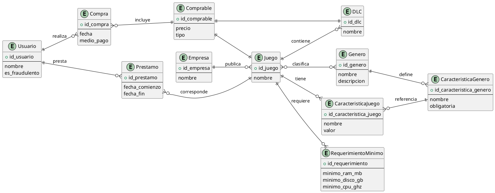

### Contexto general
Dado el contexto global, en el tiempo cercano hubo un auge en las plataformas de “streaming”, “esports” y
una gran industria de juegos indie sacando grandes éxitos. Se volvió más necesaria una plataforma donde
se pueden ofrecer de forma rápida y de fácil acceso a nuevos juegos. Por lo tanto, hoy diseñaremos una
plataforma de distribución de juegos para PC, que permita a los usuarios comprar, descargar, instalar y
jugar en línea.

### Relevamiento
#### Alta de juegos
EsTim permite a las empresas o agentes independientes cargar juegos realizados, para ello deberán
cargar el nombre del juego, los requerimientos de CPU, memoria y almacenamiento necesarios para
ejecutarlo, el género al que pertenece y finalmente su precio de venta. Al elegir el género se deberán
cargar las características en base a los atributos definidos por los administradores.
Algunos juegos son DLC ; en este caso habrá que indicar cuál es el juego al que está relacionado, y solo
se cargara su nombre y precio de venta

#### Parametrización de juegos
Los administradores de EsTim pueden cargar nuevos géneros y definir los atributos que las empresas y
agentes cargarán al dar de alta un nuevo juego; es importante que puedan elegir cuáles atributos serán
obligatorios y cuáles opcionales.
#### Adquisición de juegos
Por medio de la plataforma se podrán adquirir juegos base o algún DLC; se puede comprar solamente de
un producto a la vez (no soportamos carritos de compras). Es importante saber en qué medio de pago se
realiza la venta.
#### Préstamos a conocidos
Se debe permitir a los usuarios prestar juegos adquiridos a sus conocidos. Al hacerlo podrán definir hasta
qué fecha se puede utilizar el juego prestado.
#### Mecanismo anti-fraudes
Para evitar fraudes en los préstamos de los juegos, vamos a tener que analizar estos para determinar si se
está cometiendo fraude. En caso de detectar una cuenta que parezca sospechosa deberá marcarse como
sospechosa de fraude y ejecutar una o varias acciones definidas por el administrador (aún no sabemos
cómo estarán implementadas).
Para detectar posibles fraudes tenemos diferentes algoritmos, algunos ejemplos de estos son:
- Mas de 10 prestamos del ultimo año al mismo usuario
- Mas de 400 prestamos en el ultimo año
- Que exista algun prestamo en el ultimo año que haya durado mas de 2 años
### Alcance
El sistema deberá permitir que:
- Como administrador poder registrar nuevos géneros y los atributos definidos para estos.
- Como emprendedor poder dar de alta un juego/DLC nuevo a la plataforma.
- Como usuario poder adquirir nuevos juegos/DLC.
- Como usuario poder prestar un juego a un conocido.
- Como plataforma detectar cuentas sospechosas de fraude y actuar frente a esto.
***Se debe poder tener traza del valor de compra del juego/DLC.***

## Respuestas
### Arquitectura
1.  (10 Puntos) Los usuarios actualmente solo pueden visualizar el catálogo de juegos comprados y
de forma online, lo cual imposibilita que de forma offline puedan visualizar los juegos comprados y
jugarlos. Para solucionar este problema nos recomendaron utilizar una CDN , ¿qué opinión tiene
sobre esto? En caso de no estar de acuerdo plantear una solución al problema.
Una CDN no resuelve este problema ya que es un servidor de contenido estatico y como tal se necesita internet para acceder a el. Por ende lo mas recomendable es que los juegos que tenga instalado el usuario sean visibles mediante una interfaz local que les permita visualizar aquellos juegos a los que tienen acceso. Seria una suerte de cliente pesado que acceda a la persistencia local de los juegos para poder visualizarlos.
2. (10 Puntos) La plataforma actualmente está al límite de su capacidad de atención de pedidos
HTTP. Ya se ha mejorado varias veces la cantidad de memoria y núcleos del servidor, pero sigue
siendo insuficiente. Además, se desea maximizar la disponibilidad de la plataforma. ¿Qué
alternativas tenemos para tratar de resolver este problema?
Claramente se necesita escalar horizontalmente creando mas servicios que repliquen o sean iguales a aquellos con los que se cuenta actualmente. Principalmente del servidor rest que es quien recibe todas las solicitudes HTTP. Para implementarlo, yo implementaria un balanceador de cargas que redirija el trafico de los clientes entre los posibles servidores y asi garantizar disponibilidad y la performance requerida. Al mismo tiempo, cabe destacar la necesidad de sesiones stateless para poder distribuir la carga de la mejor forma posible.

3. (10 Puntos) Por último la plataforma los días de eventos importantes las peticiones de compras
suelen demorar más del tiempo de espera máximo configurado en los clientes, logramos analizar
que el cuello de botella se da al momento de facturar, ya que estas peticiones demoran mucho y en
algunos casos incluso fallan. ¿Qué alternativas tenemos disponibles para tratar de resolver este
problema?
Para resolver este problema, evaluaria realizar los pagos de forma asincrona cosa de no penalizar por latencia o procesos a demas operaciones del servidor. Para garantizar el asincronismo hay varias opciones. Como no se como me integro con el sistema de pagos, voy a lo simple y lo manejo desde el codigo utilizando promises o goroutines o mono segun el lenguaje en el que este.
#### Objetos
```plantuml
left to right direction
class Empresa {
	- nombre : String
}

class Comprable{
	+comprarPor(Usuario usuario)
}

class Juego extends Comprable{
	- nombre : String
	- genero : Genero
	- empresa : Empresa
	- precio : Float
	- requerimientos : List<RequerimientoMinimo>
	- caracteristicas : List<CaracteristicaJuego>
}
class Genero{
	- nombre : String
	- descripcion : String
	- caracteristicas : List<CaracteristicaGenero>
}

class CaracteristicaGenero{
	- nombre : string
	- valores : List<String>
	- obligatoria : Bool
}

class CaracteristicaJuego{
	- nombre : String
	- caracteristica : CaracteristicaGenero
	- valor : String
}

class RequerimientoMinimo{
	- minimoRAMenMB : Float
	- minimoDiscoenGB : Float
	- minimoCPUenGHz : Float  
}

class DLC extends Comprable{
- nombre : String
- precio : Float
- juego : Juego
}

class Compra{
	- comprable : Comprable
	- usuario : Usuario
	- medioPago : MedioPago
	- fecha : LocalDate
}

Enum MedioPago{
	TRANSFERENCIA
	TARJETA_CREDITO
}

class Usuario{
	- esFraudulento : Bool
	- nombre : String
	- juegos : List<Juego>
	+ prestarJuego(Juego, Usuario) : Prestamo   
	- prestamos : List<Prestamo>
	  + marcarFraudulento() : void
}

class Prestamo{
	- receptor : Usuario
	- Juego : Juego
	- fechaComienzo : LocalDate
	- fechaFin : LocalDate
}

class RevisadorDeFraude{
	- accionesPostFraude: List<AccionPostFraude>
	- fraudeStrategy : FraudeStrategy
	+revisarFraude(Usuario)
	- verFraude(Usuario)
}

interface AccionPostFraude{
	- Sancionador : Sancionador
	+ sancionar(Usuario)
}

AccionPostFraude --> Sancionador
RevisadorDeFraude -->"*" AccionPostFraude

interface Sancionador{
	+sancionarA(Usuario)
	// aca va la sancion con su metodo
}

interface FraudeStrategy{
	+cometeFraude(usuario)
}

class PrestamosAlMismoUsuario implements FraudeStrategy{
	- {static} minimo : Integer
	+cometeFraude(usuario)
}


class TotalPrestamos implements FraudeStrategy{
 - {static} minimo : Integer
	+cometeFraude(usuario)
}
class PrestamoLargo implements FraudeStrategy{
	- {static} minimoAnios : Integer
	+cometeFraude(usuario)
}

RevisadorDeFraude --> FraudeStrategy

RevisadorDeFraude ..> Usuario
Prestamo o-- Juego
Usuario -- Prestamo
Compra --> MedioPago
Compra --> Usuario
Compra --> Comprable 
Juego --> RequerimientoMinimo
Juego o-- Empresa
Juego -->"*" Genero
DLC o-- Juego
Genero *--"*" CaracteristicaGenero
CaracteristicaJuego o--> CaracteristicaGenero
Juego -->"*" CaracteristicaJuego
```

##### Desiciones de diseno/atributos de calidad
- Los requerimientos que se establecen para un juego son los minimos y es responsabilidad del cliente ver si los cumple
- Para ver los requerimientos de un juego y que sean extensibles a ser mas tipo en un futuro, son solo esto, pudiendo agrandarse a pantalla o sistema operativo
- Para cargar los requerimientos hago:		```
```java
public Juego (String nombre, Genero genero, Empresa, empresa)
```

3. Mecanismo anti fraudes
``` java

class MecanismoAntiFraudes{
	private List<AccionPostFraude> acciones;
	private FraudeStrategy fraudeStragegy
	
	public void evaluarFraude(Usuario){
		if(fraudeStrategy.cometeFraude(Usuario)){
			acciones.each(accion -> accion.sancionar(usuario));
		}
	}
}

```

#### Persistencia

