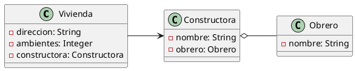
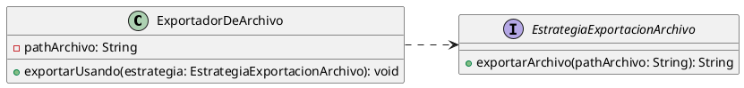
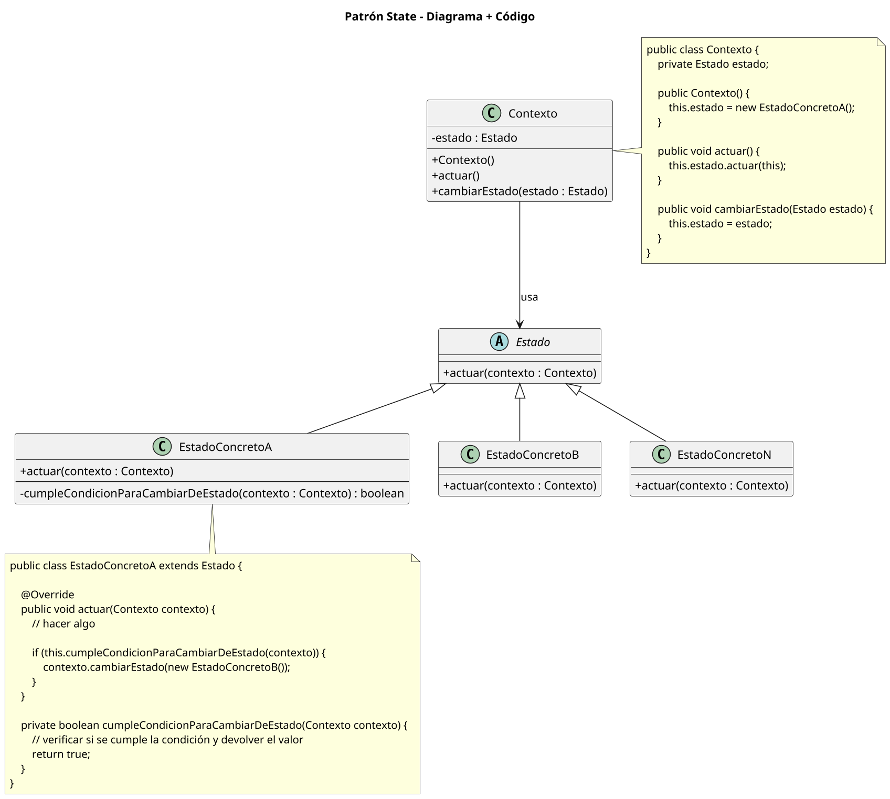
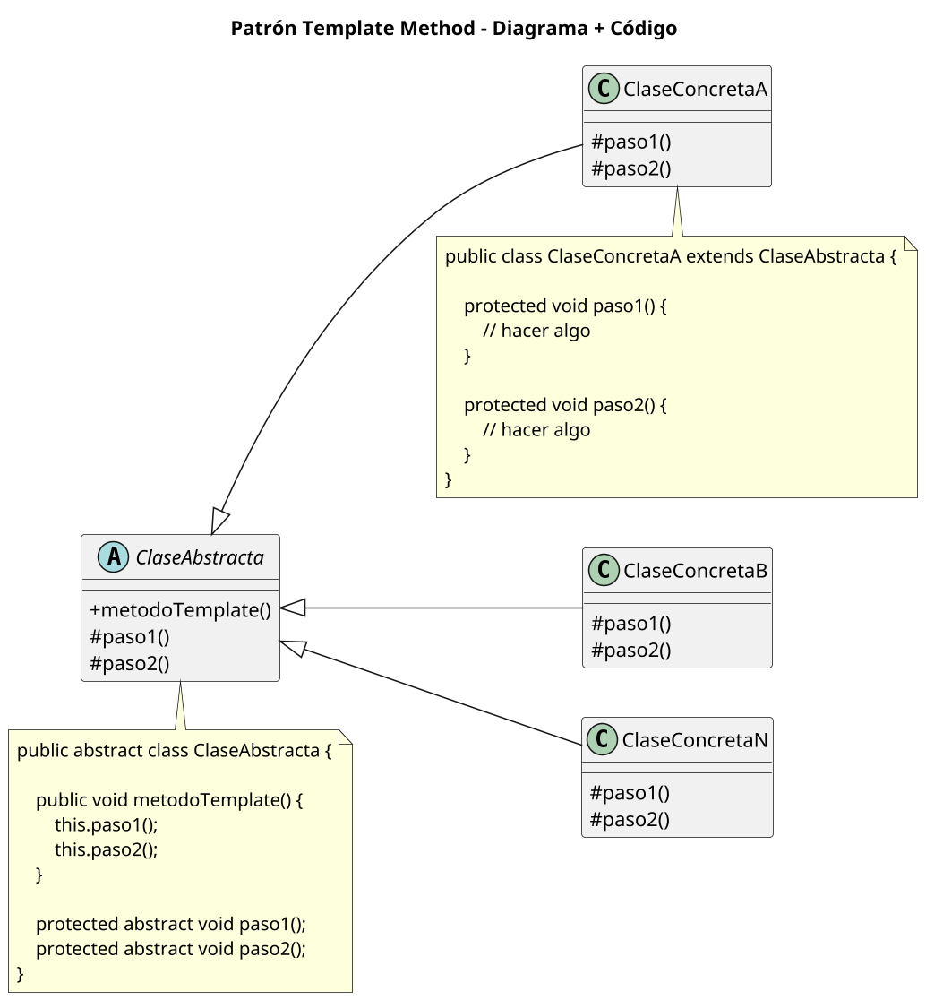
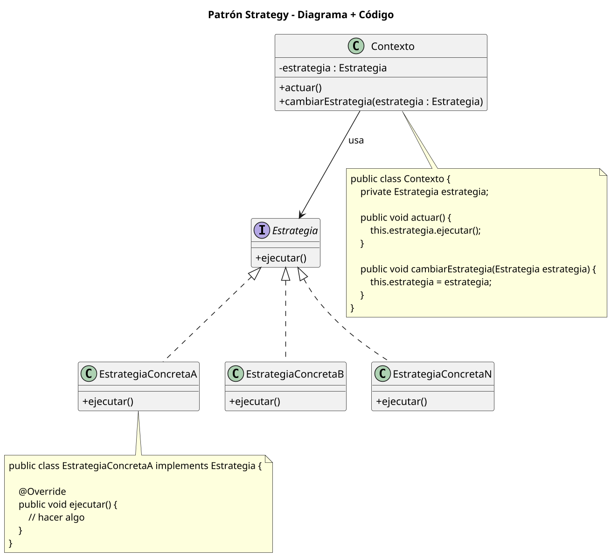
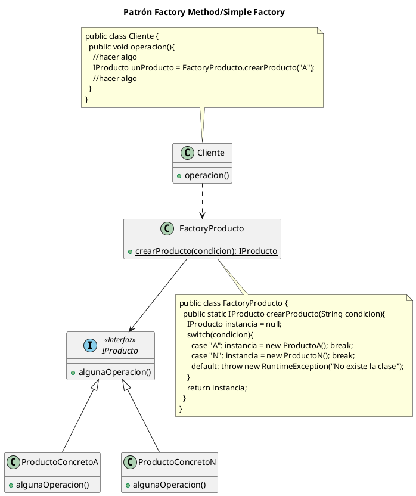
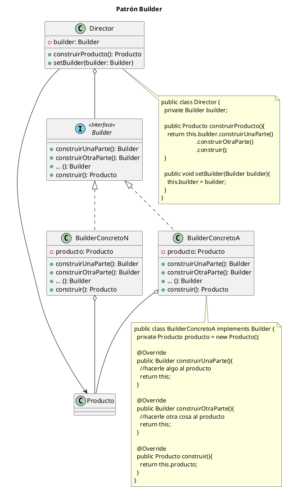
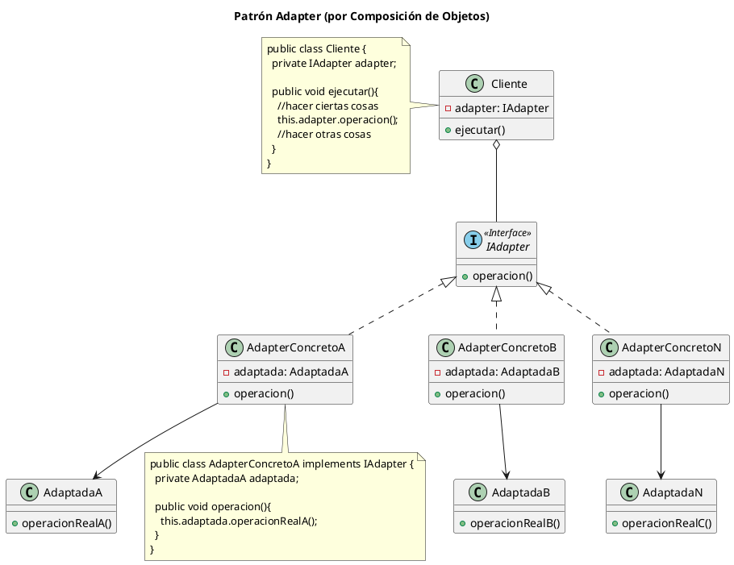
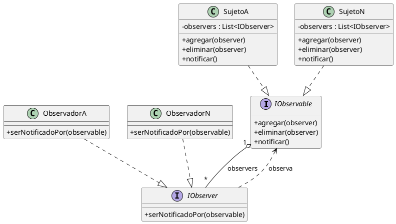
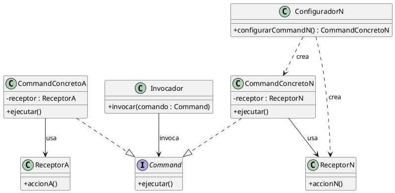

## Repaso objetos
### Objeto 
Cosa del mundo real que tiene una responsabilidad en mi dominio. Las responsabilidades se evidencian cuando otro actor del sistema le pide que haga algo. Define tipado. Cuenta con las siguientes caracteristicas:
- Identidad -> cada objeto sabe quien es. Permite distinguir objetos de la misma clase. Se pueden tener varias referencias al mismo objeto
- Comportamiento -> Son los mensajes que entiende el objeto. Esta ligado con la responsabilidad pero no es lo mismo. El conjunto de metodos que tiene el objeto hacen a la responsabilidad del mismo
- Estado interno -> Son los atributos que tiene mi objeto
#### Mensajes y metodos
Son las formas que tenemos para comunicar objetos. Cuando un objeto recibe un mensaje, ejecuta el metodo asociado.
#### Atributos
Son las variables de un objeto que van cambiando en el tiempo y determinan su estado interno. Cada atributo puede ser otro objeto
#### Responsabilidad
Es la razon de ser de un objeto. Es aquello que tiene que resolver. La responsabilidad tiene que ser cohesiva y no muy amplia. Un objeto no suele tener muchas responsabilidades
#### Encapsulamiento
Dice que un objeto no debe saber como esta hecho/implementado otro objeto que usa. Esto va desde implementacion de metodos hasta variables internas.
#### Declaratividad
Una primera, y suficiente por ahora, aproximación a este concepto nos dice que debemos pensar en el qué y no en el cómo. Deberíamos dejar de pensar los problemas algorítmicamente, imperativamente, y comenzar a concentrarnos
en lo que realmente necesitamos. Para aplicar este concepto en el paradigma orientado a objetos deberíamos pensar qué objetos necesitamos
para resolver el dominio presentado, qué mensajes deberían entender, qué responsabilidades deberían tener.
##### Clase abstracta vs interfaz
La interfaz es un contrato de metodos a cumplir y aquel que la implemente debe *overridear* dichos metodos. La clase abstracta incluye definiciones de algunos metodos y no de otros. Evita la repeticion de codigo e instancia variables. Las interfaces, no tienen implementaciones, por ende, son contratos de *prometo que voy a instanciar y crear este metodo*.
### Diagrama de clases - Relaciones
##### Asociacion simple dirigida
Es cuando una clase tiene como atributo a otra.
```plantuml
class Persona{
	equipo : EquipoFutbol	
}
class EquipoFutbol{

}
Persona -> EquipoFutbol
```
##### Agregacion
Es una representacion jerarquica que indica a un objeto y a las partes que lo componen. Las partes pueden existir sin el objeto. Tengo que ver el ciclo de vida y que instancio primero

##### Composicion
Es similiar a la agregacion pero es mas fuerte, ya que las partes no tienen sentido de existencia sin el todo:
```plantuml
left to right direction
class Factura{
	- itemFactura: ItemFActura
}
Class ItemFactura{
	- producto: Producto
}
Class Producto{
	- nombre: String
	- precio: Long
}

Factura *-- ItemFactura
ItemFactura o-- Producto 
```

##### Dependencia/Uso
Se usa para representar que una clase requiere de otra para una funcionalidad o metodo


## Calidad de SW
La calidad del producto software se puede interpretar como el grado en que dicho producto satisface los requisitos de sus usuarios aportando de esta manera un valor. Son precisamente estos requisitos (funcionalidad, rendimiento, seguridad, mantenibilidad, etc.) los que se encuentran representados en el modelo de calidad, el cual categoriza la calidad del producto en características y subcaracterísticas.

Estos atributos suelen chocar entre si. La idea de mi sistema y mi diseño es hacerlo lo mejor posible para priorizar aquello que se me indique.
### ISO 25000
Es la norma vigente y divide en 8 atributos y subAtributos de calidad. Existen atributos que se aplican a nivel objetos y otros que se aplican mas a nivel arquitectura 
#### Adecuacion funcional
Es la capacidad del producto software de **proveer las funcionalidades** especificas que **satisfacen** necesidades *implicitas y explicitas* del cliente cuando el software se usa en **condiciones determinadas**. Esta NO se usa para justificar en finales porque es redundante. Los sub atributos son:
###### Completitud funcional
Es el grado en el cual las funcionalidades cubren las tareas y objetivos del usuario. Es cumplir con los requerimientos del usuario.
###### Correccion funcional
Es el nivel de precision/correctitud con el cual el producto resuelve/provee resultados correctos al usuario. Me puedo asegurar de esto testeando
###### Pertinencia funcional
Capacidad del producto para dar un set de funciones para tareas y objetivo del usuario.
#### Eficiencia de desempeño
Es el desempeño relativo a la cantidad de recursos utilizados en **determinadas condiciones**
###### Comportamiento temporal
Son tiempos de respuesta y ratios de throughput de un sistema en unas pruebas en determinadas condiciones. Se mide en tiempos y debe ser especifico, es decir por ejemplo, que un proceso X se haga en menos de t segundos. 
###### Utilizacion de recursos / Rendimiento / Performance
Son cantidades y tipos de recursos usados cuando el sw lleva a cabo su funcion en condiciones determinadas
###### Capacidad
Es el grado en que los limites maximos de un parametro de un producto o sistema cumplen con los requisitos. Es decir, si un producto puede trabajar adecuadamente si se lo lleva a X limites. Se refiere a capacidad maxima de un sistema como capacidad maxima de usuarios concurrentes.
#### Compatibilidad
Capacidad de 2 o mas sistemas de intercambiar informacion y/o llevar a cabo sus funciones cuando comparten entorno hardware (misma computadora) o software
###### Coexistencia
Capacidad de un sw de coexistir con otro independiente pero en un entorno/computadora comun sin degradar su comportamiento.
###### Interoperabilidad
Capacidad de 2 o mas sistemas/componentes para intercambiar y usar esa informacion. Suele referirse a un standard/norma de comunicacion. No me importa la implementacion, solo la comunicacion.
#### Usabilidad
Capacidad del producto sw de ser entendido, aprendido, usado y atractivao al usuario bajo determinadas condiciones.
###### Adecuacion
Capacidad del producto que permite al usuario saber si es util para sus necesidades.
###### Capacidad de aprendizage
Capacidad del producto de ser aprendido por el usuario
###### Capacidad de ser usado
Capacidad del producto de ser operado y controlado con facilidad. Por ejemplo, navegar 100% con teclado sin mouse
###### Proteccion contra errores de usuario
Capacidad del sistema de proteger a usuarios contra errores.
###### Estetica de itnterfaz
Debe ser agradabe y satisfacer la interaccion con el usuario
###### Accesibilidad
Capacidad del producto de ser usado por usuarios con determinadas caracteristicas y discapacidades. Por ejemplo que una persona no vidente pueda usar mi sistema.
#### Fiabilidad/confiabilidad
Capacidad de un sistema o componente para desempeñar las funciones especificadas, cuando se usa bajo unas condiciones y periodo de tiempo determinados. Se ve principalmente en arquitectura. 
###### Madurez
Capacidad del producto de evitar fallas como resultado de errores en el software
###### Disponibilidad
Capacidad del sistema o componente de estar operativo y accesible cuando se requiere. Se usa demasiado.
###### Tolerancia a fallos
Mantener un nivel de funcionamiento especificado en caso de errores del software o incumplimiento de su interfaz. Se relaciona mucho con madurez
###### Recuperabilidad
Reestablecer a un nivel especifico de funcionamiento y recuperar datos afectados en caso de falla.  
#### Seguridad
Proteccion de inofrmacion y datos para que personas/sistemas no autorizadas no puedan leerlos/modificarlos
###### CIA
Triada confidencialidad, integridad y autenticidad
###### Responsabilidad
Rastrear de forma inequivoca acciones de una entidad
###### No repudio
Demostrar acciones o eventos de personas/sistemas
#### Mantenibilidad
El producto puede ser modificado efectivamente y eficientemente por evolucion(agregar funcionalidad)  / correrccion (correccion de un error) /perfeccion (mejorar una implementacion). Esta se usa en objetos principalmentes
###### Modularidad
Que el cambio en un componente tenga un impacto minimo en los demas. Puedo hacer mantenimietno en cada uno de mis modulos y los demas no les molesta
###### Relacion con acoplamiento
Mas acoplamiento implica menos modularidad.
###### Reusabilidad
Capacidad de un codigo de ser reusado en varios sistemas sw. Para esto busco hacer buenas abstracciones lejos del dominio. Generalmente se usa con diseno orientado a interfaces con patron strategy o state.
###### Analizabilidad/Soportabilidad
Facilidad para evaluar el impacto de un cambio de un componente sw en los demas, detectar deficiencias o causas de fallos e identificar partes a modificar. Lo aplico con manejo de errores, declaratividad
###### Capacidad de ser modificado
De forma efectiva y eficiente sin introducir defectos o degradar el desempeño.
###### Testeabilidad
Facilidad para establecer criterios de prueba y ver si se cumplen. Por ejemplo, si un metodo devuelve void es imposible de testear.
#### Portabilidad
Capacidad del producto o componente de ser transferido de forma efectiva y eficiente de un entorno hardware, software, operacional o de utilización a otro. Refiere mucho a arquitectura.
###### Adaptabilidad
Capacidad del producto sw a ser adaptado a diferentes entornos definidos sin hacer mediaciones/trabajo extra. Si uso java es super adaptable, pero si uso alguna funcionalidad especifica de windows, no lo puedo adaptar a linux
###### Capacidad de ser instalado
Capacidad para ser instalado/desinstalado en un determinado entorno. Refiere a la utilizacion de wizards
###### Capacidad de ser reemplazado
Capacidad de ser utilizado en lugar de otro producto sw determinado con el mismo proposito y mismo entorno.
### Cualidades de diseño
son criterios que sirven para contrastar soluciones/propuestas a sistemas segun determinados criterios. Tambien afecta la experiencia del diseñador y se deben tener en cuenta alternativas.
#### Simplicidad

Basada en evitar la complejidad accidental y manejar la intrínseca de forma sencilla. Tiene bases en:

- **KISS (Keep It Simple):** Evitar cualquier complejidad innecesaria; si una abstracción no aporta a la solución o no surge del negocio, debe evitarse.
    
- **YAGNI (You Aren't Gonna Need It):** No agregar funcionalidad pensando en futuros hipotéticos. Se debe diseñar para las necesidades conocidas del hoy. Agregar cosas "por las dudas" inyecta complejidad y quita tiempo para lo importante.
Tengo que buscar reducir la complejidad accidental e intrinseca del problema a solucionar.    

**Pluralismo:** Dado que simplificar implica recortar la realidad subjetivamente, proponemos diversidad de voces en los equipos para encontrar la "esencia" en las intersubjetividades.

####  Flexibilidad - Extensibilidad - Mantenibilidad

Es la facilidad con que el software se adapta a cambios en los parametros de diseño.

- **Extensibilidad:** Capacidad de agregar nuevas características con poco impacto.
- **Mantenibilidad:** Capacidad de modificar características existentes con el menor esfuerzo posible.

####  Robustez - Explicabilidad - Transparencia
###### Robustez
No se trata de ser inmune a fallos, sino de la gracia con la que se lidia con ellos evitando comportamiento erratico, reportando errores y detectando causa de errores. Entra manejo de errores y analizabilidad.

- **Comportamiento:** Ante un fallo, no debe generar información inconsistente y debe reportar el error volviendo a un estado seguro.
    
- **Fail Fast (Fallar Rápido):** Ante un indicio de comportamiento incorrecto, el sistema debe abortar y reportar inmediatamente. Esto facilita encontrar la causa del problema y evita inconsistencias.
###### Explicabilidad
Es el grado en que los sistemas pueden fundamentar las desiciones que toman
###### Transparencia algoritmica
Es el grado de descripcion de las reglas de negocio del sistema a disposicion de cualuqier interresado.

####  (Des)acoplamiento

Es el grado de dependencia entre componentes (cuánto sabe uno del otro). A mayor acoplamiento mas repercuten los cambios o errores sobre el otro modulo. Puede ponerse a nivel objetos tambien y tiene que ver con encapsulamiento. Las relaciones de agregacion/composicion tienen acoplamiento. Quiero reducir el acoplamiento lo mas que pueda haciendo que las clases se conozcan lo menos posible. **Haciendo test es una buena forma de ver acoplamiento**.

- Buscamos **minimizar** el acoplamiento para: mejorar mantenibilidad, aumentar reutilización, evitar que los defectos se propaguen y evitar tener que tocar múltiples componentes para un solo cambio.
    

####  Validación - Facilidad de prueba (Testeabilidad) - Rendición de Cuentas

- **Validación/Testeabilidad:** Asegurar que el código funciona correctamente. A mayor cobertura de pruebas (manuales o automáticas), mayor confianza en el producto entregado.
    

####  Cohesión

- Un componente es cohesivo si todos sus elementos están abocados a resolver el mismo problema.
    
- Se mide por la cantidad de responsabilidades: cuantas más tareas resuelva un solo componente, **menos cohesivo** es.
    

####  Abstracción - Reusabilidad - Genericidad - Humanización

- **Calidad de abstracción:** Las metáforas deben ser consistentes y encajar con nuestros modelos mentales ("que la abstracción cierre").
    
- **Cantidad de abstracción:** Buscamos que las abstracciones fundamentales del negocio estén presentes en la solución; no perder conceptos en el camino.
    

#### 3.8 Consistencia

Se toman desiciones similares ante problemas similares

#### Redundancia mínima

Busca evitar la repetición para prevenir inconsistencias y dificultad de cambios.

- **DRY (Don't Repeat Yourself) / Once and only once:** Para evitar redundancia en la **lógica**. El conocimiento debe estar en un solo lugar.
    
- **Normalización:** Para evitar redundancia en la **información** (datos).
    

####  Almacenamiento mínimo - Recopilación de contradatos

- Al diseñar, es importante no almacenar información irrelevante.
    

#### Mutaciones controladas

- **Inmutabilidad:** Diseñar partes del sistema que no cambien de estado es valioso.
    
- **Minimizar mutabilidad:** Si el componente debe cambiar, hacerlo solo cuando sea necesario y no exponer operaciones de cambio (setters) que no estén justificadas por requerimientos.
    

---

### 4. Cualidades que requieren conocimiento de la tecnología

Estas se estudian conociendo la tecnología y arquitectura en detalle.

#### 4.1 Seguridad - Protección de datos personales - Soberanía

- **Seguridad:** Impedir que agentes no autorizados realicen acciones o que autorizados hagan lo no permitido.
    
- **Protección de datos personales:** Garantizar al usuario control pleno para consultar, gestionar y eliminar sus datos.
    
- **Soberanía tecnológica:** Evitar la dependencia forzada de tecnologías generadas fuera de la jurisdicción legal/territorial del usuario.
    
- **Prevención del extractivismo:** Evitar modelos de negocio que ofrecen servicios "gratis" a cambio de apropiarse de datos personales.
    

#### 4.2 Escalabilidad

Facilidad de mi sistema para soportar una carga mayor. Puede ser:
- Horizontal: agregando mas maquinas
- Vertical: potenciando una maquina

#### 4.3 Eficiencia (Performance) - Sustentabilidad

- **Eficiencia:** El código ineficiente demanda mayor cómputo y consumo energético.
    
- **Sustentabilidad:** En un contexto de crisis climática, el consumo de energía es una responsabilidad de diseño.
    
- **Contra la Obsolescencia Programada:** El software no debe forzar actualizaciones de hardware innecesarias que generen basura electrónica.
    

#### 4.4 Trazabilidad

Es el grado de rastreo de los origenes de:
- Desiciones de diseño y sus cambios a lo largo del ciclo de vida
- Operaciones que ocurren en el sistema, para debuggear y auditar
#### 4.5 Usabilidad - Accesibilidad - Inclusión

- **Usabilidad:** Grado en que el usuario puede comprender, aprender y usar el software efectivamente.
    
- **Accesibilidad:** Diseñar para derribar barreras, reconociendo que no existe un "usuario universal" y que todos tienen capacidades diferentes.
    
- **Inclusión:** Evitar que los sesgos culturales (racismo, sexismo, binarismo) de quienes diseñan generen marginación a través del software.

## Patrones de diseño

Consiste en un diagrama de objetos que forma una solución a un problema conocido y frecuente. Los elementos son:
- Nombre: Comunica el objetivo del patrón en una o dos palabras. Aumenta el vocabulario sobre diseño.
- Problema: Describe el problema que el patrón soluciona y su contexto. Indica cuándo se aplica el patrón.
- Solución: Indica cómo resolver el problema en términos de elementos, relaciones, responsabilidades y colaboraciones. La solución debe ser lo suficientemente abstracta para poder ser aplicada en diferentes situaciones.
- Consecuencias: Indica los efectos de aplicar la solución. Son críticas al momento de evaluar distintas alternativas de diseño.
##### Configuracion del objeto
Puede darse cuando lo instancio o diferido en el tiempo. Es cuando seteo sus atributos. Cuando instancio solo le doy lo minimo indispensable. Lo que se puede configurar posteriormente es configuracion.
##### Tipos
- Creacionales -> Abstraen el proceso de creación/instanciación de los objetos. Se los suele utilizar cuando debemos crear objetos, complejos o no, tomando decisiones dinámicas en momento de ejecución.
- Comportamiento -> Resuelven cuestiones, complejas o no, de interacción entre objetos en momento de ejecución.
- Resuelven cuestiones, generalmente complejas, de generación y/o utilización de estructuras complejas o que no están acopladas al dominio.
### Patron State
Patron de comportamiento que genera una abstraccion/Clase por cada posible estado de un objeto. Define como actua el objeto en tal estado y las transiciones posibles entre estos estados.
##### Se recomienda cuando
- El comportamiento de un objeto depende de su estado y este mismo puede variar en tiempo de ejecución.
- Un método está lleno de sentencias condicionales que dependen del estado del objeto. Estos estados suelen estar representados por varios atributos de distintos tipos: primitivos (boolean, int, etc.) o por enumerados (enum).
- **No usar si el estado es meramente informativo**
##### Caracteristicas
- Existe una instancia de un estado concreto por cada instancia de la clase **Contexto** 
- El estado tiene al contexto como atributo protegido
- No es necesario una instanciea de estado por contexto, se pueden reutilizar (Si el estado no conoce contexto y lo recibe por parametro)
##### Componentes
- Interface (o clase abstracta) State: Define las firmas de los métodos que dependen del estado del objeto principal.
- Clases de estados concretas: Clases que implementan la interface State (o que heredan de ella, si ésta fuera clase abstracta), es decir, que tienen la implementación real de los métodos. Son los estados posibles del objeto principal.
- Contexto: Clase que tiene referencia a la interface/clase abstracta State, cuyos objetos van a delegar la responsabilidad de resolución de algunos problemas en el estado. Estos objetos utilizarán de forma polimórfica a los estados.


#### Ventajas
- Mayor cohesion de la clase Contexto
- Mas mantenible
- Extensible para incorporar nuevos estados
- Resuelve code smell **metodos largos**
- Resuelve code smell **God class**
- Resuelve code smell **Obsesion primitiva**

### Patron template method
Define el esqueleto de un algoritmo estableciendo los pasos que si o si deben adoptarse
##### Se utiliza cuando
- Varias abstracciones tienen los mismos pasos y orden para una misma accion pero cada una de ellas **se implementa de forma diferente**
- Se requiere usar polimorficamente 2 o mas objetos que ejecutan el mismo algoritmo respetando sus pasos pero con implementaciones de dichos pasos diferentes

##### Consideraciones
- Los metodos pueden no ser void y los pasos tambien
- Puedo definir metodos en la clase abstracta para usar en los pasos
##### Ventajas
- Mayor mantenibilidad para localizar los pasos
- Alta cohesion en todas las clases
- Extensible para agregar implementaciones nuevas de los pasos
- Resuelve codigo duplicado, godClass y herencia rechazada
### Strategy
Encapsula algoritmos/formas de resolver un problema en distintas clases. Permite cambiar en runtime la forma en la que un tercero (la forma) resuelve el problema.
#### Diferencia con strategy
No hay transiciones. En state, cada implementacion del estado debe considerar el cambio de estado. En el strategy, es un tercero quien elige que estrategia se usa.
##### Se sugiere cuando
- Se requier que un objeto realize una accion pero con un algoritmo/forma distinta
- Existen distintas formas de resolver la misma accion con distintos pasos en el mismo objeto
- Se requiere configurar en runtime la forma en la que un objeto realiza una accion
##### Consideraciones
- Cada estrategia concreta implementa su algoritmo o modo de ejecutar
- El metodo ejecutar puede recibir mas parametros
- Las estrategias no se conocen y no pueden transicionar
- Puedo reutilizar estrategias
- Si usase una clase abstracta podria usar un metodo por defecto
##### Ventajas
- Mayor cohesion del contexto
- Mayor mantenibilidad para algoritmos
- Extensibiliad para incorporar nuevos algoritmos/formas

### (Simple) Factory Method
- Factory method -> Encapsula en un metodo la creacion de objetos que tienen una interfaz comun.
- Simple Factory Method ->Encapsula en un punto la creacion que tienen al menos una interfaz comun
##### Se sugiere usar cuando
- Se requiere instanciar una clase entre varias (con al menos una interfaz en comun) segun el resultado de una condicion o el valor de una variable en varias partes del proyecto
- Se requiere instanciar una clase distinta (con al menos una interfaz en comun) segun el resultado de alguna condicion o valor de una variable en varias partes del proyecto. Dichas clases deben ser complejas de instanciar o necesitan mucha informacion

##### Consideraciones
- El **Simple Factory** es una generalizacion del factory method
- La interface puede ser una clase abstracta si se amerita
- El cliente debe ser cualquier clase que necesite instanciar alguna clase en particular en base a un valor recibido
##### Ventajas
- Extensibilidad de agregar nuevas clases
- Mas cohesion en en cliente porque no se preocupa sobre como instanciar
- Limita codigo duplicado
### Facade
Patron estructural que expone una interfaz simple para la utilizacion de un componetne de algun tercero generalmente complejo. Permite la interaccion entre 2 o mas componentes reduciendo el acoplamiento.
##### Se sugiere cuando
- Se necesita exponer una interfaz sencilla para que un tercero use un componente complejo
- Se requiere usar un componente externo complejo sin quedar fuertemente acoplados a su solucion
##### Consideraciones
- La clase facade puede usar como atributo las clases externas si lo requiere
- La clase Facade debe ser la unica que se comunique con las clases externas/complejas
- El cliente puede tener como atributo al Facade si lo requiere
##### Venajas
- Mantenibilidad por poco acoplamiento con componente externo
- Mayor cohesion en el cliente
- Evita clases alternativas con diferentes interfaces
### Builder
Es un patron creacional que separa la logica de construccion de un objeto de su representacion encapsulando la instanciacion del objeto. Permite modelar reglas de negocio para una entidad.
##### Se sugiere usar cuando
- El objeto a crear tiene mucho atributos configurados antes de que alguien lo utilice y no puede estar incosistente
- Se necesitan modelar reglas de negocio de consistencia de entidad
- El objeto a crear es complejo y requiere pasos/un algoritmo para crearlo

##### Consideraciones
- El metodo construir puede tirar exepciones si no puede garantizar la consistencia total del producto
- Puede que se llamen o no todos los metodos del builder
- Puedo usar una clase abstracta si repito comportamiento
- Los metodos de la interface pueden recibir parametros
##### Ventajas
- Mantenibilidad por encapsulamiento
- Cohesion en producto
- Extensibilidaad para agregar nuevos builders
- Evita godClass y parametros largos
### Adapter
Es un patron estructural que encapsula el uso (llamadas/envio de mensajes) de la clase que se quiere adaptar en otra clase que no concuerda con la interfaz requerida. 
##### Se recomienda cuando
- Debo seguir adelante con el diseño y la otra clase no esta dispobible pero se la responsabilidad que tendra
- Se requiere usar una clase existente pero su interfaz no concuerda con la requerida
- En ambos casos no puedo modificar la clase que me dan. 


##### Ventajas
- Mantenibilidad
- Cohesion
- Facilidad de testeo al mockear el adaptado
- Resuelve herencia rewchazada, alternativas con diferentes interfaces y biblioteca incompleta

### Patron Observer
Es un patron de comportaimento que notifica a interesados los eventos que le ocurren y que estos actuen en consecuencia. Desacopla las acciones que se ejecutan de los eventos que las activan.
#### Se sugiere cuando
- Se requiere disparar acciones de diferente naturaleza frente a la misma ocurrencia del mismo objeto sin sobrecargar al metodo asociado al evento ocurrido
- Se quiere notificar a interesados de un objeto sobre la ocurrencia de algun evento y no interesa saber quienes o cuantos son.
#### Estructura


#### Consideraciones
- Las interfaces pueden ser reemplazadas por clases abstractas **para definir comportamiento comun**
- El metodo *notificar* es sincronico o asincronico segun se requiera
#### Ventajas
- Mas cohesion en sujeto
- Mas mantenible
- Mas extensible por desacoplamiento de accion-reaccion
- Mas facil reutilizar los observadores
- Soluciona metodos largos, codigo duplicado y godClass
### Command
Es un patron de comportamiento que encapsula el comportamiento de una accion a realizar en una clase. Permite mandar ordenes para que alguien las realize en ese momento o mas tarde pero sin importar quien esta detras.
#### Se sugiere cuando
- Se quiere configurar en runtime las acciones que va a realizar un objeto (como una lista de comandos)
- Hacer una cola de comandos que resuelva el comandado posterior a la configuracion
- se quiere seguir adelante con el diseño e implementacion sabiendo que se quiere hacer pero sin saber quien lo hara o como.
#### Estructura

#### Consideraciones
- El invocador puede tener una coleccion de commands para ejecutar
- El metodo ejecutar del command puede recibir parametros
- El metodo ejecutar del command puede hacer multiples llamadas al receptor
- El configurador de comando solo se crea si la instanciasion es complicada
- Pueden haber varios comandos apuntando al mismo receptor
#### Ventajas
- Encolar/rehacer acciones 
## Componentes stateless y stateful, Solid, Refactor, Smells y dependency injection
### Componentes stateless y stateful
El estado de una aplicacion referencia su condicion de existir en un momento determinado. Es info almacenada que refleja o es el resultado de interacciones pasadas con el sistema.
#### Componente Stateless
Un proceso, una aplicación o, genéricamente, un componente sin estado se refiere a los casos en que éstos están aislados. No se almacena información sobre las operaciones anteriores ni se hace referencia a ellas. Cada operación se lleva a cabo desde cero, como si fuera la primera vez. Caracteristicas:
- Reutilizables
##### Stateless en objetos
Los objetos Stateless no deberían tener estado (atributos variables) interno; o si lo tienen, éste no deberíacondicionar el funcionamiento frente a las distintas peticiones que podría recibir el objeto en cuestión. Son reutilizables y tienen sentido de existencia propios
#### Componente Stateful
Las aplicaciones, los procesos o, genéricamente, los componentes con estado son aquellos a los que se puede volver una y otra vez y éstos recuerdan “quiénes somos” y “qué hicimos anteriormente”. Se realizan con el contexto de las operaciones anteriores, y la operación actual puede verse afectada por lo que ocurrió previamente.
##### Stateful en objetos
No son reutilizables. Como estan acoplados a otro objeto, no sirven para que un tercero opere con ellos
### SOLID
Son principios básicos de Programación Orientada a Objetos y Diseño de Sistemas que nos ayudan a obtener mejores diseños implementando una serie de reglas o principios.
#### Single responsability principle
Cada clase tiene responsabilidad sobre una parte de la funcionalidad del sw (clases cohesivas). Esta responsabilidad debe estar encapsulada por clase y su interfaz relacionada con dicha responsabilidad. Evitar *god class*. Tengo un metodo principal y otros metodos que se usen para acompañarlo.
#### Open-Closed principle
Las entidades deben estar abiertas a expancion y cerradas a modificacion. Se basa en implementacion de herencias e interfaces por sobre switches. 
#### Liskov substitution Principle
Cada clase que hereda de otra puede usarse como superclase sin necesidad de conocer diferencias entre clases derivadas. Lo mismo con interfaces. Es usar correctamente la herencia/interfaces evitando soluciones malas como `pinguino.volar()` solo porque hereda de la clase `Ave` que sabe volar.
Tipar de la forma mas abstracta posible y usar metodos de dicha clase abstracta para exprimir lo mejor posible el polimorfismo.
#### Interface segregation principle
Los clientes de un componentes solo deben conocer de este los metodos que usan y no los que no necesiten usar. Prefiero hacer multiples interfaces que una generica para todo. Diseño orientado a interfaces para mentener bajo el acoplamiento y evitar ingerfaces extensas.
#### Dependency inversion principle
Los modulos de alto nivel no deben depender de modulos de bajo nivel. Ambos deben depender de abstracciones. Desacoplo modulos con interfaces. Las clases o modulos de alto nivel se conocen a partir de interfaces.
### Inyeccion de dependencias
| **Patrón / Técnica**          | **Descripción (¿Cómo obtiene A a B?)**                                                                                                                                   | **Consecuencias Clave**                                                                                                                                                                                          |
| ----------------------------- | ------------------------------------------------------------------------------------------------------------------------------------------------------------------------ | ---------------------------------------------------------------------------------------------------------------------------------------------------------------------------------------------------------------- |
| **Singleton**                 | **A solicita a Clase 2 una instancia, la cual devuelve siempre la instancia B.**                                                                                         | \* "B" es un objeto global, única instancia para toda la ejecución.<br>\* Difícil de testear, pues es complicado _mockear_ a B.<br>* Fuerte acoplamiento entre Clase 1 y Clase 2.                                |
| **Service Locator**           | **A solicita al _Service Locator_ alguien que sea capaz de realizar la tarea X y este le devuelve la instancia B o algún otro objeto que cumpla con la misma interfaz.** | \* El _Service Locator_ es un objeto global que permite generar distintas configuraciones.<br>\* Permite el _mockeo_ de objetos.                                                                                 |
| **Inyección de Dependencias** | **A recibe como parámetro, en su constructor, a B o algún otro objeto que cumpla con la misma interfaz.**                                                                | \* A no solicita a nadie la instancia B (o algún otro similar), sino que "le llega desde afuera".<br>\* Es **más testable**, pues permite el _mockeo_ de objetos.<br>* Se puede combinar con las anteriores.<br> |
