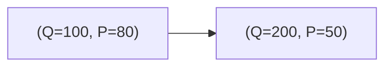
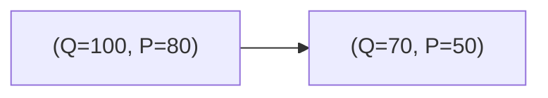

Para interactuar en el mercado, el comprador y el vendedor deben estar de acuerdo en el precio.
###### Mercado
Son un conjunto de compradores y vendedores. Los compradores tienen una necesidad y un precio al que estan dispuestos a pagarla. Los vendedores tienen un precio al que estan dispuestos vender.
### Producto
Es un bien o servicio que satisface una necesidad.
#### Demanda
Tiene una pendiente negativa -> a menor precio el publico quiere demandar mas. A mayor precio menos quiere demandar el publico.

Se entiende como que si el precio esta $80, compro 100 unidades pero si esta $50 compro 200.
##### Determinantes
Son una serie de elementos que modifican a la demanda de un producto. Entre ellos estan:
- Ingresos -> del consumidor(si me alcanza, compro cocacola)
- Preferencias ->del consumidor(me gusta mas la coca que la pepsi)
- Aumento De sustitutivos y complementarios
	- Sustitutos -> cuando el principal aumenta/disminuye el sustituto disminuye/aumenta. *Satisface la misma necesidad con otra tecnologia*.
	- Complementario -> si el principal aumenta/baja el otro tambien.
- Expectativas
- Poblacion -> cultural a veces
#### Oferta
Es lo que esta dispuesto a poner como precio de su producto el vendedor. A mayor precio, mayor cantidad de productores van a estar dispuestos a poner su producto en el mercado.

##### Determinantes
- Precios de factores de produccion -> materia prima, electricidad, gas, etc
- Precios de bienes relacionados
- Numeros de oferentes
- Expectativas
- Tecnologia
```chart
type: line
labels: [1, 2, 3, 4, 5, 6, 7, 8, 9, 10]
series:
  - title: Oferta
    data: [1, 1.3, 1.6, 2, 2.4, 3, 3.7, 4.5, 5.5, 7]
curve: smooth
x-axis-title: Cantidad
y-axis-title: Precio
```
#### Punto de equilibrio
Es el precio en que la oferta y la demanda estan dispuestos a manejarse.
##### El estado en el precio de equilibrio
Lo que puede hacer es limitar precios, poner impuestos, subencionar productores u otras situaciones. Cualquiera de ellas hace que se modifique el precio del producto. 
**Ineficiencia del estado** -> Los productores dejan de recibir plata por impuestos y demandantes que dejan de comprar, esta diferencia se la queda el estado 
##### Mercados demandantes y oferentes
- Mercados oferentes -> si hay mucha oferta la demanda controla el precio
- Mercados demandantes -> si hay mucha demanda la oferta maneja el precio.
##### Competencia entre oferentes
- Competencia perfecta -> los productores ofrecen exactamente lo mismo y todos tienen el mismo nivel de informacion. Entonces los productores no tratan de diferenciarse. Cada vez hay menos.
- Competencia monopolista -> Hay distintos productos con distintas ofertas. Mucha oferta y demanda.
- Competencia oligopolista -> Es de lo que mas hay. Hay pocos oferentes en el mercado. Se suelen poner de acuerdo (carterizar) entre ellos para arreglar el precio. Informacion acotada y controlada. 
- Competencia monopolista -> Existe un unico producto y una sola empresa. Es la unica que comercializa ese producto en ese mercado. Tiene informacion controlada y es muy complicado de entrar. 
### Elasticidad
#### Elasticidad de demanda
Sirve para medir
$$
ep = \frac{a}{Q} + b
$$
- ep = 0 -> rigida, el precio no se mueve por factores determinantes
- 0 < ep < 1 -> la demanda no se mueve por mas que suba el precio
- ep = 1 -> unitaria -> sube el precio baja la demanda y viceversa
- ep > 1 -> elastica -> en el momento en que se mueve el precio, baja el consumo
- ep > infinito -> 
